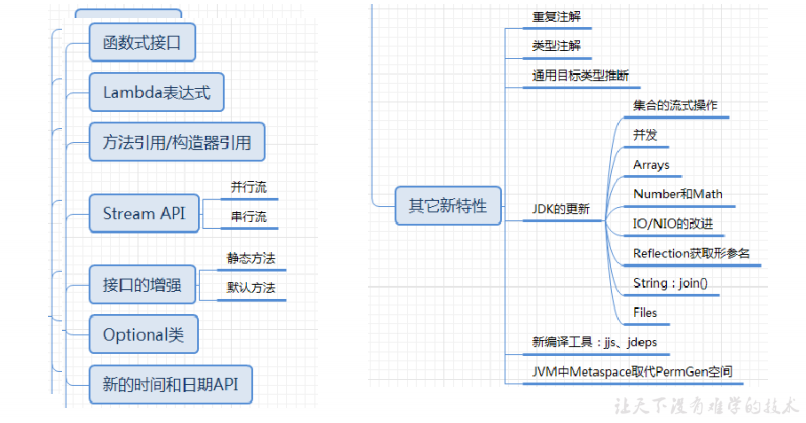
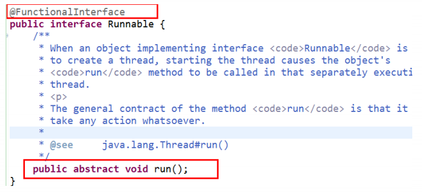
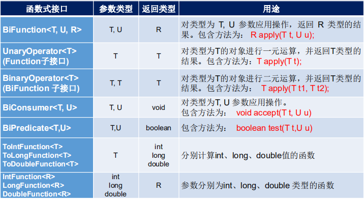
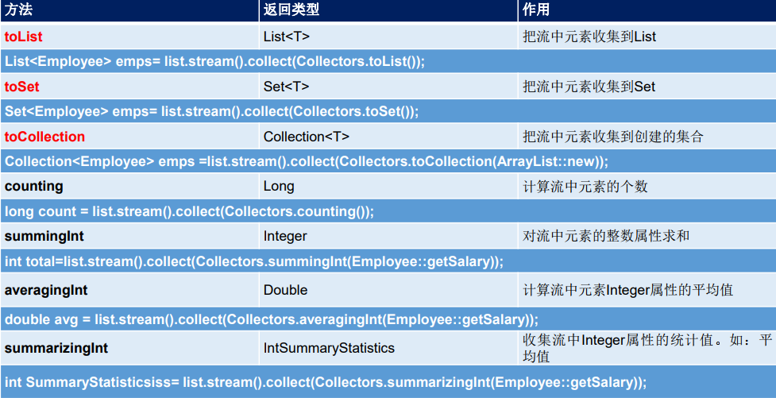
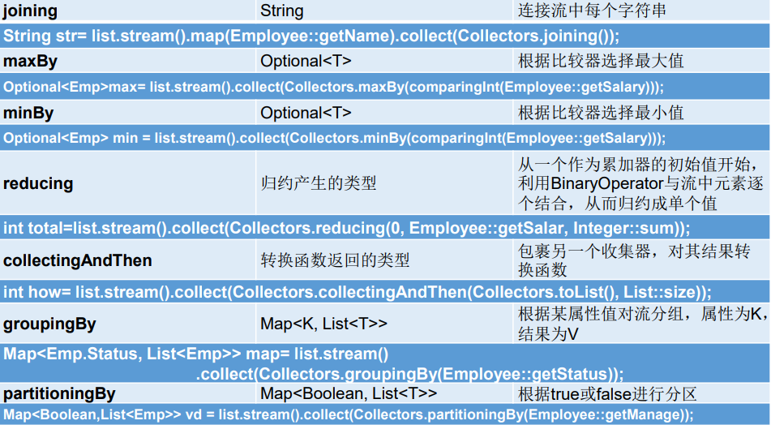

# 1.JDK8新特性



## 1.1Lambda表达式

### 1.1.1为什么要引入Lambda表达式

Java8以前，如果想把某个接口的实现类作为参数传递给一个方法会怎么做？要么创建一个类实现该接口，然后new出一个对象，在调用方法时传递进去，要么使用匿名类，可以精简一些代码。以创建一个线程并打印一行日志为例，使用匿名函数写法如下：

```java
new Thread(new Runnable() {
    @Override
    public void run() {
        System.out.println("小白也能看懂了的Lambda 表达式");
    }
}).start();
```

在java8以前，使用匿名函数已经算是很简洁的写法了，在JDK8以后，使用Lambda表达式，代码如下

```
new Thread(() -> System.out.println("小白也能看懂了的Lambda 表达式")).start();
```

### 1.1.2Lambda表达式简介

Lambda 是一个**匿名函数**，我们可以把 Lambda 表达式理解为是**一段可以传递的代码**（将代码像数据一样进行传递）。使用它可以写出更简洁、更灵活的代码。作为一种更紧凑的代码风格，使Java的语言表达能力得到了提升

### 1.1.3Lambda表达式语法结构

Lambda 表达式：在Java 8 语言中引入的一种新的语法元素和操作符。这个操作符为 “**->**” ， 该操作符被称为 **Lambda** **操作符**或**箭头操作符**。它将 Lambda 分为两个部分：

​        左侧：**指定了 Lambda 表达式需要的**参数列表（方法的形参）

​        右侧：**指定了 **Lambda **体**，是抽象方法的实现逻辑，也即Lambda 表达式要执行的功能（方体）

通用格式：

```java
([type1 parameter1,type2 paramerer2,...]) ->{ body; }
```

说明：

1. 参数类型可以省略，格式如下:

   ```java
   ([parameter1,paramerer2,...]) ->{ body; }
   ```

2. 如果只有一个参数，参数的小括号可以省略

   ```java
   parameter ->{ body; }
   ```

3. Lambda体只有一条语句时，若无返回值，大括号可以省略，若有返回值，return和大括号都省略。

   ```java
   ([parameter1,paramerer2,...]) ->body
   ```

基本格式：

```java
//没有参数
() -> body
// 1个参数
(param) -> body
// 或
(param) ->{ body; }
// 多个参数
(param1, param2...) -> { body }
// 或
(type1 param1, type2 param2...) -> { body }
```

实例：

```java
public class LambdaTest2 {
    //1.无参，无返回值
    @Test
    public void test1() {
        Runnable runnable = new Runnable() {
            @Override
            public void run() {
                System.out.println("我使用的是普通的方法");
            }
        };
        runnable.run();

        System.out.println("*********************************");
        Runnable runnable1 = () -> System.out.println("我使用了Lambda表达式");
        runnable1.run();
        /*运行结果
        我使用的是普通的方法
        *********************************
        我使用了Lambda表达式
        */
    }

    //2.一个参数，无返回值
    @Test
    public void test2(){
        Consumer<String> consumer=new Consumer<String>() {
            @Override
            public void accept(String s) {
                System.out.println("我使用的是普通的方法，"+s);
            }
        };
        consumer.accept("繁琐");

        System.out.println("****************************************");
        Consumer<String> consumer1=s -> System.out.println("我使用了Lambda表达式,"+s);
        consumer1.accept("简洁");
        /*运行结果
         我使用的是普通的方法，繁琐
         ****************************************
         我使用了Lambda表达式,简洁
        */
    }

    //3.Lambda 需要两个或以上的参数，多条执行语句，并且可以有返回值
    @Test
    public void test3(){
        Comparator<Integer> com=new Comparator<Integer>() {
            @Override
            public int compare(Integer o1, Integer o2) {
                System.out.println(o1);
                System.out.println(o2);
                return o1.compareTo(o2);
            }
        };
        System.out.println(com.compare(12,32));

        System.out.println("******************************");
        Comparator<Integer> com1=(o1,o2)->{
            System.out.println(o1);
            System.out.println(o2);
            return o1.compareTo(o2);
        };
        System.out.println(com1.compare(12,10));
    }

    //4.当 Lambda 体只有一条语句时，return 与大括号若有，都可以省略
    @Test
    public void test4(){
        Comparator<Integer> com1 = (o1,o2) -> {
            return o1.compareTo(o2);
        };
        System.out.println(com1.compare(12,6));
        System.out.println("*****************************");
        Comparator<Integer> com2 = (o1,o2) -> o1.compareTo(o2);
        System.out.println(com2.compare(12,21));
    }
}
```

## 1.2函数式接口

### 1.2.1什么是函数式接口

 **只包含一个抽象方法的接口**，称为**函数式接口**。 

 可以在一个接口上使用 **@FunctionalInterface** 注解，这样做可以检查它是否是一个函数式接口。同时javadoc 也会包含一条声明，说明这个接口是一个函数式接口。



 可以通过 Lambda 表达式来创建该接口的对象。（若 Lambda 表达式抛出一个受检异常(即：非运行时异常)，那么该异常需要在目标接口的抽象方法上进行声明）。

 **在java.util.function包下定义了Java 8 的丰富的函数式接口**。

### 1.2.2如何理解函数式接口

 Java从诞生日起就是一直倡导“一切皆对象”，在Java里面面向对象(OOP)编程是一切。但是随着python、scala等语言的兴起和新技术的挑战，Java不得不做出调整以便支持更加广泛的技术要求，也即**java不但可以支持OOP还可以支持OOF（面向函数编程）** 

 在函数式编程语言当中，函数被当做一等公民对待。在将函数作为一等公民的编程语言中，Lambda表达式的类型是函数。但是在Java8中，有所不同。在Java8中，Lambda表达式是对象，而不是函数，它们必须依附于一类特别的对象类型——**函数式接口**。 

 简单的说，在Java8中，**Lambda表达式就是一个函数式接口的实例**。这就是Lambda表达式和函数式接口的关系。也就是说，只要一个对象是函数式接口的实例，那么该对象就可以用Lambda表达式来表示。

 **所以以前用匿名实现类表示的现在都可以用Lambda表达式来写**

### 1.2.3自定义函数式接口

使用@FunctionalInterface注解

```java
@FunctionalInterface
public interface MyInterface {
    void method1();
}
```

```java
@Test
public void test3(){
    MyInterface myInterface=()-> System.out.println("lallalal");
    myInterface.method1();
}
```

函数接口中使用泛型

```java
@FunctionalInterface
public interface MyFunc<T> {
    public T getValue(T t);
}
```

### 1.2.4作为参数传递Lambda表达式

```java
@FunctionalInterface
public interface MyFunc<T> {
    public T getValue(T t);
}

class test{
    public static String toUpperString(MyFunc<String> mf,String str){
        return mf.getValue(str);
    }

    public static void main(String[] args) {
        //作为餐宿传递Lambda表达式
        String newStr=toUpperString(str->str.toUpperCase(),"abc");
        System.out.println(newStr);
    }
}
```

为了将 Lambda 表达式作为参数传递，接收Lambda 表达式的参数类型必须是与该 Lambda 表达式兼容的函数式接口的类型。

### 1.2.5java内置四大核心函数式接口


1.Consumer<T> 消费型接口： 对类型为T的对象应用操作，包含方法： void accept(T t)

```Java
 @Test
    public void teat1(){
        happyTime(400,money-> System.out.println("消费了"+money));
    }
    public void happyTime(double money, Consumer<Double> consumer){
        consumer.accept(money);
    }
```

2.Predicate<T> 断定型接口： 确定类型为T的对象是否满足某约束，并返回 boolean 值。包含方法：boolean test(T t)

```java
@Test
    public void test2(){
        List<String> list = Arrays.asList("北京","南京","天津","东京","西京","普京");      
        List<String> filterStrs = filterString(list, new Predicate<String>() {
            @Override
            public boolean test(String s) {
                return s.contains("京");
            }
        });

        System.out.println(filterStrs);
        
        System.out.println("*****************************");

        List<String> filterStrs1 = filterString(list,s -> s.contains("京"));
        System.out.println(filterStrs1);
    }

    //根据给定的规则，过滤集合中的字符串。此规则由Predicate的方法决定
    //返回包含”京“的字符串
    public List<String> filterString(List<String> list, Predicate<String> pre){

        ArrayList<String> filterList = new ArrayList<>();

        for(String s : list){
            if(pre.test(s)){
                filterList.add(s);
            }
        }

        return filterList;

    }
```

其他接口：



## 1.3方法引用

在使用Lambda表达式的时候，我们实际上传递进去的代码就是一种解决方案：拿什么参数做什么操作。那么考虑 一种情况：**如果我们在Lambda中所指定的操作方案，已经有地方存在相同方案**，那是否还有必要再写重复逻辑？

### 1.3.1冗余的Lambda场景 

来看一个简单的函数式接口以应用Lambda表达式：

```java
@FunctionalInterface
public interface Printable {
    void print(String str);
}
```

在 Printable 接口当中唯一的抽象方法 print 接收一个字符串参数，目的就是为了打印显示它。那么通过Lambda 来使用它的代码很简单

```java
public class Demo01PrintSimple {
    private static void printString(Printable data) {
    	data.print("Hello, World!");        
    }       
    public static void main(String[] args) {
    	printString(s ‐> System.out.println(s));        
    } 
}
```

其中 printString 方法只管调用 Printable 接口的 print 方法，而并不管 print 方法的具体实现逻辑会将字符串 打印到什么地方去。而 main 方法通过Lambda表达式指定了函数式接口 Printable 的具体操作方案为：拿到 String（类型可推导，所以可省略）数据后，在控制台中输出它

### 1.3.2 问题分析 

这段代码的问题在于，对字符串进行控制台打印输出的操作方案，明明已经有了现成的实现，那就是 System.out 对象中的 println(String) 方法。既然Lambda希望做的事情就是调用 println(String) 方法，那何必自己手动调 用呢？

###  1.3.3 用方法引用改进代码 

能否省去Lambda的语法格式（尽管它已经相当简洁）呢？只要“引用”过去就好了：

```java
public class Demo02PrintRef {     
    private static void printString(Printable data) {         data.print("Hello, World!");     
    }       
    public static void main(String[] args) {        
        printString(System.out::println);        
    } 
}
```

其中的双冒号 :: 写法，这被称为“方法引用”，而双冒号是一种新的语法。 

### 1.3.4 方法引用符 

双冒号 :: 为引用运算符，而它所在的表达式被称为方法引用。**如果Lambda要表达的函数方案已经存在于某个方 法的实现中**，那么则可以通过双冒号来引用该方法作为Lambda的替代者。 

**语义分析** 
例如上例中， System.out 对象中有一个重载的 println(String) 方法恰好就是我们所需要的。那么对于 printString 方法的函数式接口参数，对比下面两种写法，完全等效：
Lambda表达式写法： s -> System.out.println(s); 

方法引用写法： System.out::println
第一种语义是指：拿到参数之后经Lambda之手，继而传递给 System.out.println 方法去处理。

第二种等效写法的语义是指：直接让 System.out 中的 println 方法来取代Lambda。两种写法的执行效果完全一 样，而第二种**方法引用的写法复用了已有方案**，更加简洁。
注:**Lambda 中 传递的参数 一定是方法引用中 的那个方法可以接收的类型,否则会抛出异常** 

**推导与省略** 
如果使用Lambda，那么根据“**可推导就是可省略**”的原则，无需指定参数类型，也无需指定的重载形式——它们都 将被自动推导。而如果使用方法引用，也是同样可以根据上下文进行推导。
函数式接口是Lambda的基础，而方法引用是Lambda的孪生兄弟。 

下面这段代码将会调用 println 方法的不同重载形式，将函数式接口改为int类型的参数：

```java
@FunctionalInterface 
public interface PrintableInteger {    
    void print(int str);    
}
```

由于上下文变了之后可以自动推导出唯一对应的匹配重载，所以方法引用没有任何变化：

```java
public class Demo03PrintOverload {     private static void printInteger(PrintableInteger data) {        
    	data.print(1024);        
    }       
    public static void main(String[] args) {        
    	printInteger(System.out::println);        
    } 
}
```

这次方法引用将会自动匹配到 println(int) 的重载形式。

### 1.3.5**方法引用概述**

- **当要传递给Lambda体的操作，已经有实现的方法了，可以使用方法引用！**

- 方法引用可以看做是Lambda表达式深层次的表达。换句话说，方法引用就 是Lambda表达式，也就是函数式接口的一个实例，通过方法的名字来指向 一个方法，可以认为是Lambda表达式的一个语法糖。
- 要求：**实现接口的抽象方法的参数列表和返回值类型，必须与方法引用的方法的参数列表和返回值类型保持一致！**
- 格式：使用操作符 **“::”** 将类(或对象) 与 方法名分隔开来。
- 如下几种主要使用情况：
  - **对象::实例方法名** 
  - **类::静态方法名** 
  - **super::实例方法名** 
  - **this::实例方法名**
  - **类::实例方法名**

### 1.3.6方法引用的使用

#### 1.3.6.1**对象::实例方法名** 

这是最常见的一种方法，如果类中已经存在了一个成员方法

```java
public class MethodRefObject {     
    public void printUpperCase(String str) {        						              			System.out.println(str.toUpperCase());        
    } 
}
```

函数式接口定义

```java
@FunctionalInterface 
public interface Printable {    
	void print(String str);    
}
```

那么当需要使用这个 printUpperCase 成员方法来替代 Printable 接口的Lambda的时候，已经具有了 MethodRefObject 类的对象实例，则可以通过对象名引用成员方法，代码为：

```java
public class Demo04MethodRef {     
    private static void printString(Printable lambda) {        
    	lambda.print("Hello");        
    }       
    public static void main(String[] args) {         MethodRefObject obj = new MethodRefObject();         printString(obj::printUpperCase);     
    } 
}
```

例子：

```java
    //Consumer中的void accept(T t)
	//PrintStream中的void println(T t)
	@Test
	public void test1() {
		Consumer<String> con1 = str -> System.out.println(str);
		con1.accept("北京");

		System.out.println("********使用方法引用**********");
		PrintStream ps = System.out;
		Consumer<String> con2 = ps::println;
		con2.accept("beijing");
	}
	
	//Supplier中的T get()
	//Employee中的String getName()
	@Test
	public void test2() {
        //创建Employee类，重写getset方法
		Employee emp = new Employee(1001,"Tom",23,5600);
		Supplier<String> sup1 = () -> emp.getName();
		System.out.println(sup1.get());
		System.out.println("********使用方法引用**********");
		Supplier<String> sup2 = emp::getName;
		System.out.println(sup2.get());

	}
```

#### 1.3.6.2**类::静态方法名** 

```java
    //Comparator中的int compare(T t1,T t2)
	//Integer中的int compare(T t1,T t2)
	@Test
	public void test3() {
		Comparator<Integer> com1 = (t1,t2) -> Integer.compare(t1,t2);
		System.out.println(com1.compare(12,21));

		System.out.println("********使用方法引用***********");

		Comparator<Integer> com2 = Integer::compare;
		System.out.println(com2.compare(12,3));

	}
	
	//Function中的R apply(T t)
	//Math中的Long round(Double d)
	@Test
	public void test4() {
		Function<Double,Long> func = new Function<Double, Long>() {
			@Override
			public Long apply(Double d) {
				return Math.round(d);
			}
		};

		System.out.println("********使用Lambda表达式**********");

		Function<Double,Long> func1 = d -> Math.round(d);
		System.out.println(func1.apply(12.3));

		System.out.println("********使用方法应用***********");

		Function<Double,Long> func2 = Math::round;
		System.out.println(func2.apply(12.6));
	}
```

#### 1.3.6.3**super::实例方法名** 

如果存在继承关系，当Lambda中需要出现super调用时，也可以使用方法引用进行替代。

函数式接口：

```java
@FunctionalInterface
public interface Greetable {
	void greet();
}

```

父类：Human

```java
public class Human{
    public void sayHello(){
    	System.out.println("Hello!");
    }
}
```

子类：Man

```java
public class Man extends Human{
    @Override
    public void sayHello(){
        System.out.println("大家好,我是Man!");
    }
    //定义方法method,参数传递Greetable接口
    public void method(Greetble g){
        g.greet();
    }
    public void show(){
        //调用method方法，使用Lambda表达式
        method(()->new Human().sayHello());
        //使用super关键字代替父类对象
        method(()->super.sayHello());
        //使用方法引用来调用父类的sayHello方法
        method(super::sayHello);
    }
}
```

#### 1.3.6.4**this::实例方法名** 

this代表当前对象，如果需要引用的方法就是当前类中的成员方法，那么可以使用“this::成员方法”的格式来使用方法引用。

函数式接口：

```java
@FunctionalInterface
public interface Richable{
    void buy();
}
```

定义一个Person类

```java
public class Person{
    private void marry(Richable richer){
        richer.buy();
    }
    public void beHappy(){
        marry(()->System.out.println("买套房子"));
    }
}
```

方法 beHappy 调用了方法 marry ，后者的参数为函数式接口 Richable ，所以需要一个Lambda表达式。但是如果这个**Lambda表达式的内容已经在本类当中存在**了，则可以对 Person 类进行修改：

```java
public class Husband {
    private void buyHouse() {
    	System.out.println("买套房子");
    }
    private void marry(Richable lambda) {
    	lambda.buy();
    }
    public void beHappy() {
        //使用Lambda表达式
    	marry(() ‐> this.buyHouse());
        //使用方法引用
        marry(this::buyHouse);
    }
}
```

#### 1.3.6.5**类::实例方法名**

```java
    // Comparator中的int comapre(T t1,T t2)
	// String中的int t1.compareTo(t2)
	@Test
	public void test5() {
		Comparator<String> com1 = (s1,s2) -> s1.compareTo(s2);
		System.out.println(com1.compare("abc","abd"));

		System.out.println("*******************");

		Comparator<String> com2 = String :: compareTo;
		System.out.println(com2.compare("abd","abm"));
	}

	//BiPredicate中的boolean test(T t1, T t2);
	//String中的boolean t1.equals(t2)
	@Test
	public void test6() {
		BiPredicate<String,String> pre1 = (s1,s2) -> s1.equals(s2);
		System.out.println(pre1.test("abc","abc"));

		System.out.println("*******************");
		BiPredicate<String,String> pre2 = String :: equals;
		System.out.println(pre2.test("abc","abd"));
	}
	
	// Function中的R apply(T t)
	// Employee中的String getName();
	@Test
	public void test7() {
		Employee employee = new Employee(1001, "Jerry", 23, 6000);


		Function<Employee,String> func1 = e -> e.getName();
		System.out.println(func1.apply(employee));

		System.out.println("*******************");


		Function<Employee,String> func2 = Employee::getName;
		System.out.println(func2.apply(employee));


	}

```

> 注意：当函数式接口方法的第一个参数是需要引用方法的调用者，并且第二 个参数是需要引用方法的参数(或无参数)时：ClassName::methodName

## 1.4构造器引用和数组引用

### 1.4.1构造器引用

**格式： ClassName::new**

与函数式接口相结合，自动与函数式接口中方法兼容。 

可以把构造器引用赋值给定义的方法，要求构造器参数列表要与接口中抽象方法的参数列表一致！且方法的返回值即为构造器对应类的对象。

首先定义person类

```java
public class Person {
    private String name;
    public Person(String name) {
    	this.name = name;
    }
    public String getName() {
    	return name;
    }
    public void setName(String name) {
    	this.name = name;
    }
}

```

创建Person对象的函数式接口

```java
public interface PersonBuilder {
	Person buildPerson(String name);
}
```

```java
public class Demo09Lambda {
    public static void printName(String name,PersonBuilder builder){
        System.out.println(bbuilder.buildPerson(name).getName());
    }
    public static void main(String[] args) {
 		printName("赵丽颖", name ‐> new Person(name));
        //使用构造器引用
        printName("赵丽颖", Person::new);
	}
}
```

### 1.4.2数组的构造器引用

数组也是 Object 的子类对象，所以同样具有构造器，只是语法稍有不同

**格式： type[] :: new**

函数式接口

```java
@FunctionalInterface
public interface ArrayBuilder {
	int[] buildArray(int length);
}
```

```java
public class Demo11ArrayInitRef {
    private static int[] initArray(int length, ArrayBuilder builder) {
    	return builder.buildArray(length);
    }
    public static void main(String[] args) {
    	int[] array = initArray(10, length ‐> new int[length]);
        //使用数组引用
        int[] array = initArray(10, int[]::new);
    }
}
```

## 1.5Stream API

### 1.5.1引言

#### 传统集合的多步遍历代码

几乎所有的集合（如 Collection 接口或 Map 接口等）都支持直接或间接的遍历操作。而当我们需要对集合中的元素进行操作的时候，除了必需的添加、删除、获取外，最典型的就是集合遍历。例如：

```java
import java.util.ArrayList;
import java.util.List;
public class Demo01ForEach {
    public static void main(String[] args) {
        List<String> list = new ArrayList<>();
        list.add("张无忌");
        list.add("周芷若");
        list.add("赵敏");
        list.add("张强");
        list.add("张三丰");
        for (String name : list) {
            System.out.println(name);
        }        
    }
}
```

这是一段非常简单的集合遍历操作：对集合中的每一个字符串都进行打印输出操作。

#### 循环遍历的弊端

Java 8的Lambda让我们可以更加专注于做什么（What），而不是怎么做（How）,现在，我们仔细体会一下上例代码，可以发现：
       for循环的语法就是“怎么做”
       for循环的循环体才是“做什么”
为什么使用循环？因为要进行遍历。但循环是遍历的唯一方式吗？遍历是指每一个元素逐一进行处理，而并不是从第一个到最后一个顺次处理的循环。前者是目的，后者是方式。
试想一下，如果希望对集合中的元素进行筛选过滤：

1. 将集合A根据条件一过滤为子集B；

2. 然后再根据条件二过滤为子集C。

  那怎么办？在Java 8之前的做法可能为：

  ```java
  import java.util.ArrayList;
  import java.util.List;
  public class Demo02NormalFilter {
      public static void main(String[] args) {
          List<String> list = new ArrayList<>();
          list.add("张无忌");
          list.add("周芷若");
          list.add("赵敏");
          list.add("张强");
          list.add("张三丰");
          
          List<String> zhangList = new ArrayList<>();
          for (String name : list) {
          	if (name.startsWith("张")) {
          		zhangList.add(name);
          	}
          }
          
          List<String> shortList = new ArrayList<>();
          for (String name : zhangList) {
          	if (name.length() == 3) {
          		shortList.add(name);
          	}
          }
          for (String name : shortList) {
          	System.out.println(name);
          }
      }
  }
  ```

  这段代码中含有三个循环，每一个作用不同：
  1. 首先筛选所有姓张的人；

  2. 然后筛选名字有三个字的人；

  3. 最后进行对结果进行打印输出。

  每当我们需要对集合中的元素进行操作的时候，总是需要进行循环、循环、再循环。这是理所当然的么？不是。循环是做事情的方式，而不是目的。另一方面，使用线性循环就意味着只能遍历一次。如果希望再次遍历，只能再使用另一个循环从头开始。

  那，Lambda的衍生物Stream能给我们带来怎样更加优雅的写法呢？

#### Stream的写法

```java
import java.util.ArrayList;
import java.util.List;
public class Demo03StreamFilter {
    public static void main(String[] args) {
        List<String> list = new ArrayList<>();
        list.add("张无忌");
        list.add("周芷若");
        list.add("赵敏");
        list.add("张强");
        list.add("张三丰");
        
        list.stream()
        .filter(s ‐> s.startsWith("张"))
        .filter(s ‐> s.length() == 3)
        .forEach(System.out::println);
    }
}
```

直接阅读代码的字面意思即可完美展示无关逻辑方式的语义：获取流、过滤姓张、过滤长度为3、逐一打印。代码中并没有体现使用线性循环或是其他任何算法进行遍历，我们真正要做的事情内容被更好地体现在代码中。

### 1.5.2Stream概述

#### Stream API说明

 Java8中有两大最为重要的改变。第一个是 Lambda 表达式；另外一个则是 Stream API。

 Stream API ( java.util.stream) 把真正的函数式编程风格引入到Java中。这是目前为止对Java类库最好的补充，因为Stream API可以极大提供Java程序员的生产力，让程序员写出高效率、干净、简洁的代码。

 Stream 是 **Java8 中处理集合的关键抽象概念，它可以指定你希望对集合进行的操作，可以执行非常复杂的查找、过滤和映射数据等操作**。 **使用Stream API 对集合数据进行操作，就类似于使用 SQL 执行的数据库查询**。也可以使用 Stream API 来并行执行操作。简言之，Stream API 提供了一种高效且易于使用的处理数据的方式。

#### 为什么要使用Stream API

 实际开发中，项目中多数数据源都来自于Mysql，Oracle等。但现在数据源可以更多了，有MongDB，Radis等，而这些NoSQL的数据就需要Java层面去处理。

 Stream 和 Collection 集合的区别：**Collection 是一种静态的内存数据结构，而 Stream 是有关计算的**。前者是主要面向内存，存储在内存中，后者主要是面向 CPU，通过 CPU 实现计算。

#### 什么是 Stream

Stream到底是什么呢？
是数据渠道，用于操作数据源（集合、数组等）所生成的元素序列。
**“集合讲的是数据，Stream讲的是计算！”**

注意：
①Stream 自己不会存储元素。
②Stream 不会改变源对象。相反，他们会返回一个持有结果的新Stream。
③Stream 操作是延迟执行的。这意味着他们会等到需要结果的时候才执行。

#### Stream 的操作三个步骤

1- 创建 Stream
一个数据源（如：集合、数组），获取一个流

2- 中间操作
一个中间操作链，对数据源的数据进行处理

3- 终止操作(终端操作)
一旦执行终止操作，就执行中间操作链，并产生结果。之后，不会再被使用

### 1.5.3创建Stream

#### 创建 Stream方式一：通过集合

Java8 中的 Collection 接口被扩展，提供了两个获取流的方法：

- `default Stream<E> stream()` : 返回一个顺序流
- `default Stream<E> parallelStream()` : 返回一个并行流

```java
import java.util.*;
import java.util.stream.Stream;
public class Demo04GetStream {
    public static void main(String[] args) {
        List<String> list = new ArrayList<>();
        // ...
        Stream<String> stream1 = list.stream();
        
        Set<String> set = new HashSet<>();
        // ...
        Stream<String> stream2 = set.stream();
        
        Vector<String> vector = new Vector<>();
        // ...
        Stream<String> stream3 = vector.stream();
    }
}
```

#### 创建 Stream方式二：通过数组

Java8 中的 Arrays 的静态方法 stream() 可以获取数组流：

- `static <T> Stream<T> stream(T[] array)`: 返回一个流

重载形式，能够处理对应基本类型的数组：

- `public static IntStream stream(int[] array)`
- `public static LongStream stream(long[] array)`
- `public static DoubleStream stream(double[] array)`

```java
@Test
public void test1(){
    //通过数组
    int[] arr=new int[]{1,2,3,4,5,6};
    IntStream stream= Arrays.stream(arr);
    //通过数组对象创建Stream
    Employee e1 = new Employee(1001,"Tom");
    Employee e2 = new Employee(1002,"Jerry");
    Employee[] arr1 = new Employee[]{e1,e2};
    Stream<Employee> stream1 = Arrays.stream(arr1);
}
```

#### 创建 Stream方式三：通过Stream的of()

可以调用Stream类静态方法 of(), 通过显示值创建一个流。它可以接收任意数量的参数。

- `public static<T> Stream<T> of(T... values)` : 返回一个流

```java
@Test
public void test3(){
	Stream<Integer> stream = Stream.of(1, 2, 3, 4, 5, 6);
}
```

#### 创建 Stream方式四：创建无限流

可以使用静态方法 Stream.iterate() 或者Stream.generate() 创建无限流。

- 迭代
  `public static<T> Stream<T> iterate(final T seed, final UnaryOperator<T> f)` 
- 生成
  `public static<T> Stream<T> generate(Supplier<T> s)` 

```java
@Test
public void test4(){
    ///迭代
    Stream stream=Stream.iterate(0,t -> t + 2);
    //生成
    Stream stream1=Stream.generate(Math::random);
}
```

### 1.5.4Stream的中间操作

多个中间操作可以连接起来形成一个**流水线，除非流水线上触发终止操作，否则中间操作不会执行任何的处理！而在终止操作时一次性全部处理，称为“惰性求值”。**

- **筛选与切片**

  `filter(Predicate p)` 接收 Lambda ， 从流中排除某些元素

  如果Predicate的test()方法返回的结果为true，那么Stream流的 filter 方法将会留用元素；如果结果为false，那么 filter 方法将会舍弃元素。

  ```java
  import java.util.stream.Stream;
  public class Demo07StreamFilter {
      public static void main(String[] args) {
          Stream<String> original = Stream.of("张无忌","张三丰","周芷若");
          Stream<String> result = original.filter(s ‐> s.startsWith("张"));
          //通过Lambda表达式来指定了筛选的条件：必须姓张。
      }
  }
  
  ```

  `distinct()` 筛选，通过流所生成元素的 hashCode() 和 equals() 去除重复元素

  ```java
  @Test
  public void test3(){
      //去重
      Stream<String> original = Stream.of("张无忌","张三丰","周芷若","张无忌","张无忌");
      Stream<String> result=original.distinct();
  }
  ```

  `limit(long maxSize)`可以对流进行截取，只取用前n个

  `skip(long n)`跳过元素，返回一个扔掉了前 n 个元素的流。若流中元素不足 n 个，则返回一个空流。与 limit(n) 互补

- **映 射**

  `map(Function f)`接收一个函数作为参数，该函数会被应用到每个元素上，并将其映射成一个新的元素。

  `mapToDouble(ToDoubleFunction f)`接收一个函数作为参数，该函数会被应用到每个元素上，产生一个新的 DoubleStream。

  `mapToInt(ToIntFunction f)`接收一个函数作为参数，该函数会被应用到每个元素上，产生一个新的IntStream。

  `mapToLong(ToLongFunction f)`接收一个函数作为参数，该函数会被应用到每个元素上，产生一个新的 LongStream。

  `flatMap(Function f)`接收一个函数作为参数，将流中的每个值都换成另一个流，然后把所有流连接成一个流

- **排序**

  `sorted()` 产生一个新流，其中按自然顺序排序
  `sorted(Comparator com)` 产生一个新流，其中按比较器顺序排序

### 1.5.5Stream的终止操作

**终端操作会从流的流水线生成结果。其结果可以是任何不是流的值**，例如：List、Integer，甚至是 void 。

**流进行了终止操作后，不能再次使用。**

- **匹配与查找**

  `boolean allMatch(Predicate p)` 检查是否匹配所有元素

  `boolean anyMatch(Predicate p)` 检查是否至少匹配一个元素

  `boolean noneMatch(Predicate p)` 检查是否没有匹配所有元素

  `Optional<T> findFirst()` 返回第一个元素

  `Optional<T>  findAny()` 返回当前流中的任意元素

  `long count()` 返回流中元素总数

  `Optional<T> max(Comparator c)` 返回流中最大值

  `Optional<T> min(Comparator c)` 返回流中最小值

  `void forEach(Consumer c)`内部迭代(使用 Collection 接口需要用户去做迭代，称为外部迭代。相反，Stream API 使用内部迭代——它帮你把迭代做了)

- **规约**

  `T reduce(T iden, BinaryOperator b)` 可以将流中元素反复结合起来，得到一个值。返回 T

  `Optional<T> reduce(BinaryOperator b)` 可以将流中元素反复结合起来，得到一个值。返回Optional<T>

  > 备注：map 和 reduce 的连接通常称为 map-reduce 模式，因 Google 用它来进行网络搜索而出名。

- **收集**

  `collect(Collector c)`将流转换为其他形式。接收一个 Collector接口的实现，用于给Stream中元素做汇总的方法

  Collector 接口中方法的实现决定了如何对流执行收集的操作(如收集到 List、Set、Map)。
  另外， Collectors 实用类提供了很多静态方法，可以方便地创建常见收集器实例，具体方法与实例如下表：

  



### 1.5.6练习

```java
package com.kong.stream;

import org.junit.Test;

import javax.xml.bind.Element;
import java.util.*;
import java.util.stream.Collectors;
import java.util.stream.Stream;

public class StreamTest {
    List<Employee> employees=EmployeeData.getEmployees();
    Stream<Employee> stream=employees.stream();
    //1.筛选与切片
    @Test
    public void test1(){
        //练习一：查询员工表中薪资大于7000的员工信息
        stream.filter(e->e.getSalary()>7000)
                .forEach(System.out::println);
    }
    @Test
    public void test2(){
        //练习二：获取前3条数据
        stream.limit(3).forEach(System.out::println);
    }
    @Test
    public void test3(){
        //练习三：扔掉前三个数据，从第四个数据开始后获取
        stream.skip(3).forEach(System.out::println);
    }
    @Test
    public void test4(){
        //练习四：去除重复数据
        employees.add(new Employee(1010,"刘强东",40,8000));
        employees.add(new Employee(1010,"刘强东",41,8000));
        employees.add(new Employee(1010,"刘强东",40,8000));
        employees.add(new Employee(1010,"刘强东",40,8000));
        employees.add(new Employee(1010,"刘强东",40,8000));
        stream.distinct().forEach(System.out::println);
    }
    //2.映射
    @Test
    public void mapTest(){
        //map(Function f)——接收一个函数作为参数，将元素转换成其他形式或提取信息，
        // 该函数会被应用到每个元素上，并将其映射成一个新的元素。
        List<String> list= Arrays.asList("aa","bb","cc","dd");
        list.stream().map(String::toUpperCase)
                .forEach(System.out::println);

        //将字符串中的多个字符构成的集合转换为对应的Stream的实例
        //方式一：
        List<String> strList= Arrays.asList("aa","bb","cc","dd");
        strList.stream().map(StreamTest::stringToStream)
                .forEach(s-> {
                    s.forEach(System.out::println);
                });

        //flatMap(Function f)——接收一个函数作为参数，将流中的每个值都换成另一个流，
        // 然后把所有流连接成一个流。
        //方式二：
        List<String> strList1= Arrays.asList("aa","bb","cc","dd");
        strList1.stream().flatMap(StreamTest::stringToStream)
                .forEach(System.out::println);
    }
    //将字符串中的多个字符构成的集合转换为对应的Stream的实例
    public static Stream<Character> stringToStream(String str){
        ArrayList<Character> strList=new ArrayList<>();
        for (Character ch : str.toCharArray()){
            strList.add(ch);
        }
        return strList.stream();
    }

    @Test
    public void test5(){
        //练习五：获取员工姓名长度大于3的员工的姓名。
        stream.map(Employee::getName)
                .filter(name->name.length()>3)
                .forEach(System.out::println);
    }
    //3.排序
    @Test
    public void test6(){
        //自然排序sorted()
        //Employee必须实现Comparable接口，否则会抛异常
        //按年龄从小到大
        stream.sorted().forEach(System.out::println);

        System.out.println("**********************************");

        //定制排序sorted(Comparator com)
        //按年龄从大到小，如果年龄相同，按工资从低到高
        EmployeeData.getEmployees().stream()
                .sorted((e1,e2)->{
                    int ageValue=-Integer.compare(e1.getAge(),e2.getAge());
                    if(ageValue==0){
                        return Double.compare(e1.getSalary(),e2.getSalary());
                    }else{
                        return ageValue;
                    }
                }).forEach(System.out::println);
    }
    //4.匹配与查找
    @Test
    public void test7(){
        //allMatch(Predicate p)——检查是否匹配所有元素。
        //练习：是否所有的员工的年龄都大于18
        boolean allMatch = EmployeeData.getEmployees().stream()
                .allMatch(e -> e.getAge() > 18);
        System.out.println(allMatch);

        //anyMatch(Predicate p)——检查是否至少匹配一个元素。
        //是否存在员工的工资大于10000
        boolean anyMatch = EmployeeData.getEmployees().stream()
                .anyMatch(e -> e.getSalary() > 10000);
        System.out.println(anyMatch);

        //noneMatch(Predicate p)——检查是否没有匹配的元素。
        // 练习：是否存在员工姓“雷”      存在返回false,不存在返回true
        boolean noneMatch = EmployeeData.getEmployees().stream()
                .noneMatch(e -> e.getName().startsWith("雷"));
        System.out.println(anyMatch);

        //max(Comparator c)——返回流中最大值
        //练习：返回最高的工资：
        Stream<Double> salaryStream = EmployeeData.getEmployees()
                .stream().map(e -> e.getSalary());
        Optional<Double> maxSalary = salaryStream.max(Double::compare);
        System.out.println(maxSalary);

        //min(Comparator c)——返回流中最小值
        //练习：返回最低工资的员工
        Optional<Employee> employee = EmployeeData.getEmployees()
                .stream().min((e1, e2) -> Double.compare(e1.getSalary(), e2.getSalary()));
        System.out.println(employee);
        System.out.println();
    }

    //归约
    @Test
    public void test8(){
        //reduce(T identity, BinaryOperator)——可以将流中元素反复结合起来，得到一个值。返回 T
        //练习1：计算1-10的自然数的和
        List<Integer> list=Arrays.asList(1,2,3,4,5,6,7,8,9);
        Integer sum=list.stream().reduce(0,Integer::sum);
        System.out.println(sum);  //45

        //reduce(BinaryOperator) ——可以将流中元素反复结合起来，得到一个值。返回 Optional<T>
        //练习2：计算公司所有员工工资的总和
        List<Employee> employees = EmployeeData.getEmployees();
        Optional<Double> sumMoney=employees.stream()
                .map(Employee::getSalary)
                .reduce(Double::sum);
        System.out.println(sumMoney);
    }

    //收集
    @Test
    public void test9(){
        //collect(Collector c)——将流转换为其他形式。
        // 接收一个 Collector接口的实现，用于给Stream中元素做汇总的方法
        //练习1：查找工资大于6000的员工，结果返回为一个List或Set
        EmployeeData.getEmployees().stream()
                .filter(e->e.getSalary()>6000)
                .collect(Collectors.toList())
                .forEach(System.out::println);
    }
}

```

```java
package com.kong.stream;

public class Employee implements Comparable<Employee>{

   private int id;
   private String name;
   private int age;
   private double salary;

   public int getId() {
      return id;
   }

   public void setId(int id) {
      this.id = id;
   }

   public String getName() {
      return name;
   }

   public void setName(String name) {
      this.name = name;
   }

   public int getAge() {
      return age;
   }

   public void setAge(int age) {
      this.age = age;
   }

   public double getSalary() {
      return salary;
   }

   public void setSalary(double salary) {
      this.salary = salary;
   }

   public Employee() {
      System.out.println("Employee().....");
   }

   public Employee(int id) {
      this.id = id;
      System.out.println("Employee(int id).....");
   }

   public Employee(int id, String name) {
      this.id = id;
      this.name = name;
   }

   public Employee(int id, String name, int age, double salary) {

      this.id = id;
      this.name = name;
      this.age = age;
      this.salary = salary;
   }

   @Override
   public String toString() {
      return "Employee{" + "id=" + id + ", name='" + name + '\'' + ", age=" + age + ", salary=" + salary + '}';
   }

   @Override
   public boolean equals(Object o) {
      if (this == o)
         return true;
      if (o == null || getClass() != o.getClass())
         return false;

      Employee employee = (Employee) o;

      if (id != employee.id)
         return false;
      if (age != employee.age)
         return false;
      if (Double.compare(employee.salary, salary) != 0)
         return false;
      return name != null ? name.equals(employee.name) : employee.name == null;
   }

   @Override
   public int hashCode() {
      int result;
      long temp;
      result = id;
      result = 31 * result + (name != null ? name.hashCode() : 0);
      result = 31 * result + age;
      temp = Double.doubleToLongBits(salary);
      result = 31 * result + (int) (temp ^ (temp >>> 32));
      return result;
   }

   //根据年龄排序
   @Override
   public int compareTo(Employee o) {
      return Integer.compare(this.age,o.age);
   }
}
```

```java
package com.kong.stream;

import java.util.ArrayList;
import java.util.List;
/**
 * 提供用于测试的数据
 */
public class EmployeeData {
   
   public static List<Employee> getEmployees(){
      List<Employee> list = new ArrayList<>();
      
      list.add(new Employee(1001, "马化腾", 34, 6000.38));
      list.add(new Employee(1002, "马云", 12, 9876.12));
      list.add(new Employee(1003, "刘强东", 33, 3000.82));
      list.add(new Employee(1004, "雷军", 26, 7657.37));
      list.add(new Employee(1005, "李彦宏", 65, 5555.32));
      list.add(new Employee(1006, "比尔盖茨", 42, 9500.43));
      list.add(new Employee(1007, "任正非", 26, 4333.32));
      list.add(new Employee(1008, "扎克伯格", 35, 2500.32));
      
      return list;
   }
   
}
```

## 1.6Optional类


## 1.7接口的默认方法和静态方法

