# 1.反射(Reflection)

## 1.1反射概念

### 1.1.1反射定义

​        JAVA反射机制是在运行状态中，对于任意一个类，都能够知道这个类的所有属性和方法；对于任意一个对象，都能够调用它的任意一个方法和属性；这种动态获取的信息以及动态调用对象的方法的功能称为java语言的反射机制。

> 反射机制很重要的一点就是“运行时”，其使得我们可以在程序运行时加载、探索以及使用编译期间完全未知的 `.class` 文件。换句话说，Java 程序可以加载一个运行时才得知名称的 `.class` 文件，然后获悉其完整构造，并生成其对象实体、或对其 fields（变量）设值、或调用其 methods（方法）。

通俗概括：

​       反射就是让你可以通过名称来得到对象的信息(如类，属性，方法等) 的技术

核心：

​        反射是java被视为动态语言的关键，反射机制允许程序在执行期借助Reflection API取得任何类的内部信息，并能直接操作任意对象的内部属性及方法。

​                      Class c=Class.forName("java.lang.String")

​        加载完类之后，在堆内存的方法区中就产生了一个Class类型的对象（**一个类只有一个Class对象**），**这个对象就包含了完整的类的结构信息**。我们可以通过这个对象看到类的结构。

### 1.1.2功能

- 在运行时判断任意一个对象所属的类；
- 在运行时构造任意一个类的对象；
- 在运行时判断任意一个类所具有的成员变量和方法；
- 在运行时调用任意一个对象的方法；
- 生成动态代理

### 1.1.3反射的优点和缺点

优点：可以实现动态创建对象和编译，体现出很大的灵活性

缺点：对性能有影响。使用反射基本上是一种解释操作，我们可以告诉JVM，我们希望做什么并且它满足我们的要求。这类操作总是慢于直接执行相同的操作。

### 1.1.4反射相关的主要API

- java.lang.Class：代表一个类
- java.lang.reflect.Method：代表类的方法
- java.lang.reflect.Field：代表类的成员变量
- java.lang.reflect.Constructor：代表类的构造器

### 1.1.5 java创建对象的5种方式

- 使用new关键字
- 使用clone方法
- 使用反序列化
- 使用反射
- 使用Unsafe

[java创建对象的5种方式](https://juejin.im/post/5d44530a6fb9a06aed7103bd#heading-8)

### 1.1.6反射原理

类加载的流程：

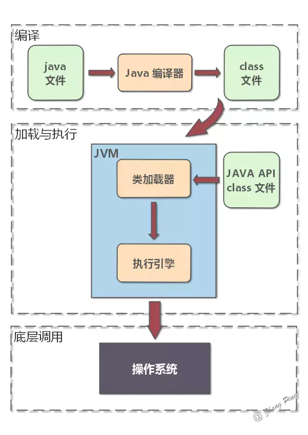

类加载的完整过程如下：
（1）在编译时，Java 编译器编译好 .java 文件之后，在磁盘中产生 .class 文件。.class 文件是二进制文件，内容是只有 JVM 能够识别的机器码。
（2）JVM 中的**类加载器**读取字节码文件，取出二进制数据，加载到内存中，解析.class 文件内的信息。类加载器会根据类的全限定名来获取此类的二进制字节流；然后，将字节流所代表的静态存储结构转化为方法区的运行时数据结构；接着，在内存中生成代表这个类的 java.lang.Class 对象。
（3）加载结束后，JVM 开始进行连接阶段（包含验证、准备、解析）。经过这一系列操作，类的变量会被初始化。

**要想使用反射，首先需要获得待操作的类所对应的 Class 对象。Java 中，无论生成某个类的多少个对象，这些对象都会对应于同一个 Class 对象。这个 Class 对象是由 JVM 生成的，通过它能够获悉整个类的结构。所以，java.lang.Class 可以视为所有反射 API 的入口点。**
**反射的本质就是：在运行时，把 Java 类中的各种成分映射成一个个的 Java 对象。**

## 1.2 Class类

### 1.2.1 Class类介绍

​        在面向对象的世界里，万物皆对象，对象是一个类的实例，所以**类是java.lang.Class类的实例对象**，而Class是所有类的类（This is a class named Class）,Class类是类类型，即类的类型。

​        对于普通的对象，我们都是直接通过new来创建一个对象。但是Class的对象是类，不能通过new来创建。

​        对于每个类而言，JRE都为其保留一个不变的Class类型的对象。一个Class对象包含了特定某个结构（class/interface/enum/annotation/primitive type/void/[])的有关信息。

### 1.2.2 Class类的常用方法

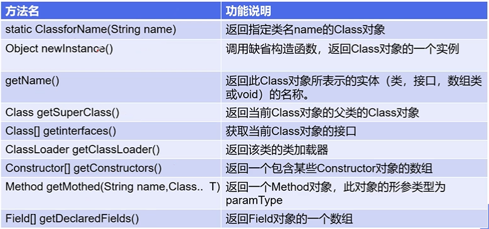

### 1.2.3 Class源码分析

```java
/*
     * Private constructor. Only the Java Virtual Machine creates Class objects.
     * This constructor is not used and prevents the default constructor being
     * generated.
     */
    private Class(ClassLoader loader) {
        // Initialize final field for classLoader.  The initialization value of non-null
        // prevents future JIT optimizations from assuming this final field is null.
        classLoader = loader;
    }

```

​       构造器是私有的，只有Java虚拟机（JVM）可以创建Class的对象，不能像普通类一样new一个Class对象。只能是通过已有的类来得到一个Class对象

### 1.2.4获取Class类的实例

​       每一种类型(如：String,Integer,Person...)都会在初次使用时被加载进虚拟机内存的『方法区』中，包含类中定义的属性字段，方法字节码等信息。Java 中使用类 java.lang.Class 来指向一个类型信息，**通过这个 Class 对象，我们就可以得到该类的所有内部信息**。

> Class没有公共构造方法。Class对象是在加载类时由Java虚拟机以及通过调用类加载器中的defineClass方法自动构造的。

获取一个 Class 对象的方法主要有以下几种：

- 若已知具体的类，通过类的class属性获取，该方法最为安全可靠，程序性能最高           

```java
    Class class=类名.class;
```

- 已知某个类的实例，调用该实例的getClass()方法获取Class对象

```java
   Class class=对象名.getClass();
```

- 已知一个类的全类名，且在该类的路径下，可通过Class类的静态方法forName()获取，可能抛出ClassNotFoundException

```java
    Class class=Class.forName("全类名");
```

- 内置基本数据类型可以直接用类名.Type

​        表格两边等价：

| boolean.class | Boolean.TYPE   |
| ------------- | -------------- |
| char.class    | Character.TYPE |
| byte.class    | Byte.TYPE      |
| short.class   | Short.TYPE     |
| int.class     | Integer.TYPE   |
| long.class    | Long.TYPE      |
| float.class   | Float.TYPE     |
| double.class  | Double.TYPE    |
| void.class    | Void.TYPE      |

这种方式最直接，但仅能获取到我已知的类的**Class对象**，也就是工程内用过的类的对象都可以通过类.class方式获取其Class对象，但是这种方式有一个**不足就是对于未知的类，或者说不可见的类是不能获取到其Class对象**的。

- 还可以利用ClassLoade

### 1.2.5哪些类型可以有Class对象？

- class：外部类、成员（成员内部类、静态内部类）、局部内部类、匿名内部类
- interface：接口
- []：数组
- enum：枚举
- annotation：注解@interface
- primitive type：基本数据类型
- void

### 1.2.6总结

- Class本身也是一个类
- Class对象只能由系统建立对象
- 一个加载的类在JVM中只会有一个Class实例
- 一个Class对象对应的是一个加载到JVM中的一个.class文件
- 通过Class可以完整地得到一个类中的所有被加载的结构
- Class类是Reflection的根源，针对任何你想动态加载、运行的类，唯有先获得相应的Class

## 1.3类加载器

### 1.3.1 Java内存分析

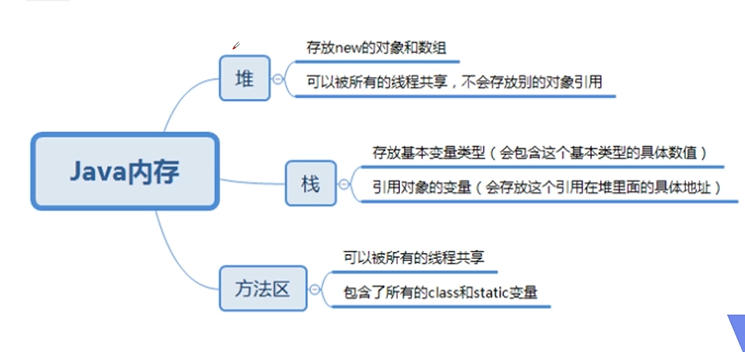


### 1.3.2类的加载过程

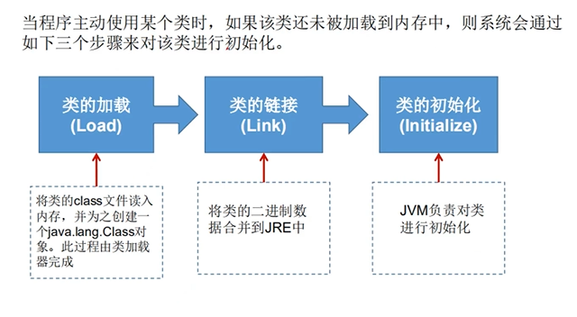

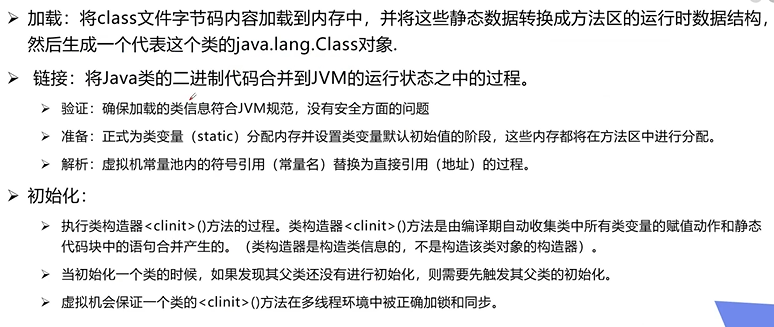

### 1.3.3什么时候会发生类的初始化

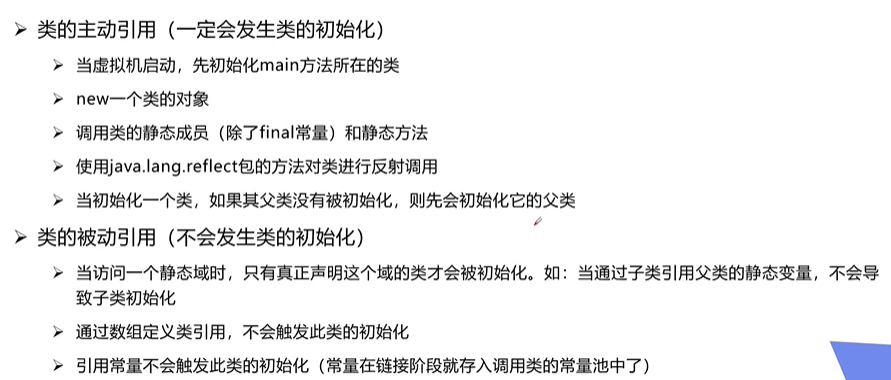


```java
public class test {
    static{
        System.out.println("Main类被加载");
    }
    public static void main(String[] args) throws ClassNotFoundException {
        /*
        //主动引用
        Son son=new Son();    //Main类被加载
                              //Father类被加载
                              //Son类被加载
        */

        /*
        //通过反射加载
       Class cl= Class.forName("com.kong.reflection.test01.Son");//Main类被加载
                                                                 //Father类被加载
                                                                 //Son类被加载
       */


       /*
       //子类引用父类的静态变量，不会导致子类初始化
        System.out.println(Son.a);  //Main类被加载
                                    //Father类被加载
                                    //100
       */


       /*
       //通过数组定义类引用，不会触发类的初始化
       Son[] sons=new Son[5];//Main类被加载
       */

        //引用常量不会触发类的初始化
        System.out.println(Son.M);//Main类被加载
                                  //2
    }
}

class Father{

    static int a=100;

    static{
        System.out.println("Father类被加载");
    }
}

class Son extends Father{
    static{
        System.out.println("Son类被加载");
        b=200;
    }
    static int b=100;
    static final int M=2;
}
```


### 1.3.4类加载器的作用

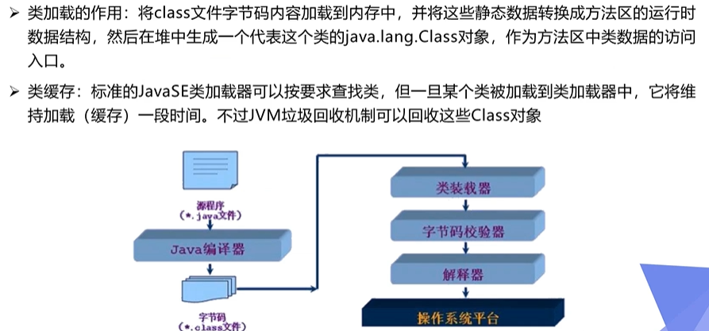


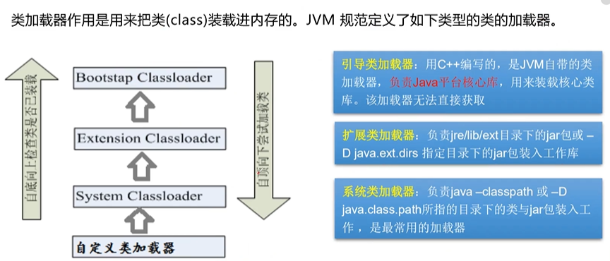


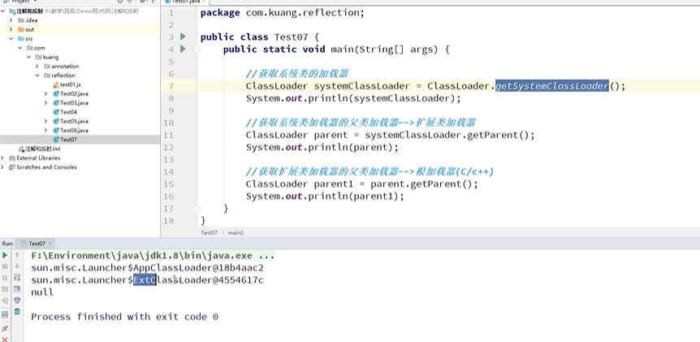

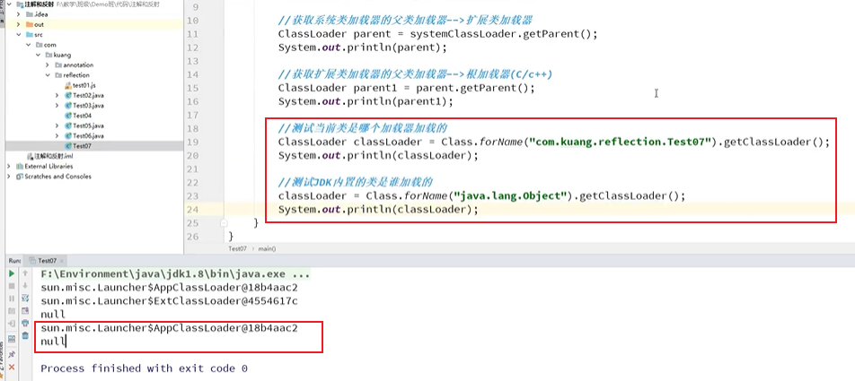


## 1.4判断是否为某个类的实例

- 用 instanceof 关键字
- 用 Class 对象的 isInstance 方法（Native 方法）

```java
public class InstanceofDemo {
    public static void main(String[] args) {
        ArrayList arrayList = new ArrayList();
        if (arrayList instanceof List) {
            System.out.println("ArrayList is List");
        }
        if (List.class.isInstance(arrayList)) {
            System.out.println("ArrayList is List");
        }
    }
}
//Output:
//ArrayList is List
//ArrayList is List
```

被不同加载器加载过的类不属于同一种类（即时包名、类名相同），所创建出的对象所属的类也不相同，如下：

```java
ClassLoader myLoader = new ClassLoader() {
            @Override
            public Class<?> loadClass(String name) throws ClassNotFoundException {
                try {
                    String fileName = name.substring(name.lastIndexOf(".") + 1) + ".class";
                    InputStream is = getClass().getResourceAsStream("./bean/" + fileName);
                    if (is == null) {
                        return super.loadClass(name);//返回父 类加载器
                    }
                    byte[] b = new byte[is.available()];
                    is.read(b);
                    return defineClass(name, b, 0, b.length);
                } catch (Exception e) {
                    throw new ClassNotFoundException();
                }
            }
        };

Object obj = null;
Class clz=myLoader.loadClass("eft.reflex.bean.Person");
System.out.println("person被自定义类加载器加载了");
obj = clz.newInstance();
System.out.println(obj instanceof Person);


运行结果：
person被自定义类加载器加载完成
person的静态块被调用了
false
```


## 1.5获取类的运行时结构

### 1.5.1获取类的名字

`Class` 对象提供以下方法获取对象的名字：

1. getName()：获得全类名（返回的是虚拟机里面的class的表示）
2. public String getCanonicalName()//获取类全路径名（返回的是更容易理解的表示）
3. getSimpleName()：获得类名(不包含包名)

### 1.5.2获取类的属性--Field

`Class` 对象提供以下方法获取对象的属性Field：

- `Field[] getFields()`：获得类中**所有public**变量，包含继承字段
- `Field[] getDeclaredFields()`：获得类中**所有访问权限**变量，不包括继承的字段
- `Field getField(String name)`：根据变量名得到对应的public变量，包含继承字段
- `Field getDeclaredField(String name)`：根据变量名获得对应的变量，**访问权限不限**，不包括继承的字段

> 注意： 1.getFields和getDeclaredFields获取的属性数组无序，所以不要通过索引来获取指定的属性        2.getXXXX 与getDeclaredXXXX 区别是，带Declared的方法不会返回父类成员，但会返回私有成员；不带Declared的方法恰好相反。

### 1.5.3获取类的方法--Method

`Class` 对象提供以下方法获取对象的方法（`Method`）：

- `Method[] getMethods()`：获得**子类及其父类的所有public**方法；

- `Method[] getDeclaredMethods()`：获得**本类的所有访问权限**的方法；

- `Method getMethod(String name, Class<?>... parameterTypes)`：根据方法签名获取类自身对应**public方法**，或者从基类继承和接口实现的对应**public方法**；

- `Method getDeclaredMethod(String name, Class<?>... parameterTypes)`：根据方法签名获得对应的**类自身声明方法**，**访问权限不限**；

获取一个 `Method` 对象后，可以用 `invoke` 方法来调用这个方法。

### 1.5.4获取类的构造方法--Constructor

`Class` 对象提供以下方法获取对象的构造方法（`Constructor`）：

- `Constructor[] getConstructors()`：获得**所有public**构造器；

- `Constructor[] getDeclaredConstructors()`：获得**本类所有访问权限**的构造器

- `Constructor getConstructor(Class<?>... parameterTypes)`：根据指定参数获得对应构造器；

- `Constructor getDeclaredConstructor(Class<?>... parameterTypes)`：根据指定参数获得对应构造器；

获取一个 `Constructor` 对象后，可以用 `newInstance` 方法来创建类实例。

## 1.6动态创建对象执行方法

### 1.6.1通过反射动态创建对象

创建类的对象：调用`Class对象`的`newInstance()`方法（默认调用无参构造方法）

- 必须有一个无参的构造器
- 要求被调用的构造函数是可见，否则会抛出IllegalAccessException xxx can not access a member of class eft.reflex.Singleton with modifiers "private"的异常

当把无参构造方法去掉时，程序运行时报错。怎样通过有参的构造器来创建对象？

只要在操作的时候明确调用类中的构造器，并将参数传递进去之后，才可以实例化。步骤如下：

1. 通过Class类的`getDeclaredConstructor(Class ... parameterTypes)`取得本类的指定形参类型的构造器
2. 通过Constructor实例化对象，调用Cosntructor的newInstance()方法，将参数传递进去

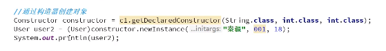

### 1.6.2通过反射调用指定方法

通过反射调用类中的方法，通过Method类完成

1. 通过Class类的getMethod(String name, Class<?>... parameterTypes)方法取得一个Method对象，并设置此方法操作时所需要的参数类型。
2. 之后使用Object invoke(Object obj,Object[] args)进行调用，并向方法中传递要设置的obj对象的参数信息。


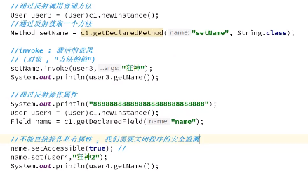

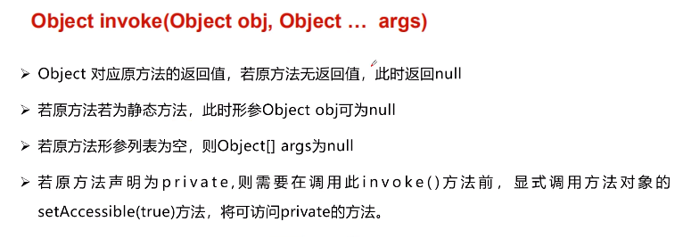


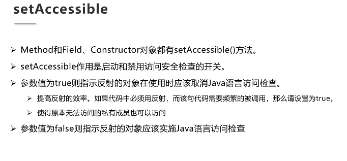

## 1.7反射源码与性能开销

## 1.8反射优缺点

## 1.9开发中使用反射的场景

## 1.10反射与内省


[https://juejin.im/post/5d4450fbe51d4561ce5a1be1#heading-30](https://juejin.im/post/5d4450fbe51d4561ce5a1be1#heading-30)

[https://juejin.im/post/5b7e708b51882542b83d70c9#heading-2](https://juejin.im/post/5b7e708b51882542b83d70c9#heading-2)

[https://juejin.im/post/598ea9116fb9a03c335a99a4#heading-4](https://juejin.im/post/598ea9116fb9a03c335a99a4#heading-4)


# 2.注解(Annotation)

## 2.1什么是注解

- JDK 5中引入了源代码中的注解（annotation）这一机制。注解使得Java源代码中不但可以包含功能性的实现代码，还可以添加元数据（matedata）。

- 注解的功能类似于代码中的注释，所不同的是**注解不是提供代码功能的说明，而是实现程序功能的重要组成部分。**

- Java注解已经在很多框架中得到了广泛的使用，用来简化程序中的配置。

- **注解的本质就是一个继承了 Annotation 接口的接口**

-  **一个注解准确意义上来说，只不过是一种特殊的注释而已，如果没有解析它的代码，它可能连注释都不如。**

- 解析一个类或者方法的注解往往有两种形式：一种是编译期直接的扫描，一种是运行期反射。

  ​        **编译期直接的扫描** - 编译器的扫描指的是编译器在对 java 代码编译字节码的过程中会检测到某个类或者方法被一些注解修饰，这时它就会对于这些注解进行某些处理。这种情况只适用于 JDK 内置的注解类。

  ​        **运行期的反射** - 如果要自定义注解，Java 编译器无法识别并处理这个注解，它只能根据该注解的作用范围来选择是否编译进字节码文件。如果要处理注解，必须利用反射技术，识别该注解以及它所携带的信息，然后做相应的处理。

### 2.1.1Annotation的作用

- 不是程序本身，可对程序做出解释
- **可以被其他程序（比如：编译器等）读取**

### 2.1.2Annotation的格式

​        注解是以“@注解名称”在代码中存在的，还可以添加一些参数值，例如:@SuppressWarnings(value="unchecked")

### 2.1.3Annotation在哪里使用

可以附加在package,class,method,field等上面，相当于给他们添加了额外的辅助信息，我们可以通过反射机制编程实现对这些元数据的访问

### 2.1.4注解分类


## 2.2内置注解

- 定义：即Java内部已经实现好的注解
- 类型：`Java`中 内置的注解有5类，具体包括：

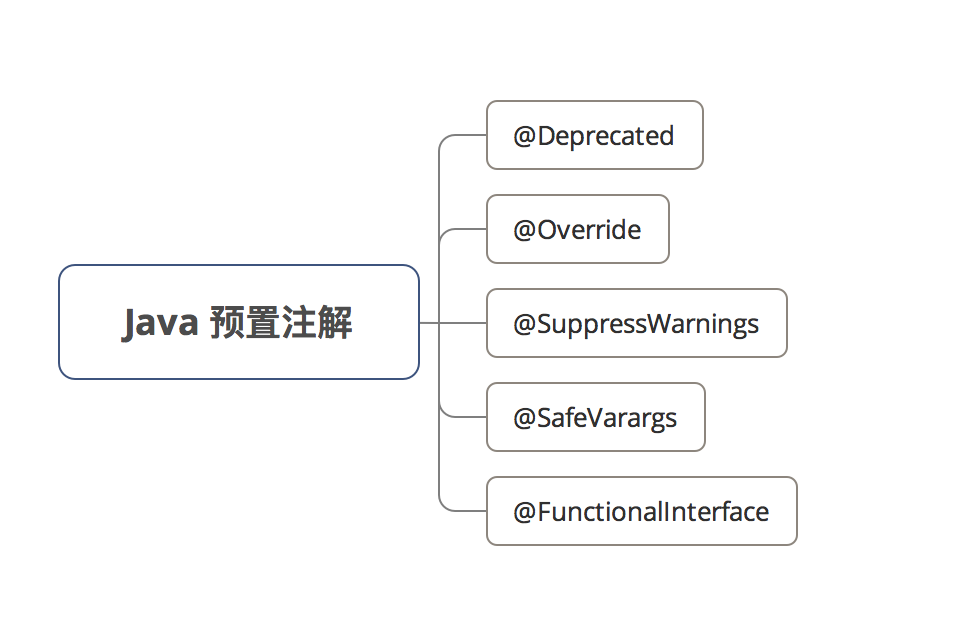

### 2.2.1@Deprecated

- 定义：过时注解，定义在java.lang.Deprecated中
- 作用：标记已过时 & 被抛弃的元素（类、方法、属性等），不鼓励程序员使用这样的角色，但可以被使用。
- 具体使用

```
// 用 注解@Deprecated 标记类中已过时的 方法Hello()
public class Buyer2   {

    @Deprecated
    public void Hello(){
        System.out.println("Hello 2015!");
    }
}
```

使用该类中被 `@Deprecated` 作用的方法时，`IDE`会提示该方法已过时 / 抛弃，该方法上出现划线。

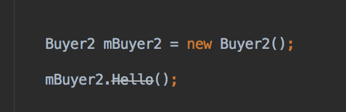


> 注意： `@Deprecated` 这个注解类型和 javadoc 中的 `@deprecated` 这个 tag 是有区别的：前者是 java 编译器识别的；而后者是被 javadoc 工具所识别用来生成文档（包含程序成员为什么已经过时、它应当如何被禁止或者替代的描述）。

### 2.2.2@Override

- 定义：重写注解，定义在java.lang.Override中
- 作用：只适用于修辞方法，标记该方法是重写父类的方法
- 具体使用

```
// UserDao 接口
public interface IUserDao {
	User loadUserByUsername(String username);
	// ...
}
// UserDao 实现类
public class UserDao implement IUserDao {
	@Override
	public User loadUserByUsername(String username) {
		// TODO: 
	}
	// ...
}
```


### 2.2.3@SuppressWarnings

- 定义：阻止警告注解，定义在java.lang.SuppressWarnings中
- 作用：标记的元素会阻止编译器发出警告提醒

> 主要应用于开发者需要忽略警告时

- 该注解需要添加一个参数才能正确使用，这些参数都是定义好的，我们可以直接拿来使用

​           @SuppressWarnings("all")

​           @SuppressWarnings("unchecked")

​           @SuppressWarnings(value={"unchecked","deprecation"})

​            等等......

参数说明：

1. `deprecation` ：使用了不赞成使用的类或方法时的警告；
2. `unchecked` ：执行了未检查的转换时的警告，例如当使用集合时没有用泛型 (Generics) 来指定集合保存的类型;
3. `fallthrough` ：当 Switch 程序块直接通往下一种情况而没有 Break 时的警告;
4. `path` ：在类路径、源文件路径等中有不存在的路径时的警告;
5. `serial` ：当在可序列化的类上缺少 serialVersionUID 定义时的警告;
6. `finally` ：任何 finally 子句不能正常完成时的警告;
7. `all` ：关于以上所有情况的警告。

### 2.2.4@SafeVarargs

- 定义：参数安全类型注解

> `Java` 1.7 后引入

- 作用：

  - 提醒开发者不要用参数做不安全的操作 & 阻止编译器产生 `unchecked`警告
  - **告诉编译器，在可变长参数中的泛型是类型安全的。可变长参数是使用数组存储的，而数组和泛型不能很好的混合使用。**简单的说，数组元素的数据类型在编译和运行时都是确定的，而泛型的数据类型只有在运行时才能确定下来。因此，当把一个泛型存储到数组中时，编译器在编译阶段无法确认数据类型是否匹配，因此会给出警告信息；即如果泛型的真实数据类型无法和参数数组的类型匹配，会导致 `ClassCastException` 异常。

  ```java
  public class SafeVarargsAnnotationDemo {
      /**
       * 此方法实际上并不安全，不使用此注解，编译时会告警
       */
      @SafeVarargs
      static void wrongMethod(List<String>... stringLists) {
          Object[] array = stringLists;
          List<Integer> tmpList = Arrays.asList(42);
          array[0] = tmpList; // 语法错误，但是编译不告警
          String s = stringLists[0].get(0); // 运行时报 ClassCastException
      }
  
      public static void main(String[] args) {
          List<String> list = new ArrayList<>();
          list.add("A");
          list.add("B");
  
          List<String> list2 = new ArrayList<>();
          list.add("1");
          list.add("2");
  
          wrongMethod(list, list2);
      }
  }
  
  ```

  以上代码，如果不使用 `@SafeVarargs` ，编译时会告警

  ```java
  [WARNING] /D:/Codes/ZP/Java/javacore/codes/basics/src/main/java/io/github/dunwu/javacore/annotation/SafeVarargsAnnotationDemo.java: 某些输入文件使用了未经检查或不安全的操作。
  [WARNING] /D:/Codes/ZP/Java/javacore/codes/basics/src/main/java/io/github/dunwu/javacore/annotation/SafeVarargsAnnotationDemo.java: 有关详细信息, 请使用 -Xlint:unchecked 重新编译。
  
  ```

  

- `@SafeVarargs` 注解使用范围：

  - `@SafeVarargs` 注解可以用于构造方法。
  - `@SafeVarargs` 注解可以用于 `static` 或 `final` 方法。

- 具体使用

```java
// 以下是官方例子
// 虽然编译阶段不报错，但运行时会抛出 ClassCastException 异常
// 所以该注解只是作提示作用，但是实际上还是要开发者自己处理问题
    @SafeVarargs // Not actually safe!
    static void m(List<String>... stringLists) {
    Object[] array = stringLists;
    List<Integer> tmpList = Arrays.asList(42);
    array[0] = tmpList; // Semantically invalid, but compiles without warnings
    String s = stringLists[0].get(0); // Oh no, ClassCastException at runtime!
}

```

### 2.2.5@FunctionalInterface

- 定义：函数式接口注解，**用于指示被修饰的接口是函数式接口。**

> `Java` 1.8 后引入的新特性
>
> 需要注意的是，如果一个接口符合"函数式接口"定义，不加 `@FunctionalInterface` 也没关系；但如果编写的不是函数式接口，却使用 `@FunctionInterface`，那么编译器会报错。

​        什么是函数式接口？

​        **函数式接口(Functional Interface)就是一个有且仅有一个抽象方法，但是可以有多个非抽象方法的接口**。函数式接口可以被隐式转换为 lambda 表达式。

> 函数式接口 (Functional Interface) = 1个具有1个方法的普通接口

​        函数式接口的特点：

​                接口有且只能有个一个抽象方法（抽象方法只有方法定义，没有方法体）。

​                不能在接口中覆写 Object 类中的 public 方法（写了编译器也会报错）。

​                允许有 default 实现方法。

- 作用：表示该接口 = 函数式接口

- 具体使用

```java
public class FunctionalInterfaceAnnotationDemo {

    @FunctionalInterface
    public interface Func1<T> {
        void printMessage(T message);
    }

    /**
     * @FunctionalInterface 修饰的接口中定义两个抽象方法，编译时会报错
     * @param <T>
     */
    /*@FunctionalInterface
    public interface Func2<T> {
        void printMessage(T message);
        void printMessage2(T message);
    }*/

    public static void main(String[] args) {
        Func1 func1 = message -> System.out.println(message);
        func1.printMessage("Hello");
        func1.printMessage(100);
    }
}

```

## 2.3元注解

- **元注解的作用就是用于定义其它的注解**，java定义了4个标准的meta-annotation类型，他们被用来提供对其他annotation类型说明。
- 这些类型和他们所支持的类在Java.lang.annotation中可以找到。

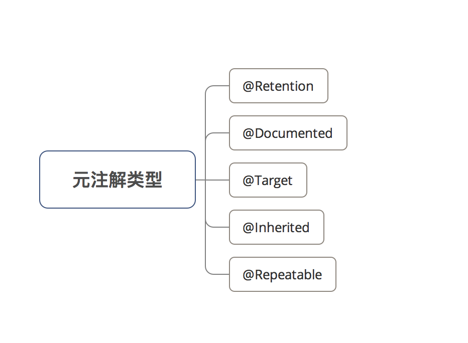

### 2.3.1@Retention

- `@Retention`保留注解，指明了注解的保留级别，用于描述注解的生命周期
- `@Retention` 源码

```java
@Documented
@Retention(RetentionPolicy.RUNTIME)
@Target(ElementType.ANNOTATION_TYPE)
public @interface Retention {
    RetentionPolicy value();
}

```

- `RetentionPolicy` 是一个枚举类型，它定义了被 `@Retention` 修饰的注解所支持的保留级别：

  - `RetentionPolicy.SOURCE` - 标记的注解仅在源文件中有效，编译器会忽略。
  - `RetentionPolicy.CLASS` - 标记的注解在 class 文件中有效，JVM 会忽略。
  - `RetentionPolicy.RUNTIME` - 标记的注解在运行时有效。

  **SOURCE<CLASS<RUNTIME**

### 2.3.2@Documented

[`@Documented`](https://docs.oracle.com/javase/8/docs/api/java/lang/annotation/Documented.html) java文档注解，说明该注解将被包含在javadoc中（默认情况下，注释不包含在 Javadoc 中）

### 2.3.3@Target

- `@Target`目标注解，指定注解可以修饰的元素类型。用于描述注解的使用范围
- `@Target` 源码

```java
@Documented
@Retention(RetentionPolicy.RUNTIME)
@Target(ElementType.ANNOTATION_TYPE)
public @interface Target {
    ElementType[] value();
}
```

- `ElementType` 是一个枚举类型，它定义了被 `@Target` 修饰的注解可以应用的范围：
  - `ElementType.ANNOTATION_TYPE` - 标记的注解可以应用于注解类型。
  - `ElementType.CONSTRUCTOR` - 标记的注解可以应用于构造函数。
  - `ElementType.FIELD` - 标记的注解可以应用于字段或属性。
  - `ElementType.LOCAL_VARIABLE` - 标记的注解可以应用于局部变量。
  - `ElementType.METHOD` - 标记的注解可以应用于方法。
  - `ElementType.PACKAGE` - 标记的注解可以应用于包声明。
  - `ElementType.PARAMETER` - 标记的注解可以应用于方法的参数。
  - `ElementType.TYPE` - 标记的注解可以应用于类的任何元素。

### 2.3.4@Inherited

`@Inherited`继承注解，表示注解类型可以被继承（子类可以继承父类中的该注解）。

表示自动继承注解类型。 如果注解类型声明中存在 `@Inherited` 元注解，则注解所修饰类的所有子类都将会继承此注解。

> 前提：子类没有被任何注解应用
>
> `@Inherited` 注解类型是被标注过的类的子类所继承。类并不从它所实现的接口继承注解，方法并不从它所覆写的方法继承注解。
>
> 此外，当 `@Inherited` 类型标注的注解的 `@Retention` 是 `RetentionPolicy.RUNTIME`，则反射 API 增强了这种继承性。如果我们使用 `java.lang.reflect` 去查询一个 `@Inherited` 类型的注解时，反射代码检查将展开工作：检查类和其父类，直到发现指定的注解类型被发现，或者到达类继承结构的顶层。

具体使用：

```java
// 元注解@Inherited 作用于 注解Carson_Annotation
@Inherited
public @interface Carson_Annotation {
}


// 注解Carson_Annotation 作用于A类
@Carson_Annotation
public class A {
  }

// B类继承了A类，即B类 = A类的子类，且B类没被任何注解应用
// 那么B类继承了A类的注解 Carson_Annotation
public class B extends A {}

```

### 2.3.5@Repeatable

- `@Repeatable`可重复注解，表示注解可以重复使用。

> `Java` 1.8后引进

- 作用：使得作用的注解可以取多个值
- 具体使用

```java
// 1. 定义 容器注解 @ 职业
public @interface Job {
    Person[]  value();
}
<-- 容器注解介绍 -->
// 定义：本身也是一个注解
// 作用：存放其它注解
// 具体使用：必须有一个 value 属性；类型 = 被 @Repeatable 注解的注解数组
// 如本例中，被 @Repeatable 作用 = @Person ，所以value属性 = Person []数组

// 2. 定义@Person 
// 3. 使用@Repeatable 注解 @Person
// 注：@Repeatable 括号中的类 = 容器注解
@Repeatable（Job.class）
public @interface Person{
    String role default "";
}

// 在使用@Person（被@Repeatable 注解 ）时，可以取多个值来解释Java代码
// 下面注解表示：Carson类即是产品经理，又是程序猿
@Person(role="coder")
@Person(role="PM")
public class Carson{

}

```


## 2.4自定义注解

使用 `@interface` 自定义注解时，自动继承了 `java.lang.annotation.Annotation` 接口，由编译程序自动完成其他细节。在定义注解时，不能继承其他的注解或接口。

- `@interface` 用来声明一个注解，其中的每一个方法实际上是声明了一个配置参数。方法的名称就是参数的名称，返回值类型就是参数的类型（返回值类型只能是基本类型、Class、String、enum）。
- 可以通过 `default` 来声明参数的默认值。

### 2.4.1注解格式

```java
public @interface 注解名 {注解属性}
```

具体使用：

```java
@Documented
@Target({ElementType.FIELD, ElementType.PARAMETER})
@Retention(RetentionPolicy.RUNTIME)
public @interface RegexValid {}
```

> 说明：
>
> - 上面的代码中定义了一个名为 `@RegexValid` 的注解。
> - `@Documented` 表示 `@RegexValid` 应该使用 javadoc。
> - `@Target({ElementType.FIELD, ElementType.PARAMETER})` 表示 `@RegexValid` 可以在类成员或方法参数上修饰。
> - @Retention(RetentionPolicy.RUNTIME) 表示 `@RegexValid` 在运行时有效。

此时，我们已经定义了一个没有任何属性的注解，如果到此为止，它仅仅是一个标记注解。作为正则工具，没有属性可什么也做不了。接下来，我们将为它添加注解属性。

### 2.4.2注解属性

```java
[访问级别修饰符] [数据类型] 名称() default 默认值;
```

例如，我们要定义在注解中定义一个名为 value 的字符串属性，其默认值为空字符串，访问级别为默认级别，那么应该定义如下：

```java
String value() default "";
```

> 注意：**在注解中，我们定义属性时，属性名后面需要加 `()`**。

定义注解属性有以下要点：

- 访问修饰符只能使用 `public` 或者 `default（默认的、友好的）`
- 返回值类型就是参数的类型且只能为 `八种基本数据类型` 、 `Class` 、 `String` 、 `Enum` 、`Annotations类型`以及上述类型所组成的 **数组**
- 通过 `default` 关键字声明参数的默认值。
- 如果只有一个参数成员最好命名为 `value()`,在使用注解时，指定的value的值可以不指定属性名称。
- 注解元素必须有确定的值，要么在定义注解元素时默认值指定，要么使用此注解时指定。非基本类型注解元素的值不可为 `null`

```java
/**
 * 基本的注解声明，只有一个属性
 */
public @interface AnnotationOne {
    String value() default "";
}

/**
 * 基本的注解使用
 */
@AnnotationOne("AnnotationOneTest")
public class AnnotationOneTest {
    
}
```


## 2.5获取注解信息

使用注解的过程中，很重要的一部分就是创建于使用注解处理器。JDK5 扩展了反射机制的 API，以帮助程序员快速的构造自定义注解处理器。

### 2.5.1注解处理器

**注解处理器类库（java.lang.reflect.AnnotatedElement）**

​       **`java.lang.annotation.Annotation` 是一个接口，程序可以通过反射来获取指定程序元素的注解对象，然后通过注解对象来获取注解里面的元数据**。

​        除此之外，Java 中支持**注解处理器接口 `java.lang.reflect.AnnotatedElement`** ，该接口代表程序中可以接受注解的程序元素，该接口主要有如下几个实现类：

- `Class` - 类定义
- `Constructor` - 构造器定义
- `Field` - 累的成员变量定义
- `Method` - 类的方法定义
- `Package` - 类的包定义

​       `java.lang.reflect` 包下主要包含一些实现反射功能的工具类。实际上，`java.lang.reflect` 包所有提供的反射 API 扩充了读取运行时注解信息的能力。当一个注解类型被定义为运行时的注解后，该注解才能是运行时可见，当 class 文件被装载时被保存在 class 文件中的注解才会被虚拟机读取。

​        `AnnotatedElement` 接口是所有程序元素（Class、Method 和 Constructor）的父接口，所以程序通过反射获取了某个类的`AnnotatedElement` 对象之后，程序就可以调用该对象的如下四个个方法来访问注解信息：

- `<T extends Annotation> T getAnnotation(Class<T> annotationClass)`: 返回改程序元素上存在的、指定类型的注解，如果该类型注解不存在，则返回null。
- `Annotation[] getAnnotations()`:返回该程序元素上存在的所有注解。
- `boolean isAnnotationPresent(Class<?extends Annotation> annotationClass)`:判断该程序元素上是否包含指定类型的注解，存在则返回true，否则返回false.
- `Annotation[] getDeclaredAnnotations()`：返回直接存在于此元素上的所有注释。与此接口中的其他方法不同，该方法将**忽略继承的注释**。（如果没有注释直接存在于此元素上，则返回长度为零的一个数组。）该方法的调用者可以随意修改返回的数组；这不会对其他调用者返回的数组产生任何影响。

### 2.5.2使用反射获取注解

```java
/***********注解声明***************/

/**
 * 水果名称注解
 *
 */
@Target(ElementType.FIELD)
@Retention(RetentionPolicy.RUNTIME)
@Documented
public @interface FruitName {
    String value() default "";
}

/**
 * 水果颜色注解
 *
 */
@Target(ElementType.FIELD)
@Retention(RetentionPolicy.RUNTIME)
@Documented
public @interface FruitColor {
    /**
     * 颜色枚举
     * @author peida
     *
     */
    public enum Color{ BULE,RED,GREEN};
    
    /**
     * 颜色属性
     * @return
     */
    Color fruitColor() default Color.GREEN;

}

/**
 * 水果供应者注解
 *
 */
@Target(ElementType.FIELD)
@Retention(RetentionPolicy.RUNTIME)
@Documented
public @interface FruitProvider {
    /**
     * 供应商编号
     * @return
     */
    public int id() default -1;
    
    /**
     * 供应商名称
     * @return
     */
    public String name() default "";
    
    /**
     * 供应商地址
     * @return
     */
    public String address() default "";
}

/***********注解使用***************/

public class Apple {
    
    @FruitName("Apple")
    private String appleName;
    
    @FruitColor(fruitColor=Color.RED)
    private String appleColor;
    
    @FruitProvider(id=1,name="陕西红富士集团",address="陕西省西安市延安路89号红富士大厦")
    private String appleProvider;
    
    public void setAppleColor(String appleColor) {
        this.appleColor = appleColor;
    }
    public String getAppleColor() {
        return appleColor;
    }
    
    public void setAppleName(String appleName) {
        this.appleName = appleName;
    }
    public String getAppleName() {
        return appleName;
    }
    
    public void setAppleProvider(String appleProvider) {
        this.appleProvider = appleProvider;
    }
    public String getAppleProvider() {
        return appleProvider;
    }
    
    public void displayName(){
        System.out.println("水果的名字是：苹果");
    }
}

/***********注解处理器***************/

public class FruitInfoUtil {
    public static void getFruitInfo(Class<?> clazz){
        
        String strFruitName=" 水果名称：";
        String strFruitColor=" 水果颜色：";
        String strFruitProvicer="供应商信息：";
        
        Field[] fields = clazz.getDeclaredFields();
        
        for(Field field :fields){
            if(field.isAnnotationPresent(FruitName.class)){
                FruitName fruitName = (FruitName) field.getAnnotation(FruitName.class);
                strFruitName=strFruitName+fruitName.value();
                System.out.println(strFruitName);
            }
            else if(field.isAnnotationPresent(FruitColor.class)){
                FruitColor fruitColor= (FruitColor) field.getAnnotation(FruitColor.class);
                strFruitColor=strFruitColor+fruitColor.fruitColor().toString();
                System.out.println(strFruitColor);
            }
            else if(field.isAnnotationPresent(FruitProvider.class)){
                FruitProvider fruitProvider= (FruitProvider) field.getAnnotation(FruitProvider.class);
                strFruitProvicer=" 供应商编号："+fruitProvider.id()+" 供应商名称："+fruitProvider.name()+" 供应商地址："+fruitProvider.address();
                System.out.println(strFruitProvicer);
            }
        }
    }
}

/***********输出结果***************/
public class FruitRun {

    /**
     * @param args
     */
    public static void main(String[] args) {
        
        FruitInfoUtil.getFruitInfo(Apple.class);
        
    }

}

====================================
 水果名称：Apple
 水果颜色：RED
 供应商编号：1 供应商名称：陕西红富士集团 供应商地址：陕西省西安市延安路89号红富士大厦
```


[https://www.cnblogs.com/peida/archive/2013/04/23/3036035.html](https://www.cnblogs.com/peida/archive/2013/04/23/3036035.html)

[https://juejin.im/post/5ca755676fb9a05e4868c973#heading-23](https://juejin.im/post/5ca755676fb9a05e4868c973#heading-23)


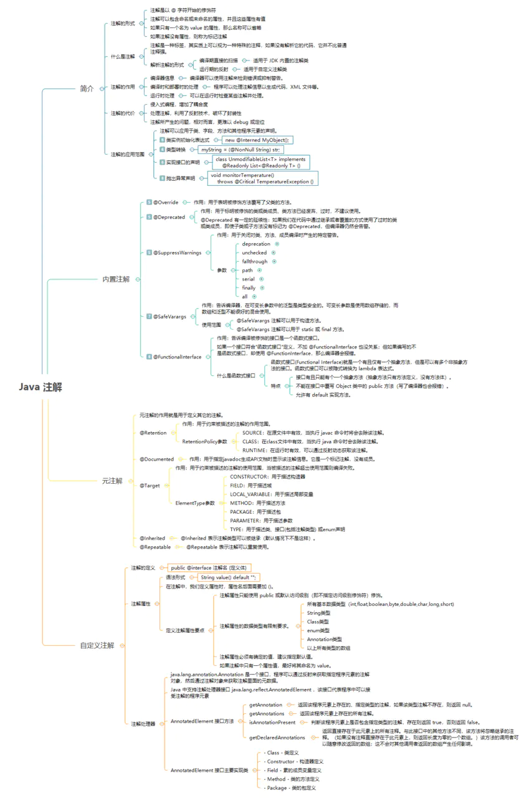


