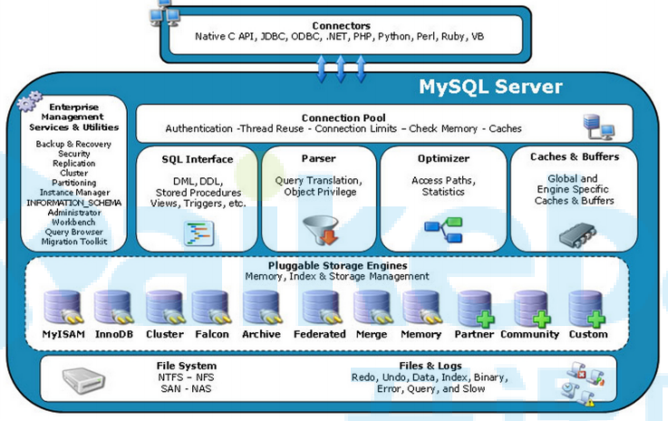

## 1.数据库和实例

- 数据库：物理操作系统文件或其他形式文件类型的集合。**在MySQL数据库中，数据库文件可以是frm、MYD、MYI、ibd结尾的文件**。当使用NDB引擎时，数据库的文件可能不是操作系统上的文件，而是存放于内存之中的文件，但是定义仍然不变。
- 实例：**MySQL数据库由后台线程以及一个共享内存区组成**。**共享内存可以被运行的后台线程所共享**。需要牢记的是，数据库实例才是真正用于操作数据库文件的。
- 这两个词有时可以互换使用，不过两者的概念完全不同。在MySQL数据库中，**实例与数据库的关通常系是一一对应的，即一个实例对应一个数据库，一个数据库对应一个实例**。但是，**在集群情况下可能存在一个数据库被多个数据实例使用的情况**。
- MySQL被设计为一个单进程多线程架构的数据库

## 2.MySQL存储引擎



## 3.MySQL体系结构


## 4.MySQLServier层对象


## 5.InnoDB存储引擎


## 6.文件

- MySQL是通过**文件系统对数据和索引进行存储的**。

- MySQL从物理结构上可以分为**日志文件和数据索引文件**。

#### 6.1日志文件

MySQL通过日志文件**记录了数据库操作信息和错误信息**。常用的日志文件包括**错误日志、二进制日志、查询日志、慢查询日志和事务Redo日志、中继日志**等。

可以通过命令查看当前数据库中的日志使用信息：

```mysql
mysql> show variables like 'log_%';
```

##### 6.1.1错误日志(errorlog)

- **默认是开启的，而且从5.5.7以后无法关闭错误日志**

- 错误日志对MySQL的启动、运行、关闭过程进行了记录

- 错误日志所记录的信息是可以通过**log_error和log_warnings**来定义的，其中log-err是定义是否启用错误日志的功能和错误日志的存储位置，log_warnings是定义是否将警告信息也定义至错误日志中。

  ```mysql
  #可以直接定义为文件路径，也可以为ON|OFF 
  log_error=/var/log/mysqld.log 
  #只能使用1|0来定义开关启动，默认是启动的 
  log_warings=1
  ```

- 通过命令`SHOW VARIABLES LIKE 'log_error'`来定位该文件，可以看到错误文件的路径和文件名，在默认情况下错误文件的文件名为服务器的主机名

##### 6.1.2二进制日志

- 默认是关闭的，需要通过以下配置进行开启。

  ```mysql
  log-bin=mysql-bin
  ```

- **二进制日志（binary log）记录了对MySQL数据库执行更改的所有操作，但是不包括SELECT和SHOW这类操作，因为这类操作对数据本身并没有修改**。然而，若操作本身并没有导致数据库发生变化，那么该操作可能也会写入二进制日志

- 通过命令SHOW BINLOG EVENT可以看出在二进制日志中的记录

- 

##### 6.1.3通用查询日志**（general query log）**

- **默认情况下通用查询日志是关闭的。**开启方式：

  ```
  #启动开关 
  general_log={ON|OFF} 
  #日志文件变量，而general_log_file如果没有指定，默认名是host_name.log general_log_file=/PATH/TO/file 
  #记录类型 
  log_output={TABLE|FILE|NONE}
  ```

- 查询日志记录了所有对MySQL数据库请求的信息，无论这些请求是否得到了正确的执行。默认文件名为：主机名.log

- 查看通用查询日志：`mysql> show global variables like 'general_log';` 

- 从MySQL 5.1开始，可以将查询日志的记录放入mysql架构下的general_log表中

##### 6.1.4慢查询日志**（slow query log）**

- **默认是关闭的**。需要通过以下设置进行开启：

  ```mysql
  #开启慢查询日志 
  slow_query_log=ON 
  #慢查询的阈值 
  long_query_time=10 
  #日志记录文件如果没有给出file_name值， 默认为主机名，后缀为-slow.log。如果给出了文件名， 但不是绝对路径名，文件则写入数据目录。 
  slow_query_log_file= file_name
  ```

- 慢查询日志（slow log）可帮助DBA定位可能存在问题的SQL语句，从而进行SQL语句层面的**优化**
- 可以在MySQL启动时设一个**阈值**，**将运行时间超过该值的所有SQL语句都记录到慢查询日志文件中**，该阈值可以通过参数`long_query_time`来设置，默认值为10，代表10秒。可通过该命令查看设置的时间：`show variables like 'long_query_time%';`。**但运行时间正好等于long_query_time的情况并不会被记录下**
- 查看是否开启了慢查询功能：`show variables like '%slow_query%';`
- 查询多少SQL超过了慢查询时间的阈值： `SHOW GLOBAL STATUS LIKE '%Slow_queries%';`

- MySQL 5.6.5版本开始新增了一个参数`log_throttle_queries_not_using_indexes`，**用来表示每分钟允许记录到slow log的且未使用索引的SQL语句次数**。该值默认为0，表示没有限制。

- 分析慢查询日志的工具

  使用`mysqldumpslow`工具，mysqldumpslow是MySQL自带的慢查询日志工具。可以使用mysqldumpslow工具搜索慢查询日志中的SQL语句。

  例如：得到按照时间排序的前10条里面含有左连接的查询语句：

  ```mysql
  [root@localhost mysql]# mysqldumpslow -s t -t 10 -g "left join" /var/lib/mysql/slow.log
  ```

  **常用参数说明：**

  -s：是表示按照何种方式排序

  > al 平均锁定时间
  >
  > ar 平均返回记录时间
  >
  > at 平均查询时间（默认）
  >
  > c 计数
  >
  > l 锁定时间
  >
  > r 返回记录
  >
  > t 查询时间

  -t：是top n的意思，即为返回前面多少条的数据

  -g：后边可以写一个正则匹配模式，大小写不敏感的

#### 6.2数据文件

- 查看MySQL数据文件

  ```sql
  SHOW VARIABLES LIKE '%datadir%';
  ```

- **InnoDB数据文件**

  > - .frm文件：主要存放与表相关的数据信息,主要包括表结构的定义信息
  >
  > - .ibd：使用独享表空间存储表数据和索引信息，一张表对应一个ibd文件。
  >
  > - ibdata文件：使用共享表空间存储表数据和索引信息，所有表共同使用一个或者多个ibdata文件。

- **MyIsam数据文件**

  > - .frm文件：主要存放与表相关的数据信息,主要包括表结构的定义信息
  >
  > - .myd文件：主要用来存储表数据信息。
  >
  > - .myi文件：主要用来存储表数据文件中任何索引的数据树。


