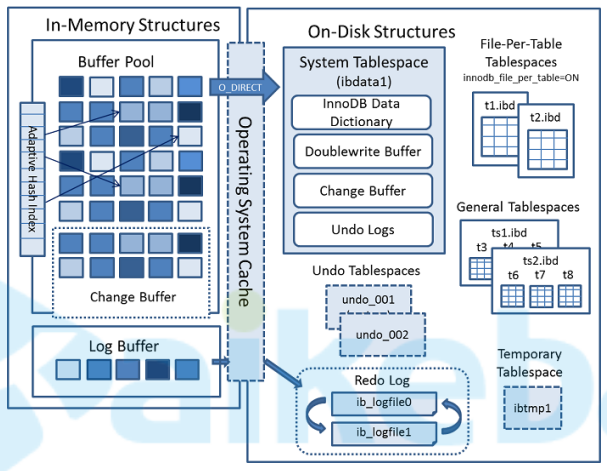
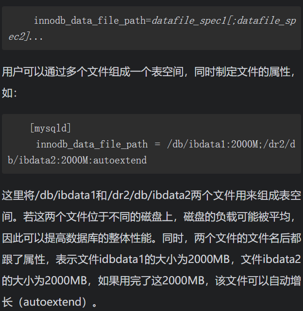
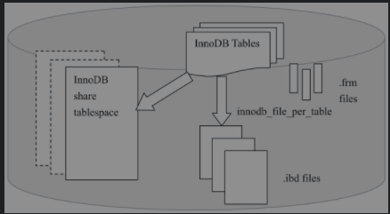
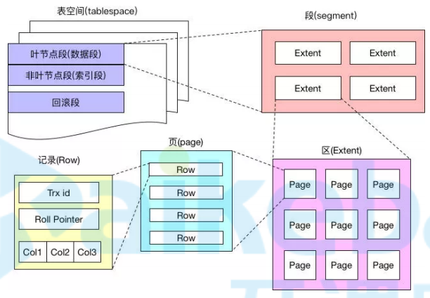
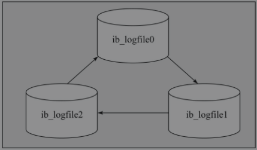
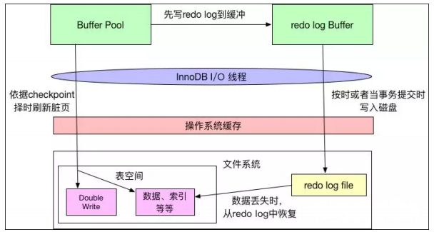
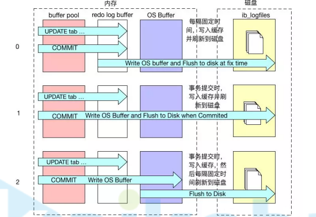
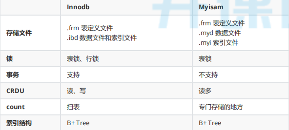

## 1.数据库和实例

- 数据库：物理操作系统文件或其他形式文件类型的集合。**在MySQL数据库中，数据库文件可以是frm、MYD、MYI、ibd结尾的文件**。当使用NDB引擎时，数据库的文件可能不是操作系统上的文件，而是存放于内存之中的文件，但是定义仍然不变。
- 实例：**MySQL数据库由后台线程以及一个共享内存区组成**。**共享内存可以被运行的后台线程所共享**。需要牢记的是，数据库实例才是真正用于操作数据库文件的。
- 这两个词有时可以互换使用，不过两者的概念完全不同。在MySQL数据库中，**实例与数据库的关通常系是一一对应的，即一个实例对应一个数据库，一个数据库对应一个实例**。但是，**在集群情况下可能存在一个数据库被多个数据实例使用的情况**。
- MySQL被设计为一个单进程多线程架构的数据库

## 2.MySQL存储引擎


## 3.MySQL体系结构


1. Connections：连接器
2. Management Serveices & Utilities：系统管理和控制工具
3. Connection Pool：连接池
4. SQL Interface：SQL接口
5. Parser：解析器
6. Optimizer：查询优化器
7. Cache和Buffer： 查询缓存
8. Pluggable Storage Engines：可插件式存储引擎

## 4.MySQLServier层对象

#### 4.1SQL语句执行流程


大体来说，MySQL 可以分为 **Server** **层**和**存储引擎层**两部分。

- **Server** **层**包括连接器、查询缓存、分析器、优化器、执行器等，涵盖 MySQL 的大多数核心服务功能，以及所有的内置函数（如日期、时间、数学和加密函数等），所有跨存储引擎的功能都在这一层实现，比如存储过程、触发器、视图等。

- **存储引擎层**负责数据的存储和提取，从 MySQL 5.5.5 版本开始InnoDB成为了默认存储引擎

- 不同的存储引擎共用一个**Server** **层**，也就是从连接器到执行器的部分


#### 4.2SQL语句执行顺序


## 5.InnoDB存储引擎

**5.1InnoDB架构图**



InnoDB存储引擎由**内存池，后台线程和磁盘文件**三大部分组成。

#### 5.2InnoDB磁盘文件

InnoDB磁盘文件包括系统表空间、用户表空间、Undo表空间、通用表空间、临时表空间、Redo日志文件。

##### 5.2.1表空间文件

表空间文件是用来管理InnoDB存储引擎的存储，分为共享表空间和独立表空间


- InnoDB采用将存储的数据按表空间（tablespace）进行存放的设计。在默认配置下会有一个初始大小为10MB，名为ibdata1的文件。该文件就是默认的表空间文件（tablespace file），用户可以通过参数innodb_data_file_path对其进行设置，格式为:

  

- 设置innodb_data_file_path参数后，所有基于InnoDB存储引擎的表的数据都会记录到该共享表空间中。**若设置了参数innodb_file_per_table，则用户可以将每个基于InnoDB存储引擎的表产生一个独立表空间**。独立表空间的命名规则为：表名.ibd。通过这样的方式，用户不用将所有数据都存放于默认的表空间中

  > 需要注意的是，这些单独的表空间文件仅存储该表的数据、索引和插入缓冲BITMAP等信息，其余信息还是存放在默认的表空间中

下图显示了InnoDB存储引擎对于文件的存储方式



##### 5.2.2InnoDB逻辑存储结构

InnoDB存储引擎逻辑存储结构可分为五级：表空间、段、区、页、行




##### 5.2.3重做日志文件


- 在默认情况下，在InnoDB存储引擎的数据目录下会有两个名为ib_logfile0和ib_logfile1的文件，这就是InnoDB的**重做日志文件(redo log file)**。它们记录了对于InnoDB存储引擎的事务日志

- 当实例或介质失败（media failure）时，重做日志文件就能派上用场。例如，数据库由于所在主机掉电导致实例失败，InnoDB存储引擎会使用重做日志恢复到掉电前的时刻，以此来保证数据的完整性。
- **每个InnoDB存储引擎至少有1个重做日志文件组（group），每个文件组下至少有2个重做日志文件**，如默认的ib_logfile0和ib_logfile1。为了得到更高的可靠性，用户可以设置多个的镜像日志组（mirrored log groups），将不同的文件组放在不同的磁盘上，以此提高重做日志的高可用性。

**重做日志文件的作用是什么？**

- 当InnoDB的数据存储文件发生错误时，重做日志文件就能派上用场。InnoDB存储引擎可以使用重做日志文件将数据恢复为正确状态，以此来保证数据的正确性和完整性。

- 为了得到更高的可靠性，用户可以设置多个镜像日志组，将不同的文件组放在不同的磁盘上，以此来提高重做日志的高可用性。

**重做日志文件组是如何写入数据的？**

在日志组中每个重做日志文件的大小一致，并以**循环写入的方式**运行。

InnoDB存储引擎先写重做日志文件1，当达到文件的最后时，会切换至重做日志文件2，再当重做日志文件2也被写满时，会再切换到重做日志文件1中



**重做日志文件使用的参数**

- innodb_log_file_size：指定每个重做日志文件的大小，在InnoDB1.2.x版本之前，重做日志文件总的大小不得大于等于4GB，而1.2.x版本将该限制扩大为了512GB。

-  innodb_log_files_in_group：指定了日志文件组中重做日志文件的数量，默认为2

- innodb_mirrored_log_groups：指定了日志镜像文件组的数量，默认为1，表示只有一个日志文件组，没有镜像。若磁盘本身已经做了高可用的方案，如磁盘阵列，那么可以不开启重做日志镜像的功能

- innodb_log_group_home_dir：指定了日志文件组所在路径，默认为./，表示在MySQL数据库的数据目录下

通过命令`show variables like 'innodb%log%'`来查看上述命令的值

**如何设置重做日志文件大小？**

重做日志文件的大小设置对于InnoDB存储引擎的性能有着非常大的影响。

- 一方面重做日志文件不能设置得太大，如果设置得很大，在恢复时可能需要很长的时间；

- 另一方面又不能设置得太小了，否则可能导致一个事务的日志需要多次切换重做日志文件。此外，重做日志文件太小会导致频繁地发生asynccheckpoint，导致性能的抖动

#### 5.3InnoDB内存结构


##### 5.3.1缓冲池（Buffer Pool）


##### 5.3.2额外内存池（Addtional memory pool)


##### 5.3.3重做日志缓冲区（Redo log Buffer)



- InnoDB在缓冲池中变更数据时，会首先将相关变更写入重做日志缓冲中，然后再按时或者当事务提交时写入磁盘，这符合Force-log-at-commit原则；
- 当重做日志写入磁盘后，缓冲池中的变更数据才会依据checkpoint机制择时写入到磁盘中，这符 合WAL原则。 
- 在checkpoint择时机制中，就有重做日志文件写满的判断，所以，如前文所述，如果重做日志文件太小，经常被写满，就会频繁导致checkpoint将更改的数据写入磁盘，导致性能抖动。
- 操作系统的文件系统是带有缓存的，当InnoDB向磁盘写入数据时，有可能只是写入到了文件系统的缓存中，没有真正的“落袋为安”。

InnoDB的`innodb_flush_log_at_trx_commit`属性可以控制每次事务提交时InnoDB的行为。

- 当属性值为0时，**事务提交时，不会对重做日志进行写入操作，而是等待主线程按时写入每秒写入一次；**

- 当属性值为1时，**事务提交时，会将重做日志写入文件系统缓存，并且调用文件系统的fsync，将文件系统缓冲中的数据真正写入磁盘存储，确保不会出现数据丢失；**

- 当属性值为2时，**事务提交时，也会将日志文件写入文件系统缓存，但是不会调用fsync，而是让文件系统自己去判断何时将缓存写入磁盘。**

  > innodb_flush_log_at_trx_commit是InnoDB性能调优的一个基础参数，涉及InnoDB的写入效率和数据安全。当参数值为0时，写入效率最高，但是数据安全最低；参数值为1时，写入效率最低，但是数据安全最高；参数值为2时，二者都是中等水平。一般建议将该属性值设置为1，以获得较高的数据安全性，而且也只有设置为1，才能保证事务的持久性。

日志的刷盘机制如下图所示：



##### 5.3.4内存数据落盘

- InnoDB内存缓冲池中的数据page要完成持久化的话，是通过两个流程来完成的，**一个是脏页落盘；一个是预写redo log日志。**

- **当缓冲池中的页的版本比磁盘要新时，数据库需要将新版本的页从缓冲池刷新到磁盘。**但是如果每次一个页发送变化，就进行刷新，那么性能开发是非常大的，于是InnoDB采用了**Write Ahead Log（WAL）策略和Force Log at Commit**机制实现事务级别下数据的持久性。

- WAL要求数据的变更写入到磁盘前，首先必须将内存中的日志写入到磁盘；

- Force-log-at-commit要求当一个事务提交时，所有产生的日志都必须刷新到磁盘上，如果日志刷新成功后，缓冲池中的数据刷新到磁盘前数据库发生了宕机，那么重启时，数据库可以从日志中恢复数据。

- 为了确保每次日志都写入到重做日志文件，在每次将重做日志缓冲写入重做日志后，必须调用一次**fsync**操作，将缓冲文件从文件系统缓存中真正写入磁盘。

###### 5.3.4.1脏页落盘

- 在数据库中进行**读取操作**，将从磁盘中读到的页放在缓冲池中，下次再读相同的页时，首先判断该页是否在缓冲池中。若在缓冲池中，称该页在缓冲池中被命中，直接读取该页。否则，读取磁盘上的页。

- 对于数据库中页的**修改操作**，则首先修改在缓冲池中的页，然后再以一定的频率刷新到磁盘上。页从缓冲池刷新回磁盘的操作并不是在每次页发生更新时触发，而是通过一种称为**CheckPoint的机制**刷新回磁盘。

###### 5.3.4.2重做日志落盘


##### 5.3.5CheckPoint检查点机制


##### 5.3.6双写（Double Write）


InnoDB和MyISAM存储引擎区别：




## 6.文件

- MySQL是通过**文件系统对数据和索引进行存储的**。

- MySQL从物理结构上可以分为**日志文件和数据索引文件**。

#### 6.1日志文件

MySQL通过日志文件**记录了数据库操作信息和错误信息**。常用的日志文件包括**错误日志、二进制日志、查询日志、慢查询日志和事务Redo日志、中继日志**等。

可以通过命令查看当前数据库中的日志使用信息：

```mysql
mysql> show variables like 'log_%';
```

##### 6.1.1错误日志(errorlog)

- **默认是开启的，而且从5.5.7以后无法关闭错误日志**

- 错误日志对MySQL的启动、运行、关闭过程进行了记录

- 错误日志所记录的信息是可以通过**log_error和log_warnings**来定义的，其中log-err是定义是否启用错误日志的功能和错误日志的存储位置，log_warnings是定义是否将警告信息也定义至错误日志中。

  ```mysql
  #可以直接定义为文件路径，也可以为ON|OFF 
  log_error=/var/log/mysqld.log 
  #只能使用1|0来定义开关启动，默认是启动的 
  log_warings=1
  ```

- 通过命令`SHOW VARIABLES LIKE 'log_error'`来定位该文件，可以看到错误文件的路径和文件名，在默认情况下错误文件的文件名为服务器的主机名

##### 6.1.2二进制日志

- 默认是关闭的，需要通过以下配置进行开启。

  ```mysql
  log-bin=mysql-bin
  ```

- **二进制日志（binary log）记录了对MySQL数据库执行更改的所有操作，但是不包括SELECT和SHOW这类操作，因为这类操作对数据本身并没有修改**。然而，若操作本身并没有导致数据库发生变化，那么该操作可能也会写入二进制日志

- 通过命令SHOW BINLOG EVENT可以看出在二进制日志中的记录

- 

**二进制日志与重做日志的区别**

##### 6.1.3通用查询日志**（general query log）**

- **默认情况下通用查询日志是关闭的。**开启方式：

  ```
  #启动开关 
  general_log={ON|OFF} 
  #日志文件变量，而general_log_file如果没有指定，默认名是host_name.log general_log_file=/PATH/TO/file 
  #记录类型 
  log_output={TABLE|FILE|NONE}
  ```

- 查询日志记录了所有对MySQL数据库请求的信息，无论这些请求是否得到了正确的执行。默认文件名为：主机名.log

- 查看通用查询日志：`mysql> show global variables like 'general_log';` 

- 从MySQL 5.1开始，可以将查询日志的记录放入mysql架构下的general_log表中

##### 6.1.4慢查询日志**（slow query log）**

- **默认是关闭的**。需要通过以下设置进行开启：

  ```mysql
  #开启慢查询日志 
  slow_query_log=ON 
  #慢查询的阈值 
  long_query_time=10 
  #日志记录文件如果没有给出file_name值， 默认为主机名，后缀为-slow.log。如果给出了文件名， 但不是绝对路径名，文件则写入数据目录。 
  slow_query_log_file= file_name
  ```

- 慢查询日志（slow log）可帮助DBA定位可能存在问题的SQL语句，从而进行SQL语句层面的**优化**
- 可以在MySQL启动时设一个**阈值**，**将运行时间超过该值的所有SQL语句都记录到慢查询日志文件中**，该阈值可以通过参数`long_query_time`来设置，默认值为10，代表10秒。可通过该命令查看设置的时间：`show variables like 'long_query_time%';`。**但运行时间正好等于long_query_time的情况并不会被记录下**
- 查看是否开启了慢查询功能：`show variables like '%slow_query%';`
- 查询多少SQL超过了慢查询时间的阈值： `SHOW GLOBAL STATUS LIKE '%Slow_queries%';`

- MySQL 5.6.5版本开始新增了一个参数`log_throttle_queries_not_using_indexes`，**用来表示每分钟允许记录到slow log的且未使用索引的SQL语句次数**。该值默认为0，表示没有限制。

- 分析慢查询日志的工具

  使用`mysqldumpslow`工具，mysqldumpslow是MySQL自带的慢查询日志工具。可以使用mysqldumpslow工具搜索慢查询日志中的SQL语句。

  例如：得到按照时间排序的前10条里面含有左连接的查询语句：

  ```mysql
  [root@localhost mysql]# mysqldumpslow -s t -t 10 -g "left join" /var/lib/mysql/slow.log
  ```

  **常用参数说明：**

  -s：是表示按照何种方式排序

  > al 平均锁定时间
  >
  > ar 平均返回记录时间
  >
  > at 平均查询时间（默认）
  >
  > c 计数
  >
  > l 锁定时间
  >
  > r 返回记录
  >
  > t 查询时间

  -t：是top n的意思，即为返回前面多少条的数据

  -g：后边可以写一个正则匹配模式，大小写不敏感的

#### 6.2数据文件

- 查看MySQL数据文件

  ```sql
  SHOW VARIABLES LIKE '%datadir%';
  ```

- **InnoDB数据文件**

  > - .frm文件：主要存放与表相关的数据信息,主要包括表结构的定义信息
  >
  > - .ibd：使用独享表空间存储表数据和索引信息，一张表对应一个ibd文件。
  >
  > - ibdata文件：使用共享表空间存储表数据和索引信息，所有表共同使用一个或者多个ibdata文件。

- **MyIsam数据文件**

  > - .frm文件：主要存放与表相关的数据信息,主要包括表结构的定义信息
  >
  > - .myd文件：主要用来存储表数据信息。
  >
  > - .myi文件：主要用来存储表数据文件中任何索引的数据树。


