# Spring Boot笔记

## 1.SpringBoot入门

#### 1.1 Spring Boot简介

#### 1.2 Spring Boot工程的创建

#### 1.3 容器功能

##### 1.3.1 添加组件

1. @Configuration

   表示当前类为一个 配置类，等同于spring的bean.xml文件

   例如：将两个实体类Pet、User注入到spring容器中

   - spring做法：在resources下创建一个xml文件，文件内容如下

     ```xml
     <?xml version="1.0" encoding="UTF-8"?>
     <beans xmlns="http://www.springframework.org/schema/beans"
            xmlns:xsi="http://www.w3.org/2001/XMLSchema-instance"
            xsi:schemaLocation="http://www.springframework.org/schema/beans http://www.springframework.org/schema/beans/spring-beans.xsd">
     
         <bean id="user" class="com.kyn.pojo.User">
             <property name="name" value="zhangsan"></property>
             <property name="age" value="18"></property>
         </bean>
     
         <bean id="pet" class="com.kyn.pojo.Pet">
             <property name="name" value="小黄"></property>
             <property name="color" value="blue"></property>
          </bean>
     
     </beans>
     ```

   - springBoot做法：无需配置文件，直接创建一个类，在该类上使用@Configuration注解，该注解表示该类是一个配置类。在配置类中通过方法+@Bean注解的方式将组件添加到spring容器中。

     ```java
     package com.kyn.conf;
     
     import com.kyn.pojo.Pet;
     import com.kyn.pojo.User;
     import org.springframework.context.annotation.Bean;
     import org.springframework.context.annotation.Configuration;
     
     @Configuration  //等同于bean的xml配置文件
     public class MyConfig {
     
         @Bean  //等同于配置文件中的bean标签，方法名作为组件的id，返回的值就是组件在容器中的实例
         public User user(){
             return new User("zhangsan",18);
         }
     
         @Bean
         public Pet pet(){
             return new Pet("小黄","blue");
         }
     }
     ```

     > 说明：
     >
     > 1. spring容器中的组件默认是单实例的
     > 2. @Configuration标注的配置类本身也是组件       
     > 3. spring boot5.2之后，Configuration注解中添加了属性proxyBeanMethods

   - proxyBeanMethods属性

     用来指定@Bean注解标注的方法是否使用代理；

     proxyBeanMethods属性默认值是true，也就是说该配置类会被代理（CGLIB），**在同一个配置文件中调用其它被@Bean注解标注的方法获取对象时首先会检查spring容器中是否又该组件，有则直接从IOC容器之中获取，无论调用多少次，都是同一个对象；**

     如果设置为false,也就是不使用注解，**无需检查spring容器，每次调用@Bean标注的方法获取到的对象和IOC容器中的都不一样，是一个新的对象**，所以我们可以将此属性设置为false来提高性能；

   - 底层配置模式：**Full模式与Lite模式**

     - Full（proxyBeanMethods=true）：配置类组件之间有依赖关系，方法会被调用得到之前单实例组件，用Full模式
     - Lite（proxyBeanMethods=false）：配置 类组件之间无依赖关系用Lite模式加速容器启动过程，减少判断

     

2. @Bean、@Component、@Controller、@Service、@Repository

   

3. @ComponentScan、@Import

   - @Import：向容器中导入组件，该注解只能标注在类上并此类必须在spring 容器中。

   ​                           默认组件的名字是全类名

4. @Conditional

   条件装配，是Spring4新提供的注解，它的作用是按照一定的条件进行判断，满足条件才给容器注册bean。

   可以标注在类上或者方法中
   
   该注解包含如下派生注解，（使用时使用派生注解）
   
   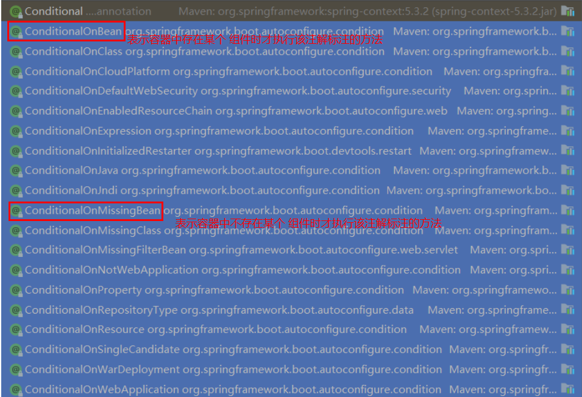

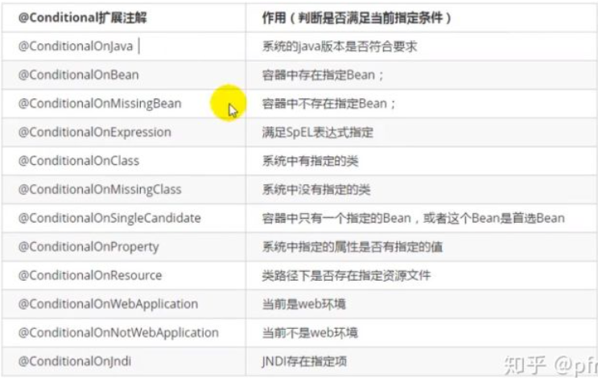

##### 1.3.2 原生配置文件引入

1. @ImportResource

   导入beans.xml配置文件，并将组件注入到容器中

##### 1.3.3 配置绑定

如何使用Java读取到properties或者yml文件中的内容，并且把它封装到JavaBean中，以供随时使用；

1. spring做法：

   ```java
   public class getProperties {
        public static void main(String[] args) throws FileNotFoundException, IOException      {
            Properties pps = new Properties();
            pps.load(new FileInputStream("a.properties"));
            Enumeration enum1 = pps.propertyNames();//得到配置文件的名字
            while(enum1.hasMoreElements()) {
                String strKey = (String) enum1.nextElement();
                String strValue = pps.getProperty(strKey);
                System.out.println(strKey + "=" + strValue);
                //封装到JavaBean。
            }
        }
    }
   ```

2. springboot做法：

   - 方法一：在需绑定参数的类上加@ConfigurationProperties

     - 在编写项目代码时，我们要求更灵活的配置，更好的模块化整合。在 Spring Boot 项目中，为满足以上要求，我们将大量的参数配置在 application.properties 或 application.yml 文件中，通过 `@ConfigurationProperties` 注解，我们可以方便的获取这些参数值

     - **只有容器中有的方法才能使用该注解**

     - 需指定一个前缀prefix

       ```java
       @ConfigurationProperties(prefix = "pet")
       public class Pet {
           private String name;
           private String color;
           
           .........
       }
       ```

       ```yaml
       #yml配置文件
       pet:
         name: aa
         color: blue
       ```

     - 可以用在类上也可以用在方法上

     - 类的字段必须有公共 setter 方法
     - 根据 Spring Boot 宽松的绑定规则，**类的属性名称必须与外部属性的名称匹配**
     - 前缀定义了哪些外部属性将绑定到类的字段上

   - 方法二：在配置类上使用@EnableConfigurationProperties("XXX.class") + 在需绑定参数的类上使用@ConfigurationProperties

     - @EnableConfigurationProperties：开启属性配置功能

     - `@EnableConfigurationProperties("XXX.class")`：表示开启XXX类的属性配置，也表示把XXX自动注册到spring容器中
     - 实体类无需注册到spring容器中

#### 1.4 自动配置原理

##### 1.4.1 引导加载自动配置类

打开启动类的@SpringBootApplication 注解源码。

```java
@Target({ElementType.TYPE})
@Retention(RetentionPolicy.RUNTIME)
@Documented
@Inherited
@SpringBootConfiguration
@EnableAutoConfiguration
@ComponentScan(
    excludeFilters = {@Filter(
    type = FilterType.CUSTOM,
    classes = {TypeExcludeFilter.class}
), @Filter(
    type = FilterType.CUSTOM,
    classes = {AutoConfigurationExcludeFilter.class}
)}
)
public @interface SpringBootApplication {
    ..............
}
```

1. 前四个是专门（即只能）用于对注解进行注解的，称为元注解

2. @SpringBootConfiguration

   查看该注解的源码注解可知，该注解与@Configuration 注解功能相同，仅表示当前类为一个 JavaConfig 类，其就是为 Spring Boot 专门创建的一个注解。

   ```java
   @Target({ElementType.TYPE})
   @Retention(RetentionPolicy.RUNTIME)
   @Documented
   @Configuration
   public @interface SpringBootConfiguration {
       @AliasFor(
           annotation = Configuration.class
       )
       boolean proxyBeanMethods() default true;
   }
   ```

3. @ComponentScan

   用于完成组件扫描。不过需要注意，其仅仅是指定了要扫描的包，并没有装配其中的类，这个真正装配这些类是@EnableAutoConfiguration 完成的

4. @EnableAutoConfiguration

   

##### 1.4.2 按需开启自动配置项


##### 1.4.3 修改默认配置


## 2.SpringBoot基础配置

## 3.模板引擎—Thymeleaf


## 4.Spring Boot整合Web开发

#### 4.1 静态资源配置

##### 4.1.1 静态资源访问

- 默认情况下，静态资源放在类路径下：`/static` ( or `/public` or `/resources` or `/META-INF/resources`可以通过`http://ip:端口号+当前项目根路径(/)+静态资源名`直接访问到

- 通过如下配置可以为静态资源添加访问前缀

  ```yaml
  spring:
    mvc:
      static-path-pattern: /img/**
  ```

  访问地址：`http://ip:端口号+当前项目根路径(/)+img/静态资源名`

- 修改静态资源默认路径

  ```yaml
  spring:
    web:
      resources:
        static-locations: classpath:/image/
  ```

  访问地址：`http://ip:端口号+当前项目根路径(/)+静态资源名`

##### 4.1.2 静态资源配置原理

springboot的所有的自动配置都在spring-boot-autoconfigure包中

SpringBoot启动默认加载  xxxAutoConfiguration 类（自动配置类）

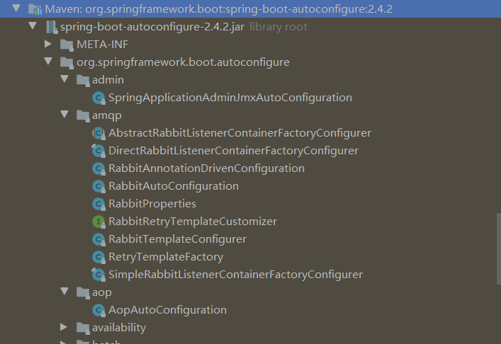

SpringMVC功能的自动配置类 WebMvcAutoConfiguration

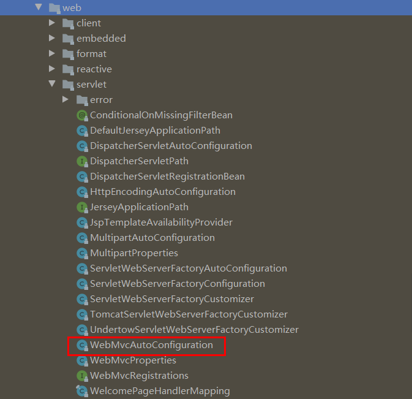

在WebMvcAutoConfiguration自动配置类中包含一个内部静态类，该类是一个配置类，开启了WebMvcProperties、ResourceProperties的属性配置

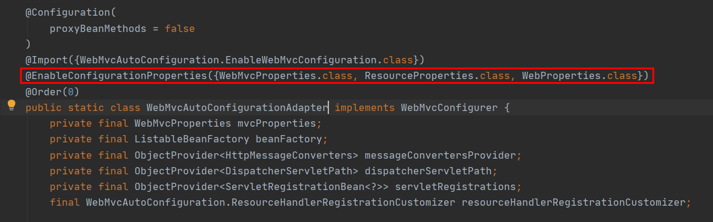

```java
//WebMvcAutoConfigurationAdapter配置类只有一个有参构造器，有参构造器所有参数的值都会从容器中确定
//ResourceProperties resourceProperties；获取和spring.resources绑定的所有的值的对象
//WebMvcProperties mvcProperties 获取和spring.mvc绑定的所有的值的对象
//ListableBeanFactory beanFactory Spring的beanFactory
//HttpMessageConverters 找到所有的HttpMessageConverters
//ResourceHandlerRegistrationCustomizer 找到 资源处理器的自定义器。
//DispatcherServletPath  
//ServletRegistrationBean   给应用注册Servlet、Filter....
	public WebMvcAutoConfigurationAdapter(ResourceProperties resourceProperties, WebMvcProperties mvcProperties,
				ListableBeanFactory beanFactory, ObjectProvider<HttpMessageConverters> messageConvertersProvider,
				ObjectProvider<ResourceHandlerRegistrationCustomizer> resourceHandlerRegistrationCustomizerProvider,
				ObjectProvider<DispatcherServletPath> dispatcherServletPath,
				ObjectProvider<ServletRegistrationBean<?>> servletRegistrations) {
			this.resourceProperties = resourceProperties;
			this.mvcProperties = mvcProperties;
			this.beanFactory = beanFactory;
			this.messageConvertersProvider = messageConvertersProvider;
			this.resourceHandlerRegistrationCustomizer = resourceHandlerRegistrationCustomizerProvider.getIfAvailable();
			this.dispatcherServletPath = dispatcherServletPath;
			this.servletRegistrations = servletRegistrations;
		}
```

1、资源处理的默认规则

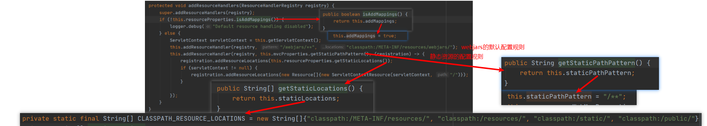

通过如下配置可以禁用所有静态资源规则

```
spring:
  resources:
    add-mappings: false   
```

2、欢迎页的默认规则

```java
	HandlerMapping：处理器映射。保存了每一个Handler能处理哪些请求。	

	@Bean
		public WelcomePageHandlerMapping welcomePageHandlerMapping(ApplicationContext applicationContext,
				FormattingConversionService mvcConversionService, ResourceUrlProvider mvcResourceUrlProvider) {
			WelcomePageHandlerMapping welcomePageHandlerMapping = new WelcomePageHandlerMapping(
					new TemplateAvailabilityProviders(applicationContext), applicationContext, getWelcomePage(),
					this.mvcProperties.getStaticPathPattern());
			welcomePageHandlerMapping.setInterceptors(getInterceptors(mvcConversionService, mvcResourceUrlProvider));
			welcomePageHandlerMapping.setCorsConfigurations(getCorsConfigurations());
			return welcomePageHandlerMapping;
		}


```

```java
	WelcomePageHandlerMapping(TemplateAvailabilityProviders templateAvailabilityProviders,
			ApplicationContext applicationContext, Optional<Resource> welcomePage, String staticPathPattern) {
		if (welcomePage.isPresent() && "/**".equals(staticPathPattern)) {
            //要用欢迎页功能，必须是/**
			logger.info("Adding welcome page: " + welcomePage.get());
			setRootViewName("forward:index.html");
		}
		else if (welcomeTemplateExists(templateAvailabilityProviders, applicationContext)) {
            // 调用Controller  /index
			logger.info("Adding welcome page template: index");
			setRootViewName("index");
		}
	}
```

#### 4.2 请求参数处理

##### 4.2.1 请求映射

1、rest使用与原理


2、请求映射原理


4.2.2 

#### 4.3 数据响应与内容协商


#### 4.4 拦截器

​        在非Spring Boot工程中若要使用SpringMVC的拦截器，在定义好拦截器后，需要在Spring配置文件中对其进行注册。但 Spring Boot 工程中没有了 Spring 配置文件，那么如何使用拦截器呢？

​        Spring Boot 对于原来在配置文件配置的内容，现在全部体现在一个类中，该类需要继承自WebMvcConfigurationSupport 类，并使用@Configuration 进行注解，表示该类为一个JavaConfig 类，其充当配置文件的角色。

##### 4.41 操作步骤

以登录为例

1、定义一个拦截器，实现HandlerInterceptor

```java
@Component
public class LoginInterceptor implements HandlerInterceptor {

    //目标方法执行之前
    @Override
    public boolean preHandle(HttpServletRequest request, HttpServletResponse response, Object handler) throws Exception {
        //检查是否登录
        HttpSession session=request.getSession();
        Object loginUser=session.getAttribute("loginUser");
        if(loginUser!=null){
            //放行
            return true;
        }
        //拦截住
        return false;
    }

    //目标方法执行之后
    @Override
    public void postHandle(HttpServletRequest request, HttpServletResponse response, Object handler, ModelAndView modelAndView) throws Exception {

    }

    //页面渲染以后
    @Override
    public void afterCompletion(HttpServletRequest request, HttpServletResponse response, Object handler, Exception ex) throws Exception {

    }
}
```

2、编写配置类（所有web操作都需实现WebMvcConfigure接口）

```java
@Configuration
public class AdminWebConfig implements WebMvcConfigurer {

    @Override
    public void addInterceptors(InterceptorRegistry registry) {
        registry.addInterceptor(new LoginInterceptor())
                .addPathPatterns("/**")  //所有请求都被拦截包括静态资源
                .excludePathPatterns("/","/login","/css/**","/fonts/**","/images/**","/js/**"); //放行的请求
    }
}

```

3、编写处理器

```java
@Controller
public class LoginController {

    @GetMapping("/login")
    public String loginPage(){
        return "login";
    }

    @PostMapping("/login")
    public String main(User user, HttpSession session, Model model){
        if(StringUtils.hasLength(user.getName())){
            session.setAttribute("loginUser",user);
            return "main";
        }
        model.addAttribute("msg","用户名错误");
        return "login";
    }
}

```

##### 4.4.2 拦截器原理


#### 4.5 过滤器


#### 4.6 文件上传


#### 4.7 异常处理


#### 4.8 Web原生组件注入


#### 4.9 嵌入式Servlet容器


#### 4.10 定制化原理


## 5.Spring Boot整合持久层技术

#### 5.1 整合JdbcTemplate

JdbcTemplate是Spring提供的一套JDBC模板框架，利用AOP技术来解决直接使用JDBC时大量重复代码的问题。JdbcTemplate虽然没有MyBatis那么灵活，但是比直接使用JDBC要方便很多。**Spring Boot中对JdbcTemplate的使用提供了自动化配置类JdbcTemplateAutoConfiguration**

##### 5.1.1 数据源的自动配置

1. 导入JDBC场景

   ```java
    <dependency>
        <groupId>org.springframework.boot</groupId>
        <artifactId>spring-boot-starter-data-jdbc</artifactId>
   </dependency>
   ```

   ​	导入JDBC后，一些有关的依赖自动导入：

   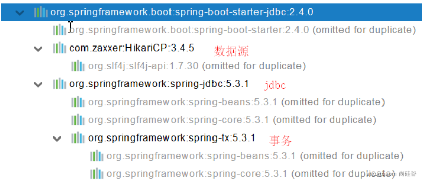

   **分析自动配置类**

   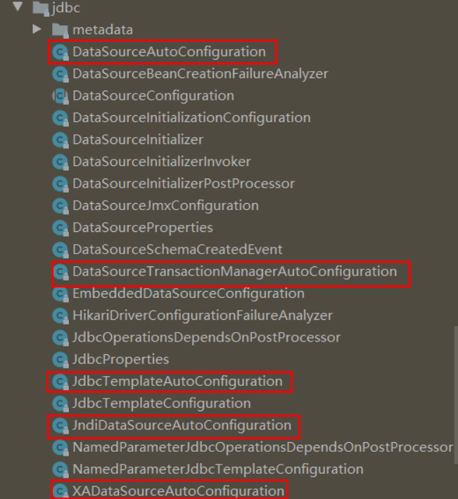

   

   - DataSourceAutoConfiguration：数据源的自动配置

     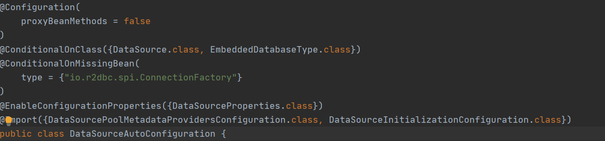

     

     - 打开DataSourceProperties

     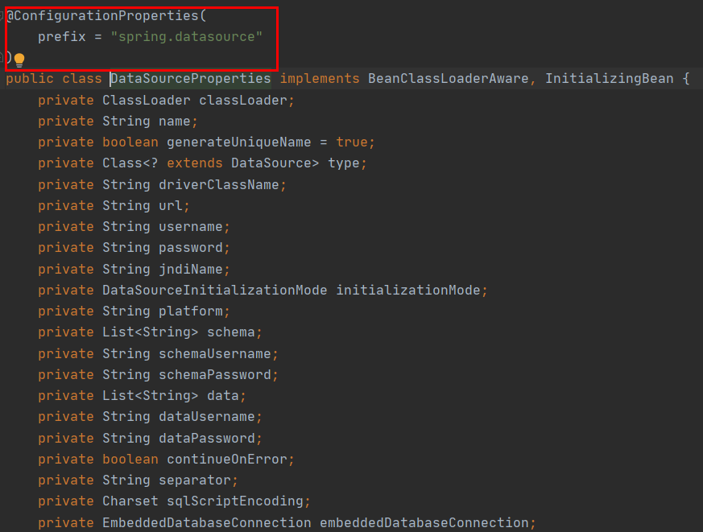

     > 修改数据源相关的配置，可以通过**spring.datasource**前缀指定属性修改

     - **数据库连接池的配置，是自己容器中没有DataSource才自动配置的**

       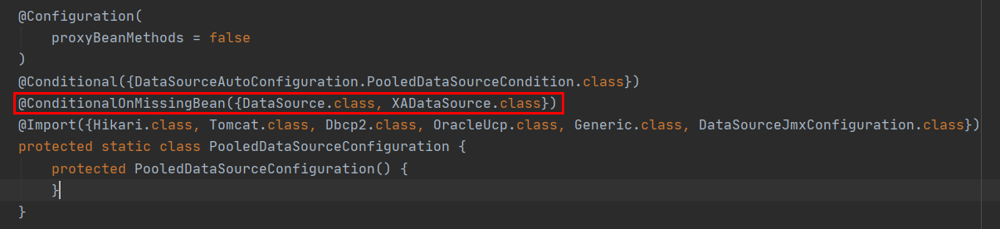

     - 底层配置好的连接池是：**HikariDataSource**

   - DataSourceTransactionManagerAutoConfiguration： 事务管理器的自动配置

   - JdbcTemplateAutoConfiguration： **JdbcTemplate的自动配置，可以来对数据库进行crud**

     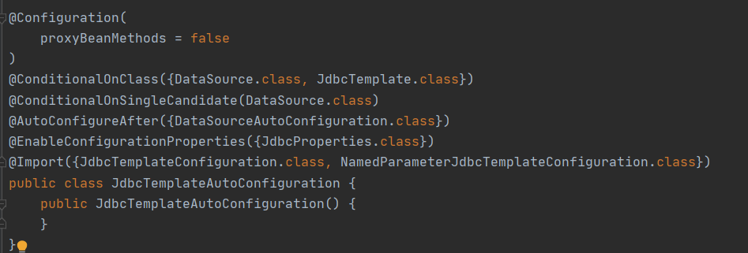

   - > 当classpath下存在DataSource和JdbcTemplate并且DataSource只有一个实例时，自动配置才会生效

   - 

   - 打开JdbcProperties。

   - 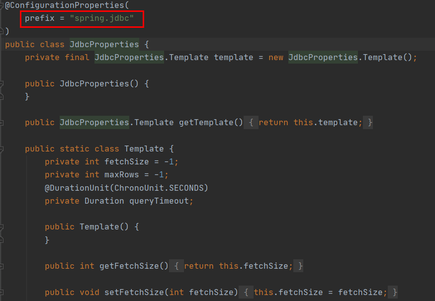

   - > 可以修改这个配置项@ConfigurationProperties(prefix = **"spring.jdbc"**) 来修改JdbcTemplate

   - 

   - - @Bean@Primary   JdbcTemplate；容器中有这个组件

       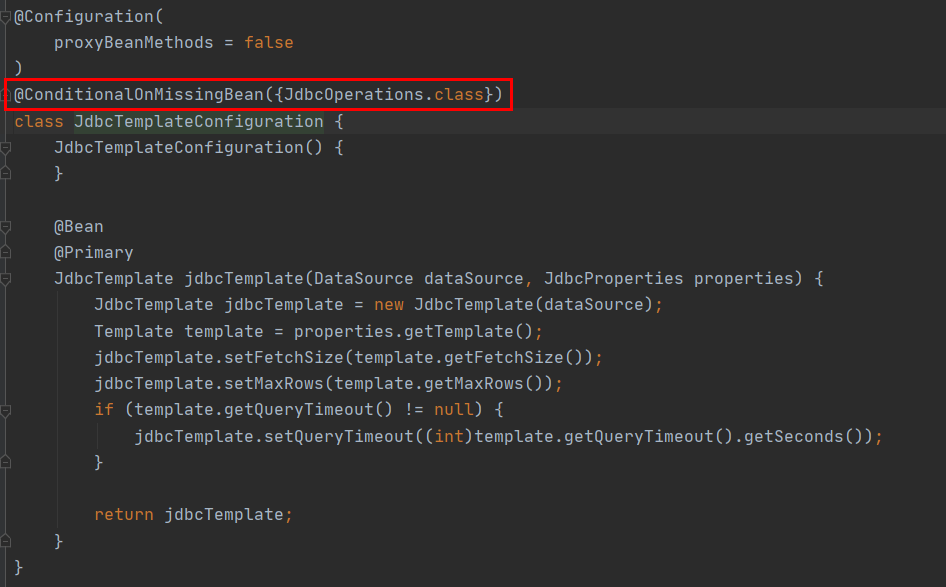

       > 若开发者没有提供JdbcOperations，则Spring Boot会自动向容器中注入一个JdbcTemplate（JdbcTemplate是JdbcOperations的子类）

   由此可以看到，开发者想要使用JdbcTemplate，只需要提供JdbcTemplate的依赖和DataSource依赖即可

   

   - JndiDataSourceAutoConfiguration： jndi的自动配置
   - XADataSourceAutoConfiguration： 分布式事务相关的

2. 导入数据库驱动依赖

   在jdbc依赖中我们发现官方并没有为我们导入数据库驱动，为什么导入JDBC场景，官方不导入驱动？因为官方不知道我们接下要操作什么数据库。

   ```java
   默认版本：<mysql.version>8.0.22</mysql.version>
   
           <dependency>
               <groupId>mysql</groupId>
               <artifactId>mysql-connector-java</artifactId>
               <!--<version>5.1.49</version>-->
           </dependency>
   想要修改版本
   1、直接依赖引入具体版本（maven的就近依赖原则）
   2、重新声明版本（maven的属性的就近优先原则）
       <properties>
           <java.version>1.8</java.version>
           <mysql.version>5.1.49</mysql.version>
       </properties>
   ```

3. 添加数据库配置项

   ```java
   spring:
     datasource:
       url: jdbc:mysql://localhost:3306/test?characterEncoding=utf-8&useSSL=false
       username: root
       password: 123456
       driver-class-name: com.mysql.jdbc.Driver
   #    type: com.zaxxer.hikari.HikariDataSource
   ```

   

4. 创建实体类

   ```java
   package com.kyn.pojo;
   
   public class User {
       private String name;
       private int age;
       
       //省略getter/setter
   }
   ```

5.  创建数据库访问层

   ```java
   @Repository
   public class UserDao {
   
       @Autowired
       JdbcTemplate jdbcTemplate;
   
       public int addUser(User user){
           return jdbcTemplate.update("insert into userinfo(name,age) values(?,?) ",
                                     user.getName(),user.getAge());
       }
   
       public User getUserByName(String name){
           return jdbcTemplate.queryForObject("select * from userinfo where name=?",
                                              new BeanPropertyRowMapper<>(User.class),name);
       }
   
       public List<User> getAllBooks(){
           return jdbcTemplate.query("select * from userinfo"
                                           ,new BeanPropertyRowMapper(User.class));
       }
   
   }
   ```

   > 代码解释：
   >
   > - 创建BookDao，注入JdbcTemplate。由于已经添加了spring-jdbc相关的依赖，JdbcTemplate会被自动注册到Spring容器中，因此这里可以直接注入JdbcTemplate使用。
   >
   > - 在JdbcTemplate中，增删改三种类型的操作主要使用update和batchUpdate方法来完成。query和queryForObject方法主要用来完成查询功能。另外，还有execute方法可以用来执行任意的SQL、call方法用来调用存储过程等。
   >
   > - 在执行查询操作时，需要有一个RowMapper将查询出来的列和实体类中的属性一一对应起来。如果列名和属性名都是相同的，那么可以直接使用BeanPropertyRowMapper；如果列名和属性名不同，就需要开发者自己实现RowMapper接口，将列和实体类属性一一对应起来。

6. 创建Service和Controller

   ```java
   @Service
   public class UserService {
   
       @Autowired
       UserDao userDao;
   
       public int addUser(User user){
           return userDao.addUser(user);
       }
   
       public User getUserByName(String name){
           return userDao.getUserByName(name);
       }
   
       public List<User> getAllUser(){
           return userDao.getAllBooks();
       }
   
   }
   
   
   ```

   ```java
   @RestController
   public class UserController {
   
       @Autowired
       UserService userService;
   
       @RequestMapping("/add")
       public String addUser(){
           User user=new User("李四",18);
           int res=userService.addUser(user);
           if(res>0) {
               return "添加成功";
           }
           return "添加失败";
       }
   
       @RequestMapping("getUser")
       public User getUserByName(){
           return userService.getUserByName("张三");
       }
   
       @RequestMapping("/getAllUser")
       public List<User> getAllUser(){
           return userService.getAllUser();
       }
   }
   ```

7. 测试

##### 5.1.2 使用Druid数据源

druid官方github地址：https://github.com/alibaba/druid

整合第三方技术的两种方式

- 自定义
- 找starter

###### 1、自定义方式

> 注：本节代码是在上一节代码上进行修改的

1. 导入依赖

   ```java
   <dependency>
       <groupId>com.alibaba</groupId>
       <artifactId>druid</artifactId>
       <version>1.1.17</version>
   </dependency>
   ```

2. 创建数据源

   创建配置类MyDataSourceConfig，将数据源添加到容器中

   ```java
   @Configuration
   public class MyDataSourceConfig {
   
       @Bean
       @ConfigurationProperties(prefix = "spring.datasource")  //将DataSource中属性与配置文件进行绑定
       public DataSource dataSource(){
           return new DruidDataSource();
       }
   }
   ```

3. 测试

**Druid数据源的其他功能**

1. 查看Druid的内置监控界面

   在配置类中添加如下内容

   ```java
   @Bean
       public ServletRegistrationBean statViewServlet(){
           StatViewServlet statViewServlet=new StatViewServlet();
           ServletRegistrationBean<StatViewServlet> registrationBean=new ServletRegistrationBean<>(statViewServlet,"/druid/*");
           return registrationBean;
       }
   ```

   启动springboot，进入浏览器访问http://localhost:8080/druid

   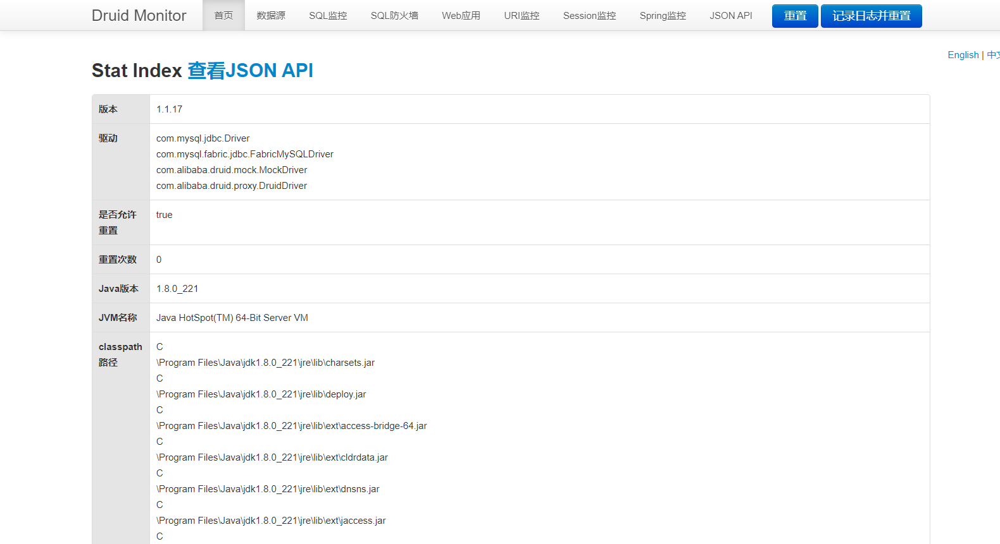

2. 打开Druid的监控统计功能，查看SQL监控

   修改配置类数据源配置方法，配置_StatFilter

   ```java
   @Bean
   @ConfigurationProperties(prefix = "spring.datasource")  //将DataSource中属性与配置文件进行绑定
   public DataSource dataSource() throws SQLException {
       DruidDataSource druidDataSource=new DruidDataSource();
       //配置SQL监控功能
       druidDataSource.setFilters("stat");
       return druidDataSource;
   }
   ```

   测试

   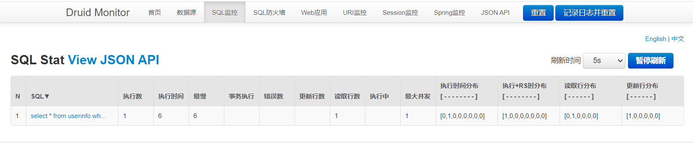

3. Web关联监控配置，查看Web应用和URI监控

   在配置类中添加如下内容

   ```java
   @Bean
       public FilterRegistrationBean webStatFilter(){
           WebStatFilter webStatFilter=new WebStatFilter();
           FilterRegistrationBean<WebStatFilter> registrationBean=new FilterRegistrationBean<WebStatFilter>(webStatFilter);
           registrationBean.setUrlPatterns(Arrays.asList("/*"));
           registrationBean.addInitParameter("exclusions","*.js,*.gif,*.jpg,*.png,*.css,*.ico,/druid/*");
           return registrationBean;
       }
   ```

   

4. 等等，其他的可参考官方文档：https://github.com/alibaba/druid/wiki/%E5%B8%B8%E8%A7%81%E9%97%AE%E9%A2%98

###### 2、使用官方starter方式

1. 引入druid-starter

   ```java
           <dependency>
               <groupId>com.alibaba</groupId>
               <artifactId>druid-spring-boot-starter</artifactId>
               <version>1.1.17</version>
           </dependency>
   ```

   **分析自动配置**

   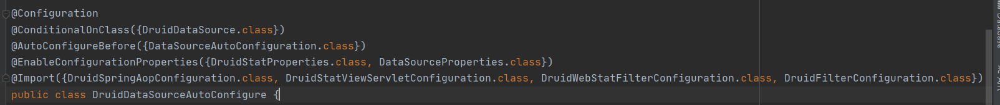

   - 扩展配置项 **spring.datasource.druid**
   - DruidSpringAopConfiguration.**class**,  监控SpringBean的；配置项：**spring.datasource.druid.aop-patterns**
   - DruidStatViewServletConfiguration.**class**, 监控页的配置：**spring.datasource.druid.stat-view-servlet；默认开启**
   -  DruidWebStatFilterConfiguration.**class**, web监控配置；**spring.datasource.druid.web-stat-filter；默认开启**
   - DruidFilterConfiguration.**class**}) 所有Druid自己filter的配置

   ```java
       private static final String FILTER_STAT_PREFIX = "spring.datasource.druid.filter.stat";
       private static final String FILTER_CONFIG_PREFIX = "spring.datasource.druid.filter.config";
       private static final String FILTER_ENCODING_PREFIX = "spring.datasource.druid.filter.encoding";
       private static final String FILTER_SLF4J_PREFIX = "spring.datasource.druid.filter.slf4j";
       private static final String FILTER_LOG4J_PREFIX = "spring.datasource.druid.filter.log4j";
       private static final String FILTER_LOG4J2_PREFIX = "spring.datasource.druid.filter.log4j2";
       private static final String FILTER_COMMONS_LOG_PREFIX = "spring.datasource.druid.filter.commons-log";
       private static final String FILTER_WALL_PREFIX = "spring.datasource.druid.filter.wall";
   ```

   

2. 添加配置

   ```yaml
   spring:
     datasource:
       url: jdbc:mysql://localhost:3306/db_account
       username: root
       password: 123456
       driver-class-name: com.mysql.jdbc.Driver
   
       druid:
         aop-patterns: com.atguigu.admin.*  #监控SpringBean
         filters: stat,wall     # 底层开启功能，stat（sql监控），wall（防火墙）
   
         stat-view-servlet:   # 配置监控页功能
           enabled: true    #druid提供的功能默认是关闭的，使用时先打开
           login-username: admin
           login-password: admin
           resetEnable: false
   
         web-stat-filter:  # 监控web
           enabled: true
           urlPattern: /*
           exclusions: '*.js,*.gif,*.jpg,*.png,*.css,*.ico,/druid/*'
   
   
         filter:
           stat:    # 对上面filters里面的stat的详细配置
             slow-sql-millis: 1000
             logSlowSql: true
             enabled: true
           wall:
             enabled: true
             config:
               drop-table-allow: false
   ```

#### 5.2 整合MyBatis 

https://github.com/mybatis

SpringBoot官方的Starter：spring-boot-starter-*

第三方的： *-spring-boot-starter

导入依赖

```java
<dependency>
    <groupId>org.mybatis.spring.boot</groupId>
    <artifactId>mybatis-spring-boot-starter</artifactId>
    <version>2.1.4</version>
</dependency>
```

##### 5.2.1 配置模式

在application.xml添加mybatis配置规则

```
#mybatis配置规则
mybatis:
  #全局配置文件位置，可以不写，所有配置都在这里配置
  #config-location: classpath:com/mybatis-config.xml
  #mapper映射文件位置(包名应与XXXMapper类所在包名相同，否则会报BindingException）
  mapper-locations: classpth:com/kyn/mapper/*.xml
```

创建xxMapper.xml和xxMapper类，xxMapper.xml在resources下，并与xxMapper所在包名相同

```xml
<?xml version="1.0" encoding="UTF-8" ?>
<!DOCTYPE mapper
        PUBLIC "-//mybatis.org//DTD Mapper 3.0//EN"
        "http://mybatis.org/dtd/mybatis-3-mapper.dtd">
<mapper namespace="com.kyn.mapper.UserMapper">
    <select id="getUser" resultType="com.kyn.pojo.User">
        select * from userinfo where name=#{name}
    </select>
</mapper>
```

```java
package com.kyn.mapper;

import com.kyn.pojo.User;
import org.apache.ibatis.annotations.Mapper;
import org.springframework.stereotype.Component;

@Mapper
public interface UserMapper {

    public User getUser(String name);
}

```

编写service和controller

```java
@Service
public class UserService {

    @Autowired
    UserMapper userMapper;

    public User getUser(String name){
        return userMapper.getUser(name);
    }

}
```

```

@RestController
public class UserController {

    @Autowired
    UserService userService;

    @GetMapping("/user")
    public User getUser(@RequestParam("name") String name){
        return userService.getUser(name);
    }
}

```

测试

##### 5.2.2 注解模式

```java
//代替mapper.xml文件
@Mapper
@Component
public interface UserMapper {

    @Select("select * from userinfo where name=#{name}")
    public User getUser(String name);
}
```


#### 5.3 整合MyBatis-Plus

Mybatis-Plus官方网站：https://baomidou.com/guide/page.html

##### 5.3.1 简单整合

**引入依赖**

```java
<dependency>
    <groupId>com.baomidou</groupId>
    <artifactId>mybatis-plus-boot-starter</artifactId>
    <version>3.4.1</version>
</dependency>
```

**实体类**

```java
@AllArgsConstructor
@NoArgsConstructor
@Data
@TableName("userinfo")
public class User {
    private int id;
    private String name;
    private int age;
}
```

**界面**

```html
<!DOCTYPE html>
<html lang="en" xmlns:th="http://www.thymeleaf.org">
<head>
    <meta charset="UTF-8">
    <title>Title</title>
</head>
<body>
<Table>
    <tr>
        <td>#</td>
        <td>姓名</td>
        <td>年龄</td>
    </tr>
    <tr th:each="user,stat:${users}">
        <td th:text="${stat.count}"></td>
        <td th:text="${user.name}"></td>
        <td>[[${user.age}]]</td>        
    </tr>
</Table>
</body>
</html>
```

**配置文件**

```yml
spring:
  datasource:
    url: jdbc:mysql://localhost:3306/test?characterEncoding=utf-8&useSSL=false
    username: root
    password: 123456
    driver-class-name: com.mysql.jdbc.Driver
    #    type: com.zaxxer.hikari.HikariDataSource
  jdbc:
    template:
      query-timeout: 1000

  # 一项是非严格的HTML检查，一项是禁用缓存来获取实时页面数据，其他采用默认项即可
thymeleaf:
  mode: LEGACYHTML5
  cache: false

```

**配置类**

```java
@Configuration
public class MyDataSourceConfig {

    @Bean
    @ConfigurationProperties(prefix = "spring.datasource")  //将DataSource中属性与配置文件进行绑定
    public DataSource dataSource() throws SQLException {
        DruidDataSource druidDataSource=new DruidDataSource();
        return druidDataSource;
    }
   
}
```

**创建mapper接口继承BaseMapper**

```java
@Mapper
@Component
public interface UserMapper extends BaseMapper<User> {

}
```

**创建service层接口及实现类**

```java
//继承IService
public interface UserService extends IService<User> {

}
```

```java
//继承ServiceImpl
@Service
public class UserServiceImpl extends ServiceImpl<UserMapper, User> implements UserService {
}
```

**controller层**

```java
@Controller
public class UserController {

    @Autowired
    UserService userService;

    @GetMapping("getAllUser")
    public String getAllUser(Model model){
        model.addAttribute("users",userService.list());
        return "test";
    }
}
```


##### 5.3.2 案例：实现CRUD

**html界面**

```html
<!DOCTYPE html>
<html lang="en" xmlns:th="http://www.thymeleaf.org">
<head>
    <meta charset="UTF-8">
    <title>Title</title>
</head>
<body>
<Table>
    <tr>
        <td>#</td>
        <td>姓名</td>
        <td>年龄</td>
    </tr>
    <tr th:each="user,stat:${users.records}">
        <td th:text="${stat.count}"></td>
        <td th:text="${user.name}"></td>
        <td>[[${user.age}]]</td>
        <td><a th:href="@{/deleteUser/{id}(id=${user.id},pn=${users.current})}">删除</a></td>
    </tr>
</Table>
<div><a th:href="@{/getPageUser(pn=${num})}" th:each="num:${#numbers.sequence(1,users.pages)}" th:marginwidth="10px">[[${num}]]</a></div>
<div>
    当前是第[[${users.current}]]页，总共[[${users.pages}]]页，共[[${users.total}]]条记录
</div>
</body>
</html>
```

**service和mapper层同上**

**controller层**

```java
@Controller
public class UserController {

    @Autowired
    UserService userService;

    @GetMapping("getPageUser")
    public String getPageUser(@RequestParam(value = "pn",defaultValue = "1") Integer pn,Model model){

        /**
         * pn:表示第几页
         * 第二个参数是每页显示几行
         */
        Page<User> page=new Page<>(pn,2);
        Page<User> userPage = userService.page(page, null);
        model.addAttribute("users",userPage);
        return "test";
    }

    @GetMapping("deleteUser/{id}")
    public String deleteUser(@PathVariable("id") int id,
                             @RequestParam(value="pn",defaultValue = "1") int pn,
                             RedirectAttributes ra){
        userService.removeById(id);
        //重定向时携带参数
        ra.addAttribute("pn",pn);
        return "redirect:/getPageUser";
    }

}

```

在配置类中设置分页功能

```java
@Bean
    public MybatisPlusInterceptor paginationInterceptor() {
        MybatisPlusInterceptor mybatisPlusInterceptor = new MybatisPlusInterceptor();
        // 设置请求的页面大于最大页后操作， true调回到首页，false 继续请求  默认false
        // paginationInterceptor.setOverflow(false);
        // 设置最大单页限制数量，默认 500 条，-1 不受限制
        // paginationInterceptor.setLimit(500);
        // 开启 count 的 join 优化,只针对部分 left join

        PaginationInnerInterceptor paginationInnerInterceptor=new PaginationInnerInterceptor();
        mybatisPlusInterceptor.addInnerInterceptor(paginationInnerInterceptor);
        return mybatisPlusInterceptor;
    }
```


## 6.Spring Boot整合NoSQL

#### 6.1 整合Redis


#### 6.2 整合MongoDB


## 7.单元测试

#### 7.1 Junit5简介

**Spring Boot 2.2.0 版本开始引入 JUnit 5 作为单元测试默认库**

作为最新版本的JUnit框架，JUnit5与之前版本的Junit框架有很大的不同。由三个不同子项目的几个不同模块组成。

> **JUnit 5 = JUnit Platform + JUnit Jupiter + JUnit Vintage**

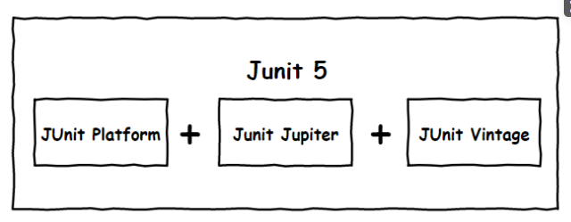

**JUnit Platform**: Junit Platform是在JVM上启动测试框架的基础，不仅支持Junit自制的测试引擎，其他测试引擎也都可以接入。

**JUnit Jupiter**: JUnit Jupiter提供了JUnit5的新的编程模型，是JUnit5新特性的核心。内部 包含了一个**测试引擎**，用于在Junit Platform上运行。

**JUnit Vintage**: 由于JUint已经发展多年，为了照顾老的项目，JUnit Vintage提供了兼容JUnit4.x,Junit3.x的测试引擎。

在进行迁移的时候需要注意如下的变化：

- 注解在 org.junit.jupiter.api 包中，断言在 org.junit.jupiter.api.Assertions 类中，前置条件在 org.junit.jupiter.api.Assumptions 类中。
- 把@Before 和@After 替换成@BeforeEach 和@AfterEach。
- 把@BeforeClass 和@AfterClass 替换成@BeforeAll 和@AfterAll。
- 把@Ignore 替换成@Disabled。
- 把@Category 替换成@Tag。
- 把@RunWith、@Rule 和@ClassRule 替换成@ExtendWith。

> 注意：
>
> **SpringBoot 2.4 以上版本移除了默认对 Vintage 的依赖。如果需要兼容junit4需要自行引入（不能使用junit4的功能 @Test）**
>
> **JUnit 5’s Vintage Engine Removed from** **`spring-boot-starter-test,如果需要继续兼容junit4需要自行引入vintage`**
>
> ```java
> <dependency>
>     <groupId>org.junit.vintage</groupId>
>     <artifactId>junit-vintage-engine</artifactId>
>     <scope>test</scope>
>     <exclusions>
>         <exclusion>
>             <groupId>org.hamcrest</groupId>
>             <artifactId>hamcrest-core</artifactId>
>         </exclusion>
>     </exclusions>
> </dependency>
> ```

Junit5被封装在spring-boot-starter-test，使用Junit需导入spring-boot-starter-test依赖

```java
<dependency>
  <groupId>org.springframework.boot</groupId>
  <artifactId>spring-boot-starter-test</artifactId>
  <scope>test</scope>
</dependency>
```

现在版本在SpringBoot中的使用

```java
@SpringBootTest
class Boot05WebAdminApplicationTests {


    @Test
    void contextLoads() {

    }
}

```

以前版本：@SpringBootTest + @RunWith(SpringRunner.class)

#### 7.2 JUnit5常用注解

JUnit5的注解与JUnit4的注解有所变化

https://junit.org/junit5/docs/current/user-guide/#writing-tests-annotations

- **@Test :**表示方法是测试方法。但是与JUnit4的@Test不同，他的职责非常单一不能声明任何属性，拓展的测试将会由Jupiter提供额外测试
- **@ParameterizedTest :**表示方法是参数化测试
- **@RepeatedTest :**表示方法可重复执行
- **@DisplayName :**为测试类或者测试方法设置展示名称
- **@BeforeEach :**表示在每个单元测试之前执行
- **@AfterEach :**表示在每个单元测试之后执行
- **@BeforeAll :**表示在所有单元测试之前执行
- **@AfterAll :**表示在所有单元测试之后执行
- **@Tag :**表示单元测试类别，类似于JUnit4中的@Categories
- **@Disabled :**表示测试类或测试方法不执行，类似于JUnit4中的@Ignore
- **@Timeout :**表示测试方法运行如果超过了指定时间将会返回错误
- **@ExtendWith :**为测试类或测试方法提供扩展类引用

#### 7.3 断言

断言（assertions）是测试方法中的核心部分，用来对测试需要满足的条件进行验证，**检查业务逻辑返回的数据是否合理**。**这些断言方法都是 org.junit.jupiter.api.Assertions 的静态方法**。JUnit 5 内置的断言可以分成如下几个类别：

1、简单断言

用来对单个值进行简单的验证。如：

| 方法            | 说明                                 |
| --------------- | ------------------------------------ |
| assertEquals    | 判断两个对象或两个原始类型是否相等   |
| assertNotEquals | 判断两个对象或两个原始类型是否不相等 |
| assertSame      | 判断两个对象引用是否指向同一个对象   |
| assertNotSame   | 判断两个对象引用是否指向不同的对象   |
| assertTrue      | 判断给定的布尔值是否为 true          |
| assertFalse     | 判断给定的布尔值是否为 false         |
| assertNull      | 判断给定的对象引用是否为 null        |
| assertNotNull   | 判断给定的对象引用是否不为 null      |

```java
@Test
@DisplayName("simple assertion")
public void simple() {
     assertEquals(3, 1 + 2, "simple math");
     assertNotEquals(3, 1 + 1);

     assertNotSame(new Object(), new Object());
     Object obj = new Object();
     assertSame(obj, obj);

     assertFalse(1 > 2);
     assertTrue(1 < 2);

     assertNull(null);
     assertNotNull(new Object());
}
```


2、数组断言

通过 assertArrayEquals 方法来判断两个对象或原始类型的数组是否相等

```java
@Test
@DisplayName("array assertion")
public void array() {
 assertArrayEquals(new int[]{1, 2}, new int[] {1, 2});
}
```


3、组合断言

assertAll 方法接受多个 org.junit.jupiter.api.Executable 函数式接口的实例作为要验证的断言，可以通过 lambda 表达式很容易的提供这些断言


```java
@Test
@DisplayName("assert all")
public void all() {
 assertAll("Math",
    () -> assertEquals(2, 1 + 1),
    () -> assertTrue(1 > 0)
 );
}
```


4、异常断言

在JUnit4时期，想要测试方法的异常情况时，需要用**@Rule**注解的ExpectedException变量还是比较麻烦的。而JUnit5提供了一种新的断言方式**Assertions.assertThrows()** ,配合函数式编程就可以进行使用。

```java
@Test
@DisplayName("异常测试")
public void exceptionTest() {
    ArithmeticException exception = Assertions.assertThrows(
           //扔出断言异常
            ArithmeticException.class, () -> System.out.println(1 % 0));

}
```


5、超时断言

Junit5还提供了**Assertions.assertTimeout()** 为测试方法设置了超时时间

```java
@Test
@DisplayName("超时测试")
public void timeoutTest() {
    //如果测试方法时间超过1s将会异常
    Assertions.assertTimeout(Duration.ofMillis(1000), () -> Thread.sleep(500));
}
```


6、快速失败

通过 fail 方法直接使得测试失败

```java
@Test
@DisplayName("fail")
public void shouldFail() {
 fail("This should fail");
}
```

> **所有的测试运行结束以后，会有一个详细的测试报告；**

#### 7.4 前置条件

JUnit 5 中的前置条件（**assumptions【假设】**）类似于断言，不同之处在于**不满足的断言会使得测试方法失败**，而不满足的**前置条件只会使得测试方法的执行终止**。前置条件可以看成是测试方法执行的前提，当该前提不满足时，就没有继续执行的必要。

```java
@DisplayName("前置条件")
public class AssumptionsTest {
 private final String environment = "DEV";
 
 @Test
 @DisplayName("simple")
 public void simpleAssume() {
    assumeTrue(Objects.equals(this.environment, "DEV"));
    assumeFalse(() -> Objects.equals(this.environment, "PROD"));
 }
 
 @Test
 @DisplayName("assume then do")
 public void assumeThenDo() {
    assumingThat(
       Objects.equals(this.environment, "DEV"),
       () -> System.out.println("In DEV")
    );
 }
}
```

`assumeTrue 和 assumFalse` 确保给定的条件为 true 或 false，不满足条件会使得测试执行终止。`assumingThat` 的参数是表示条件的布尔值和对应的 Executable 接口的实现对象。只有条件满足时，Executable 对象才会被执行；当条件不满足时，测试执行并不会终止。

#### 7.5 嵌套测试

JUnit 5 可以通过 Java 中的内部类和@Nested 注解实现嵌套测试，从而可以更好的把相关的测试方法组织在一起。在内部类中可以使用@BeforeEach 和@AfterEach 注解，而且嵌套的层次没有限制。

> 注意：
>
> 1、嵌套的情况下，外层的Test不能驱动内层的Before(After)Each/All之类的方法提前/之后执行
>
> 2、嵌套的情况下，内层的Test可以驱动外层的Before(After)Each/All之类的方法提前/之后执行

```java
@DisplayName("A stack")
class TestingAStackDemo {

    Stack<Object> stack;

    @Test
    @DisplayName("is instantiated with new Stack()")
    void isInstantiatedWithNew() {
        new Stack<>();
    }

    @Nested
    @DisplayName("when new")
    class WhenNew {

        @BeforeEach
        void createNewStack() {
            stack = new Stack<>();
        }

        @Test
        @DisplayName("is empty")
        void isEmpty() {
            assertTrue(stack.isEmpty());
        }

        @Test
        @DisplayName("throws EmptyStackException when popped")
        void throwsExceptionWhenPopped() {
            assertThrows(EmptyStackException.class, stack::pop);
        }

        @Test
        @DisplayName("throws EmptyStackException when peeked")
        void throwsExceptionWhenPeeked() {
            assertThrows(EmptyStackException.class, stack::peek);
        }

        @Nested
        @DisplayName("after pushing an element")
        class AfterPushing {

            String anElement = "an element";

            @BeforeEach
            void pushAnElement() {
                stack.push(anElement);
            }

            @Test
            @DisplayName("it is no longer empty")
            void isNotEmpty() {
                assertFalse(stack.isEmpty());
            }

            @Test
            @DisplayName("returns the element when popped and is empty")
            void returnElementWhenPopped() {
                assertEquals(anElement, stack.pop());
                assertTrue(stack.isEmpty());
            }

            @Test
            @DisplayName("returns the element when peeked but remains not empty")
            void returnElementWhenPeeked() {
                assertEquals(anElement, stack.peek());
                assertFalse(stack.isEmpty());
            }
        }
    }
}
```

#### 7.6 参数化测试

参数化测试是JUnit5很重要的一个新特性，它使得用不同的参数多次运行测试成为了可能，也为我们的单元测试带来许多便利。

利用**@ValueSource**等注解，指定入参，我们将可以使用不同的参数进行多次单元测试，而不需要每新增一个参数就新增一个单元测试，省去了很多冗余代码。

**@ValueSource**: 为参数化测试指定入参来源，支持八大基础类以及String类型,Class类型

**@NullSource**: 表示为参数化测试提供一个null的入参

**@EnumSource**: 表示为参数化测试提供一个枚举入参

**@CsvFileSource**：表示读取指定CSV文件内容作为参数化测试入参

**@MethodSource**：表示读取指定方法的返回值作为参数化测试入参(注意方法返回需要是一个流)

> 当然如果参数化测试仅仅只能做到指定普通的入参还达不到让我觉得惊艳的地步。让我真正感到他的强大之处的地方在于他可以支持外部的各类入参。如:CSV,YML,JSON 文件甚至方法的返回值也可以作为入参。只需要去实现**ArgumentsProvider**接口，任何外部文件都可以作为它的入参。

```java
@ParameterizedTest
@ValueSource(strings = {"one", "two", "three"})
@DisplayName("参数化测试1")
public void parameterizedTest1(String string) {
    System.out.println(string);
    Assertions.assertTrue(StringUtils.isNotBlank(string));
}


@ParameterizedTest
@MethodSource("method")    //指定方法名
@DisplayName("方法来源参数")
public void testWithExplicitLocalMethodSource(String name) {
    System.out.println(name);
    Assertions.assertNotNull(name);
}

static Stream<String> method() {
    return Stream.of("apple", "banana");
}
```

## 8.指标监控

#### 8.1 SpringBoot Actuator

Actuator 是 Spring Boot 提供的一个可插拔模块，用于对工程进行监控。其通过不同的监控终端实现不同的监控功能。Spring Boot 的 Actuator 可以部署在每个工程中，实现对每个工程的监控。

每一个微服务在云上部署以后，我们都需要对其进行监控、追踪、审计、控制等。SpringBoot就抽取了Actuator场景，使得我们每个微服务快速引用即可获得生产级别的应用监控、审计等功能。

导入依赖

```java
<dependency>
    <groupId>org.springframework.boot</groupId>
    <artifactId>spring-boot-starter-actuator</artifactId>
</dependency>
```

添加配置

```yaml
management:
  endpoints:
    enabled-by-default: true #暴露所有端点信息
    web:
      exposure:
        include: '*'  #以web方式暴露
        #include: ['env','beans']
      base-path: /base #指定监控终端的基本路径，默认为Actuator
  #Actuator监控的端口号与上下文路径
#  server:
#    port: 8989
#    servlet:
#      context-path: /xxx
```

测试

http://localhost:8080/actuator/beans

http://localhost:8080/actuator/configprops

http://localhost:8080/actuator/metrics

http://localhost:8080/actuator/metrics/jvm.gc.pause

。。。。。。

#### 8.2 Actuator Endpoint

##### 8.2.1 最常使用的端点

| ID                 | 描述                                                         |
| ------------------ | ------------------------------------------------------------ |
| `auditevents`      | 暴露当前应用程序的审核事件信息。需要一个`AuditEventRepository组件`。 |
| `beans`            | 显示应用程序中所有Spring Bean的完整列表。                    |
| `caches`           | 暴露可用的缓存。                                             |
| `conditions`       | 显示自动配置的所有条件信息，包括匹配或不匹配的原因。         |
| `configprops`      | 显示所有`@ConfigurationProperties`。                         |
| `env`              | 暴露Spring的属性`ConfigurableEnvironment`                    |
| `flyway`           | 显示已应用的所有Flyway数据库迁移。 需要一个或多个`Flyway`组件。 |
| `health`           | 显示应用程序运行状况信息。                                   |
| `httptrace`        | 显示HTTP跟踪信息（默认情况下，最近100个HTTP请求-响应）。需要一个`HttpTraceRepository`组件。 |
| `info`             | 显示应用程序信息。                                           |
| `integrationgraph` | 显示Spring `integrationgraph` 。需要依赖`spring-integration-core`。 |
| `loggers`          | 显示和修改应用程序中日志的配置。                             |
| `liquibase`        | 显示已应用的所有Liquibase数据库迁移。需要一个或多个`Liquibase`组件。 |
| `metrics`          | 显示当前应用程序的“指标”信息。                               |
| `mappings`         | 显示所有`@RequestMapping`路径列表。                          |
| `scheduledtasks`   | 显示应用程序中的计划任务。                                   |
| `sessions`         | 允许从Spring Session支持的会话存储中检索和删除用户会话。需要使用Spring Session的基于Servlet的Web应用程序。 |
| `shutdown`         | 使应用程序正常关闭。默认禁用。                               |
| `startup`          | 显示由`ApplicationStartup`收集的启动步骤数据。需要使用`SpringApplication`进行配置`BufferingApplicationStartup`。 |
| `threaddump`       | 执行线程转储。                                               |

如果您的应用程序是Web应用程序（Spring MVC，Spring WebFlux或Jersey），则可以使用以下附加端点：

| ID           | 描述                                                         |
| ------------ | ------------------------------------------------------------ |
| `heapdump`   | 返回`hprof`堆转储文件。                                      |
| `jolokia`    | 通过HTTP暴露JMX bean（需要引入Jolokia，不适用于WebFlux）。需要引入依赖`jolokia-core`。 |
| `logfile`    | 返回日志文件的内容（如果已设置`logging.file.name`或`logging.file.path`属性）。支持使用HTTP`Range`标头来检索部分日志文件的内容。 |
| `prometheus` | 以Prometheus服务器可以抓取的格式公开指标。需要依赖`micrometer-registry-prometheus`。 |

最常用的Endpoint

- **Health：监控状况**
- **Metrics：运行时指标**
- **Loggers：日志记录**

##### 8.2.2 Health Endpoint

健康检查端点，我们一般用于在云平台，平台会定时的检查应用的健康状况，我们就需要Health Endpoint可以为平台返回当前应用的一系列组件健康状况的集合。

重要的几点：

- health endpoint返回的结果，应该是一系列健康检查后的一个汇总报告
- 很多的健康检查默认已经自动配置好了，比如：数据库、redis等
- 可以很容易的添加自定义的健康检查机制

查看健康详细信息

```yaml
management:
    endpoint:
        health:
          show-details: always #总是显示详细信息。可显示每个模块的状态信息
```

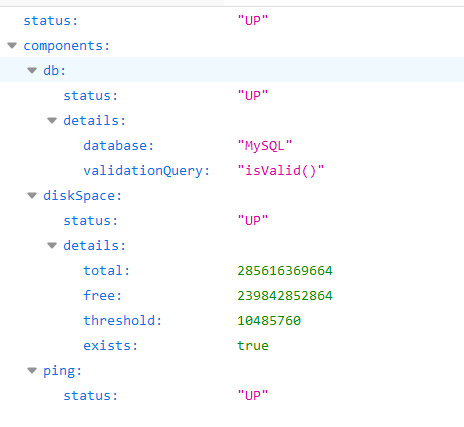

##### 8.2.3 Metrics Endpoint

提供详细的、层级的、空间指标信息，这些信息可以被pull（主动推送）或者push（被动获取）方式得到；

- 通过Metrics对接多种监控系统
- 简化核心Metrics开发
- 添加自定义Metrics或者扩展已有Metrics

##### 8.2.4 管理Endpoints

1、开启与禁用Endpoints

- 默认所有的Endpoint除过shutdown都是开启的。
- 需要开启或者禁用某个Endpoint。配置模式为  **management.endpoint.********.enabled = true**

```
management:
  endpoint:
    beans:
      enabled: true
```

- 或者禁用所有的Endpoint然后手动开启指定的Endpoint

```
management:
  endpoints:
    enabled-by-default: false
  endpoint:
    beans:
      enabled: true
    health:
      enabled: true
```

2、暴露Endpoints

支持的暴露方式

- HTTP：默认只暴露**health**和**info** Endpoint
- **JMX**：默认暴露所有Endpoint
- 除过health和info，剩下的Endpoint都应该进行保护访问。如果引入SpringSecurity，则会默认配置安全访问规则

| ID                 | JMX  | Web  |
| ------------------ | ---- | ---- |
| `auditevents`      | Yes  | No   |
| `beans`            | Yes  | No   |
| `caches`           | Yes  | No   |
| `conditions`       | Yes  | No   |
| `configprops`      | Yes  | No   |
| `env`              | Yes  | No   |
| `flyway`           | Yes  | No   |
| `health`           | Yes  | Yes  |
| `heapdump`         | N/A  | No   |
| `httptrace`        | Yes  | No   |
| `info`             | Yes  | Yes  |
| `integrationgraph` | Yes  | No   |
| `jolokia`          | N/A  | No   |
| `logfile`          | N/A  | No   |
| `loggers`          | Yes  | No   |
| `liquibase`        | Yes  | No   |
| `metrics`          | Yes  | No   |
| `mappings`         | Yes  | No   |
| `prometheus`       | N/A  | No   |
| `scheduledtasks`   | Yes  | No   |
| `sessions`         | Yes  | No   |
| `shutdown`         | Yes  | No   |
| `startup`          | Yes  | No   |
| `threaddump`       | Yes  | No   |

#### 8.3 定制 Endpoint

##### 8.3.1 定制 Health 信息

方法1：实现HealthIndicator接口

```java
import org.springframework.boot.actuate.health.Health;
import org.springframework.boot.actuate.health.HealthIndicator;
import org.springframework.stereotype.Component;

@Component
public class MyHealthIndicator implements HealthIndicator {

    @Override
    public Health health() {
        int errorCode = check(); // perform some specific health check
        if (errorCode != 0) {
            return Health.down().withDetail("Error Code", errorCode).build();
        }
        return Health.up().build();
    }

}

构建Health
Health build = Health.down()
                .withDetail("msg", "error service")
                .withDetail("code", "500")
                .withException(new RuntimeException())
                .build();
```

方法2：继承AbstractHealthIndicator抽象类

```java
@Component
public class MyComHealthIndicator extends AbstractHealthIndicator {

    /**
     * 真实的检查方法
     * @param builder
     * @throws Exception
     */
    @Override
    protected void doHealthCheck(Health.Builder builder) throws Exception {
        //mongodb。  获取连接进行测试
        Map<String,Object> map = new HashMap<>();
        // 检查完成
        if(1 == 2){
//            builder.up(); //健康
            builder.status(Status.UP);
            map.put("count",1);
            map.put("ms",100);
        }else {
//            builder.down();
            builder.status(Status.OUT_OF_SERVICE);
            map.put("err","连接超时");
            map.put("ms",3000);
        }


        builder.withDetail("code",100)
                .withDetails(map);

    }
}
```

##### 8.3.2 定制info信息

方式1：编写配置文件

```yaml
info:
  appName: boot-admin
  version: 2.0.1
  mavenProjectName: @project.artifactId@  #使用@@可以获取maven的pom文件值
  mavenProjectVersion: @project.version@
```

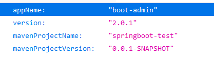

方式2：实现InfoContributor接口

```java
@Component
public class ExampleInfoContributor implements InfoContributor {
    @Override
    public void contribute(Info.Builder builder) {
        builder.withDetail("example",
                Collections.singletonMap("key", "value"))
                .withDetail("version","@project.artifactId@");
    }
}
```

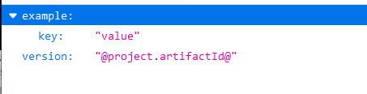

##### 8.3.3 定制Metrics信息

在service实现类构造方法中定义

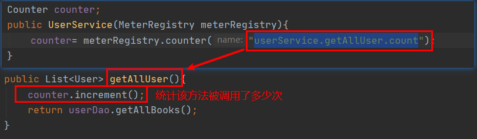

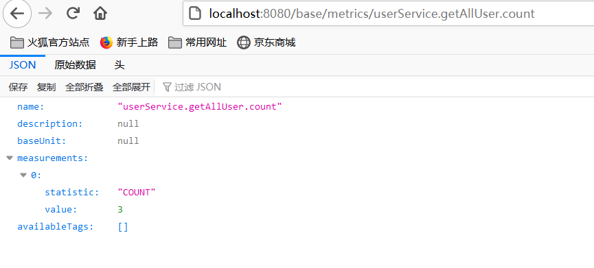

##### 8.3.4 定制Endpoint

```java
@Component
@Endpoint(id="myEndpoint")
public class MyEndpoint {
    @ReadOperation
    public Map getMyServerInfo(){
        return Collections.singletonMap("info","MyServer tarted...");
    }

    @WriteOperation
    private void restartMyServer(){
        System.out.println("MyServer restarted....");
    }
}

```

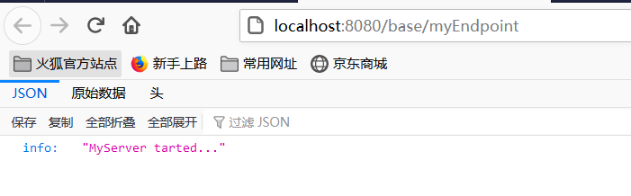

#### 8.3 可视化工具

https://github.com/codecentric/spring-boot-admin

新建一个工程作为spring-boot-admin的服务端

在spring-boot-admin的服务端中

1、添加依赖

```java
       <dependency>
			<groupId>de.codecentric</groupId>
			<artifactId>spring-boot-admin-starter-server</artifactId>
			<version>2.3.1</version>
		</dependency>
```

2、在启动类中添加@EnableAdminServer注解

```java
@EnableAdminServer
@SpringBootApplication
public class SpringbootAdminserverApplication {

	public static void main(String[] args) {
		SpringApplication.run(SpringbootAdminserverApplication.class, args);
	}

}

```

3、修改端口号（不能和客户服务端口相同）

```properties
server.port=8888
```

在客户端的服务中

添加依赖

```java
        <dependency>
            <groupId>de.codecentric</groupId>
            <artifactId>spring-boot-admin-starter-client</artifactId>
            <version>2.3.1</version>
        </dependency>
```

添加配置

```yaml
spring:
    boot:
      admin:
        client:
          url: http://localhost:8888
```

启动两个服务，测试，访问8888端口

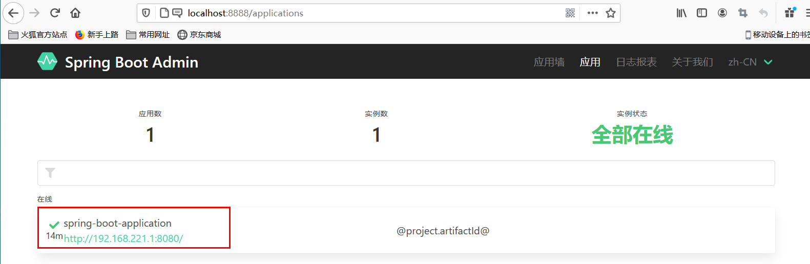

## 9.原理解析


