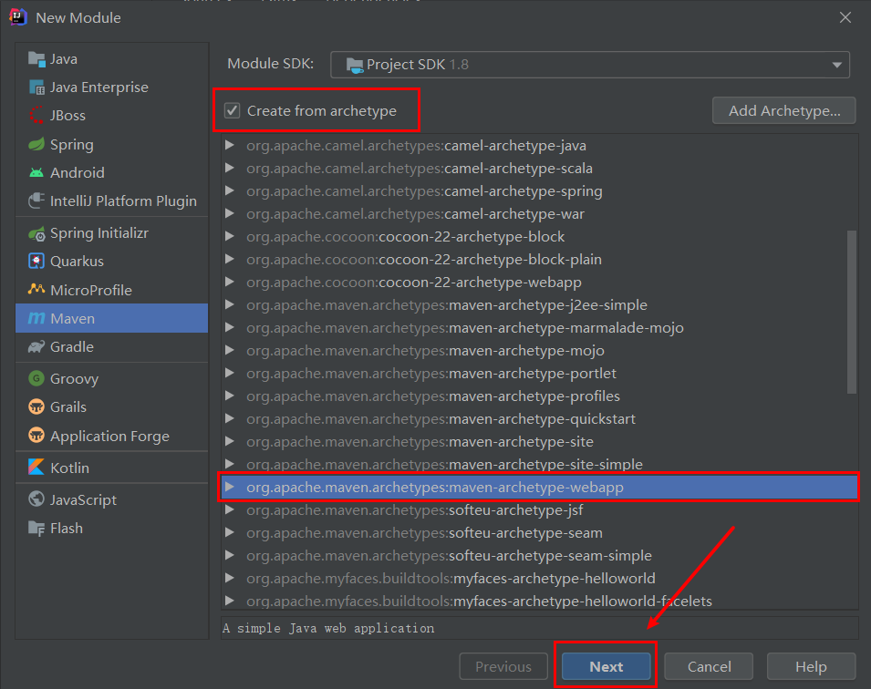
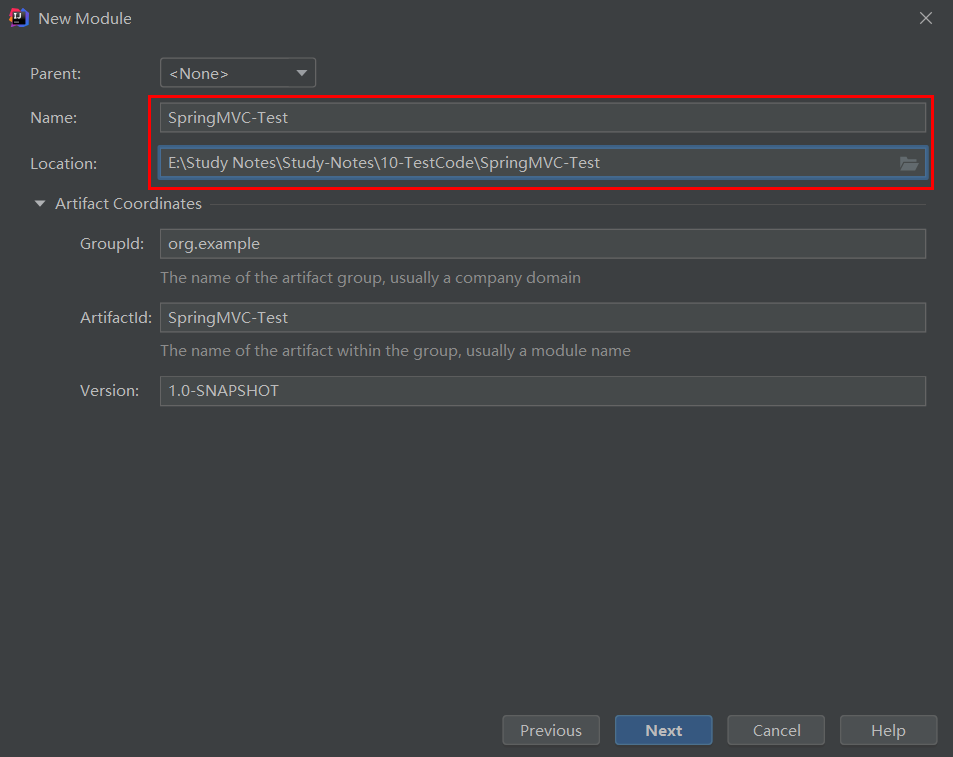
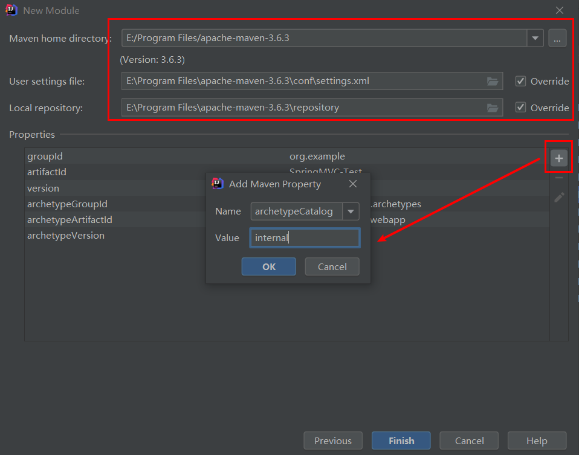
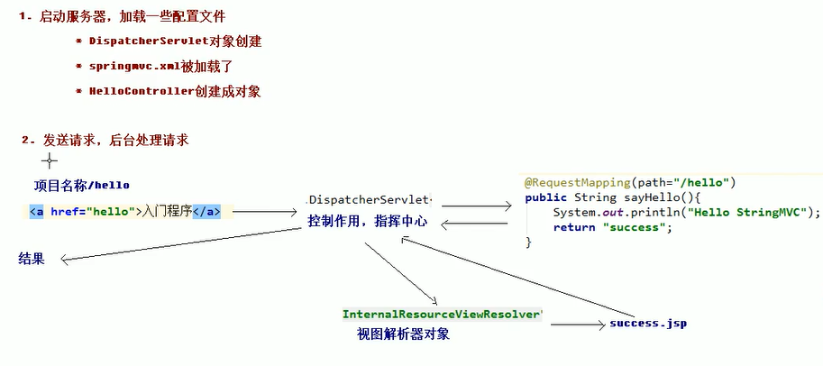
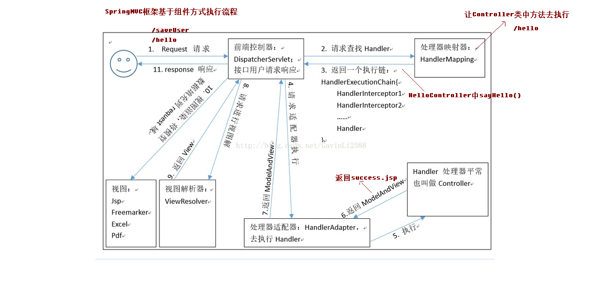

## 一、SpringMVC介绍


## 二、SpringMVC入门程序

工具：idea2020.1.2

1、搭建入门环境







点击finish完成搭建

2、添加依赖

```java
<!-- 版本锁定 -->
<properties>
	<spring.version>5.0.7.RELEASE</spring.version>
</properties>
<dependencies>
    <dependency>
        <groupId>org.springframework</groupId>
        <artifactId>spring-context</artifactId>
        <version>${spring.version}</version>
    </dependency>
    <dependency>
        <groupId>org.springframework</groupId>
        <artifactId>spring-web</artifactId>
        <version>${spring.version}</version>
    </dependency>
    <dependency>
        <groupId>org.springframework</groupId>
        <artifactId>spring-webmvc</artifactId>
        <version>${spring.version}</version>
    </dependency>
    <dependency>
        <groupId>javax.servlet</groupId>
        <artifactId>servlet-api</artifactId>
        <version>2.5</version>
    	<scope>provided</scope>
    </dependency>
    <dependency>
        <groupId>javax.servlet.jsp</groupId>
        <artifactId>jsp-api</artifactId>
        <version>2.0</version>
        <scope>provided</scope>
    </dependency>
</dependencies>

```

3、在web.xml配置文件中核心控制器DispatcherServle

```javascript
<!-- SpringMVC的核心控制器 -->
  <servlet>
    <servlet-name>dispatcherServlet</servlet-name>
    <servlet-class>org.springframework.web.servlet.DispatcherServlet</servlet-class>
    <!-- 配置Servlet的初始化参数，读取springmvc的配置文件，创建spring容器 -->
    <init-param>
      <param-name>contextConfigLocation</param-name>
      <param-value>classpath:springmvc.xml</param-value>
    </init-param>
    <!-- 配置servlet启动时加载对象 -->
    <load-on-startup>1</load-on-startup>
  </servlet>
  <servlet-mapping>
    <servlet-name>dispatcherServlet</servlet-name>
    <url-pattern>/</url-pattern>
  </servlet-mapping>
```

4、在resources中创建springmvc的配置文件springmvc.xml

```java
<?xml version="1.0" encoding="UTF-8"?>
<beans xmlns="http://www.springframework.org/schema/beans"
       xmlns:mvc="http://www.springframework.org/schema/mvc"
       xmlns:context="http://www.springframework.org/schema/context"
       xmlns:xsi="http://www.w3.org/2001/XMLSchema-instance"
       xsi:schemaLocation="http://www.springframework.org/schema/beans
                           http://www.springframework.org/schema/beans/spring-beans.xsd
                           http://www.springframework.org/schema/mvc
                           http://www.springframework.org/schema/mvc/spring-mvc.xsd
                           http://www.springframework.org/schema/context
                           http://www.springframework.org/schema/context/spring-context.xsd">
    <!-- 配置spring创建容器时要扫描的包 -->
    <context:component-scan base-package="com.kong"></context:component-scan>
    <!-- 配置视图解析器 -->
    <bean id="viewResolver"
          class="org.springframework.web.servlet.view.InternalResourceViewResolver">
        <property name="prefix" value="/WEB-INF/pages/"></property>
        <property name="suffix" value=".jsp"></property>
    </bean>
    <!-- 配置spring开启注解mvc的支持
    <mvc:annotation-driven></mvc:annotation-driven>-->
</beans>

```

5、编写index.jsp和HelloController控制器类

```java
<body>
    <h3>入门案例</h3>
    <a href="hello">入门案例</a>
</body>
```

```java
package com.kong.controller;

import org.springframework.stereotype.Controller;
import org.springframework.web.bind.annotation.RequestMapping;

@Controller
public class HelloController {
    /**
     * 接收请求
     * @return
     */
    @RequestMapping(path="/hello")
    public String sayHello() {
        System.out.println("Hello SpringMVC!!");
        return "success";
    }
}

```

6、 在WEB-INF目录下创建pages文件夹，编写success.jsp的成功页面

```java
<body>
	<h3>入门成功！！</h3>
</body>
```

7、启动Tomcat服务器，进行测试

8、入门案例的总结



1. 当启动Tomcat服务器的时候，因为配置了load-on-startup标签，所以会创建DispatcherServlet对象，
    就会加载springmvc.xml配置文件

2. 开启了注解扫描，那么HelloController对象就会被创建

3. 从index.jsp发送请求，请求会先到达DispatcherServlet核心控制器，根据配置@RequestMapping注解
    找到执行的具体方法

4. 根据执行方法的返回值，再根据配置的视图解析器，去指定的目录下查找指定名称的JSP文件

5. Tomcat服务器渲染页面，做出响应

   

9、入门案例中使用的组件介绍（SpringMVC执行流程）

1. 前端控制器（DispatcherServlet）
2. 处理器映射器（HandlerMapping）
3. 处理器（Handler）
4. 处理器适配器（HandlAdapter）
5. 视图解析器（View Resolver）
6. 视图（View）



## 二、RequestMapping注解

1、RequestMapping注解的作用是**建立请求URL和处理方法之间的对应关系**

2、RequestMapping注解可以作用在方法和类上

- 作用在类上：第一级的访问目录

- 作用在方法上：第二级的访问目录

- 细节：路径可以不编写 / 表示应用的根目录开始

- 细节：${ pageContext.request.contextPath }也可以省略不写，但是路径上不能写 /

3、RequestMapping的属性

- path 指定请求路径的url

- value value属性和path属性是一样的

  - 请求URL映射（用在方法上）

    作用：用于映射URL和HandlerMethod方法。

    用法如下：

    ```java
    @RequestMapping(value="/item")
    @RequestMapping("/item“）
    @RequestMapping(value={"/item",”/queryItem”})
    ```

  - 窄化请求映射（类和方法上同时使用）

    作用：限制此类下的所有方法的访问请求url必须以请求前缀开头，对url进行模块化分类管理。

    用法如下：
    访问时的URL是 /item/findItem

    ```java
    @RequestMapping("item")
    @Controller
    public class ItemController {
        @RequestMapping("findItem")
        public String findItem(Model model) {
            model.addAttribute("msg","ItemController...findItem方法执行了");
            return "success";
        }
    }
    
    ```

- mthod 指定该方法的请求方式

  作用：限定请求URL只能通过指定的method请求方式去访问该 HandlerMethod

  用法如下：

  ```java
  @RequestMapping(value="/findItem",method=RequestMethod.GET)
  @RequestMapping(value="/findItem",method=RequestMethod.POST)
  @RequestMapping(value="/findItem",method={RequestMethod.GET,RequestMethod.POST})
  ```

- params 指定限制请求参数的条件,它支持简单的表达式。**要求请求参数的 key 和 value 必须和配置的一模一样。**

  > 例如：
  >       params = {"userName"}，表示请求参数必须有 userName
  >       params = {"moeny!100"}，表示请求参数中 money 不能是 100。

  作用：通过设置 params 参数条件，进行访问 HandlerMethod 的限制

  用法如下：

  ```java
  @Controller
  public class ItemController {
      @RequestMapping(value="Item",params={"userName"})
      public String findItem(Model model) {
          model.addAttribute("msg","ItemController...findItem方法执行了");
          return "success";
      }
  }
  ```

  在发送请求时必须带上userName，否则会报错。

  ```java
  <body>
      <h3>入门案例</h3>
      <a href="Item/userName=haha">入门案例</a>
  </body>
  ```

  

- headers 发送的请求中必须包含的请求头

  > 注意：以上四个属性只要出现 2 个或以上时，他们的关系是与的关系。

## 三、返回值处理

**不使用注解修饰**

1、String

-  Controller方法返回字符串可以指定逻辑视图的名称

- 用法如下:

  ```java
  @RequestMapping(value="/hello")
  public String sayHello() {
      System.out.println("Hello SpringMVC!!");
      // 跳转到XX页面
      return "success";
  }
  ```

- 使用请求转发或者重定向跳转到指定的页面（不在执行前端视图解析器）

  - redirect重定向

    ```java
    return "redirect:jsp界面（不需要全路径，底层封装好了）";
    ```

    > redirect:
    >       相当于“ response.sendRedirect(全路径) ”
    >       浏览器URL发生改变
    >       Request域不能共享

  - forward转发

    ```java
    return “forward:界面路径";
    ```

    > forward：
    >       相当于“ request.getRequestDispatcher().forward(request,response) ”
    >       浏览器URL不发送改变
    >       Request 域可以共享

2、void

在Controller方法形参上可以定义request和response，使用 request 或 response 指定响应结果

```java
@RequestMapping(value="/hello")
public void sayHello(HttpServletRequest request,HttpServletResponse response) {
    System.out.println("Hello SpringMVC!!");    
}
```

默认会跳转到@RequestMapping(value="/hello") hello的页面。执行程序报404的异常，找不到hello.jsp页面

可以使用请求转发或者重定向跳转到指定的页面（不在执行前端视图解析器）

- 使用request转发到页面（一次请求）

  ```java
  request.getRequestDispatcher("页面路径").forward(request, response);
  ```

- 通过response页面重定向（两次请求）

  ```java
  response.sendRedirect("url")
  ```

- 也可以通过response指定响应结果，例如响应json数据如下：

  ```java
  response.setCharacterEncoding("utf-8");
  response.setContentType("application/json;charset=utf-8");
  response.getWriter().write("json串");
  ```

3、ModelAndView

Controller方法中定义ModelAndView对象并返回，对象中可添加model数据、指定view。

ModelAndView对象是Spring提供的一个对象，可以用来调整具体的JSP视图

用法如下：

```java
@RequestMapping("/modelandviewTest")
public ModelAndView modelAndViewTest(){
    ModelAndView mv=new ModelAndView();
    //添加model数据到request
    mv.addObject("name","张三");
    //设置跳转页面
    mv.setViewName("success");
    return mv;
}

success.jsp界面
//首先将isELIgnored="false"才能使el表达式的值不被忽略
<%@ page contentType="text/html;charset=UTF-8" language="java" isELIgnored="false" %>
<html>
<head>
    <title>Title</title>
</head>
<body>
	${name}
</body>
</html>
```

**使用注解修饰**

1、ResponseBody

- ResponseBody注解介绍

  1. ResponseBody注解可以针对Controller返回值类型，使用内置的9种`HttpMessageConverter`进行
     匹配，找到合适的HttpMessageConverter进行处理。

  2. HttpMessageConverter处理逻辑分为两步：
         第一步：指定HttpServletResponse的ContentType值。
         第二步：将转换之后的数据放到HttpServletResponse对象的响应体返回到页面

  3. 常用的HttpMessageConverter

     - MappingJacksonHttpMessageConverter

       > 作用：处理POJO类型返回值
       >       默认使用MappingJackson的JSON处理能力，将后台返回的Java对象（POJO类型），转为JSON格式输出到页面
       >       将响应体的Content-Type设置为application/json；charset=utf-8
       >       调用response.getWriter()方法将json格式的字符串写回给调用者。

     - StringHttpMessageConverter

       > 作用：处理String类型返回值
       >       将响应体的Content-Type设置为text/plain；charset=utf-8
       >       调用response.getWriter()方法将String类型的字符串写回给调用者。


## 四、参数绑定处理

**什么是参数绑定**

就是将请求参数串中的value值获取到之后，再进行类型转换，然后将转换后的值赋值给Controller
类中方法的形参，这个过程就是参数绑定。

> 总结参数绑定需要两步：
>
> ​      类型转换（请求中的String类型值--->Controller各种数据类型的方法形参）
>
> ​      赋值操作，将转换之后的值赋值给Controller方法形参

**请求参数格式**

```
默认是key/value格式，比如： http://XXXXX?id=1&type=301
```

**请求参数值的数据类型**

```
都是String类型的各种值
```

**请求参数值要绑定的目标类**

```
Controller类中的方法参数，比如简单类型、String类型、POJO类型、集合类型等。
```

1、简单类型

- 直接绑定

  ​      http请求参数的【key】和controller方法的【形参名称】一致 

- 基本数据类型和字符串类型

  ​      提交表单的name和参数的名称是相同的

  ​      区分大小写

- 注解绑定

  ​      请求参数的【key】和controller方法的【形参名称】不一致时，需要使用【@RequestParam】注解才能

  将请求参数绑定成功。

  > RequestParam注解
  >
  > - value
  >
  >   参数名字，即入参的请求参数名字，如value=“itemid”表示请求的参数中的名字为itemid的参数的值将传 入
  >
  > - required
  >
  >   是否必须，默认是true，表示请求中一定要有相应的参数，否则将报； TTP Status 400 - Required Integer parameter 'XXXX' is not present 
  >
  > - defaultValue
  >
  >   默认值，表示如果请求中没有同名参数时的默认值 


2、实体类型（JavaBean）

​             提交表单的name和**JavaBean中的属性名称**需要一致

​             如果一个JavaBean类中包含其他的引用类型，那么表单的name属性需要编写成：对象.属性 例如：address.name

3、给集合属性数据封装

​              JSP页面编写方式：list[0].属性、map(key).value

- 简单类型数组

  ​     通过HTTP请求批量传递简单类型数据的情况，Controller方法中可以用String[]或者pojo的String[] 属性接         收（两种方式任选其一），但是不能使用List集合接收。 

- POJO类型集合或者数组

  ​     批量传递的请求参数，最终要使用List<POJO>来接收，那么这个List<POJO>必须放在另一个POJO类中。 

4、默认支持的**ServletAPI**参数类型

Controller方法形参中可以随时添加如下类型的参数（Servlet API支持），处理适配器会自动识别并进行赋值

- HttpServletRequest
  通过 request 对象获取请求信息

- HttpServletResponse
  通过 response 处理响应信息

- HttpSession
  通过 session 对象得到 session 中存放的对象

- InputStream、OutputStream

- Reader、Writer

- Model/ModelMap

  ModelMap 继承自 LinkedHashMap ，Model是一个接口，它们的底层实现都是同一个类（ BindingAwareModelMap ），**作用就是向页面传递数据，相当于 Request 的作用**，如下：

```java
model.addAttribute("msg",“测试springmvc”);
```

**SpringMVC内置的参数解析组件**

```
默认内置了24种参数解析组件（ArgumentResolver）
```

**参数绑定案例**

```java
//实体类
package com.kj.pojo;

import java.util.*;

public class User {
    private int id;
    private String username;
    private Date birthday;
    private String sex;

    // 演示包装POJO参数绑定
    private Address address;
    // 演示批量简单类型参数接收
    private List<Integer> uid = new ArrayList<>();
    //将request请求参数，绑定到[元素是POJO类型的List集合]参数
    private List<Item> itemList = new ArrayList<>();
    // 将request请求参数，绑定到[元素是POJO类型的Map集合]参数
    private Map<String, Item> itemMap = new HashMap<>();

    //。。。。。。
}

```

```java
package com.kj.pojo;

public class Address {
    private String provinceName;
    private String cityName;
    
    //。。。。。。

}

```

```Java
package com.kj.pojo;

public class Item {
    private String name;
    private double price;

    //。。。。。。
}

```


```jsp
<%@ page contentType="text/html;charset=UTF-8" language="java" isELIgnored="false" %>
<html>
<body>
<h3>入门案例</h3>
<a href="hello">入门案例</a><br>
<!-- request请求的内容类型主要分为：K/V类型、Multipart类型、JSON类型 -->
<!-- 将request请求参数，绑定到简单类型（基本类型和String类型）方法参数 -->

<!-- 1、直接绑定 -->
<a href="${pageContext.request.contextPath}/user/findUserById?id=1">查询用户1</a><br>

<!-- 2、@RequestParam注解绑定 -->
<a href="${pageContext.request.contextPath}/user/findUserById2?uid=1">查询用户2</a><br>

<!-- 3、将request请求参数，绑定到POJO类型(简单POJO和包装POJO的)方法参数 -->
<form action="${pageContext.request.contextPath}/user/saveUser" method="post">
    用户名称：<input type="text" name="username"><br />
    用户性别：<input type="text" name="sex"><br />
    所属省份：<input type="text" name="address.provinceName"><br />
    所属城市：<input type="text" name="address.cityName"><br />
    <input type="submit" value="保存">
</form>

<!-- 将request请求参数，绑定到[元素是简单类型的集合或数组]参数 -->
<!-- 使用数组接收 -->
<a href="${pageContext.request.contextPath}/user/findUserByIds/?id=1&id=3">根据ID批量删除用户</a>
<!--使用List接收（错误示例）
    Request processing failed; nested exception is java.lang.IllegalStateException: No primary or default constructor found for interface java.util.List-->
<a href="${pageContext.request.contextPath}/user/findUserByIds2?id=1&id=3">根据ID批量删除用户</a>
<!--使用Bean的List接收-->
<a href="${pageContext.request.contextPath}/user/findUserByIds3?uid=1&uid=3">根据ID批量删除用户</a>

<!-- 将request请求参数，绑定到[元素是POJO类型的List集合或Map集合]参数 -->
<form action="${pageContext.request.contextPath}/user/updateUser" method="post">
    用户名称：<input type="text" name="username"><br />
    用户性别：<input type="text" name="sex"><br />
    <!-- itemList[集合下标]：集合下标必须从0开始 -->
    <!-- 辅助理解：先将name属性封装到一个Item对象中，再将该Item对象放入itemList集合的 指定下标处 -->
    购买商品1名称：<input type="text" name="itemList[0].name"><br />
    购买商品1价格：<input type="text" name="itemList[0].price"><br />
    购买商品2名称：<input type="text" name="itemList[1].name"><br />
    购买商品2价格：<input type="text" name="itemList[1].price"><br />
    <!-- itemMap['item3']：其中的item3、item4就是Map集合的key -->
    <!-- 辅助理解：先将name属性封装到一个Item对象中，再将该Item对象作为value放入 itemMap集合的指定key处 -->
    购买商品3名称：<input type="text" name="itemMap['item3'].name"><br />
    购买商品3价格：<input type="text" name="itemMap['item3'].price"><br />
    购买商品4名称：<input type="text" name="itemMap['item4'].name"><br />
    购买商品4价格：<input type="text" name="itemMap['item4'].price"><br />
    <input type="submit" value="保存"> </form>
</body>
</html>

```

```Java
@RequestMapping("user")
@Controller
public class UserController {

    @RequestMapping("findUserById")
    public String findUserById(Integer id, Model model, HttpServletRequest request){
        model.addAttribute("msg", "直接参数绑定接收到的参数："+id);
        //model.addAttribute("msg", "通过Request getParameter参数接收到的参 数："+request.getParameter("id"));
        return "success";
    }

    @RequestMapping("findUserById2")
    public String findUserById2(@RequestParam("uid") Integer id, Model model) {
        model.addAttribute("msg", "@RequestParam注解绑定："+id);
        return "success";
    }

    @RequestMapping("saveUser")
    public String saveUser(User user, Model model)
    {
        model.addAttribute("msg", "将request请求参数，绑定到POJO类型(简单POJO和包装POJO的)方法参数："+user.toString());
        return "success";
    }
    @RequestMapping("findUserByIds")
    public String findUserByIds(int[] id,Model model){
        model.addAttribute("msg", "将request请求参数，绑定到数组参数："+id[1]);
        return "success";
    }

    //报错
    //Request processing failed; nested exception is java.lang.IllegalStateException: No primary or default constructor found for interface java.util.List
    @RequestMapping("findUserByIds2")
    public String findUserByIds2(List<Integer> id,Model model){
        model.addAttribute("msg","将request请求参数，绑定到集合参数："+id);
        return "success";
    }

    @RequestMapping("findUserByIds3")
    public String findUserByIds3(User user,Model model){
        model.addAttribute("msg","将request请求参数，绑定到对象的List参数:"+user.getUid());
        return "success";
    }

    @RequestMapping("updateUser")
    public String updateUser(User user,Model model){
        model.addAttribute("msg","将request请求参数，绑定到[元素是POJO类型的List集合或Map集合]参数"+user);
        return "success";
    }
}

```

**自定义日期参数绑定**

​        对于springmvc无法解析的参数绑定类型，比如[年月日时分秒格式的日期]绑定到Date类型会报错，此时需要自定义[参数转换器]进行参数绑定。 

```jsp
<!-- 将request请求参数，绑定到Date类型方法参数 -->
<!-- 请求参数是：【年月日】 格式 -->
<a href="${pageContext.request.contextPath}/user/deleteUser?birthday=2018- 01-01">根据日期删除用户(String)</a>
<!-- 请求参数是：【年月日 时分秒】 格式 -->
<a href="${pageContext.request.contextPath}/user/deleteUser2?birthday=2018- 01-01 12:10:33">根据日期删除用户(Date)</a>
```

```java
//自定义[参数转换器]进行参数绑定
package com.kj.utils;
import org.springframework.core.convert.converter.Converter;

import java.text.ParseException;
import java.text.SimpleDateFormat;
import java.util.Date;

public class DateConverter implements Converter<String, Date> {

    @Override
    public Date convert(String s) {
        SimpleDateFormat simpleDateFormat=new SimpleDateFormat("yyyy-MM-dd");
        try {
            return simpleDateFormat.parse(s);
        } catch (ParseException e) {
            e.printStackTrace();
        }
        return null;
    }
}

```

```xml
<!-- Converter配置 -->
<!-- 加载注解驱动 -->
    <mvc:annotation-driven conversion-service="conversionService"/>
    <!-- 转换器配置 -->
    <bean id="conversionService" class="org.springframework.format.support.FormattingConversionServiceFactoryBean ">
        <property name="converters">
            <set>
                <bean class="com.kj.utils.DateConverter"/>
            </set>
        </property>
    </bean>
```

```java
    @RequestMapping("deleteUser")
    public String deleteUser(User user,Model model){
        model.addAttribute("msg","请求参数是：【年月日】 格式 :"+user.getBirthday());
        return "success";
    }
    @RequestMapping("deleteUser2")
    public String deleteUser2(User user,Model model){
        model.addAttribute("msg","请求参数是：【年月日 时分秒】 格式:"+user.getBirthday());
        return "success";
    }
```

**文件类型参数绑定**

SpringMVC 文件上传的实现，是由 commons-fileupload 这个第三方jar包实现的。

**导入依赖包**

```java
<dependency> 
    <groupId>commons-fileupload</groupId> 
    <artifactId>commons-fileupload</artifactId> 
    <version>1.3.1</version> 
</dependency>
```

**上传页面**

```jsp
<!-- 文件类型参数绑定 JSP中的form表单需要指定enctype=”multipart/form-data” -->
<form action="${pageContext.request.contextPath}/user/fileupload" method="post" enctype="multipart/form-data">
    图片：<input type="file" name="uploadFile" /><br />
    <input type="submit" value="上传" />
</form>
```

**配置Multipart解析器**

在 springmvc.xml 中配置 multipart 类型解析器：

```java
<!-- multipart类型解析器，文件上传 --> 
<bean id="multipartResolver" class="org.springframework.web.multipart.commons.CommonsMultipartResolver"> 
<!-- 上传文件的最大尺寸 5M--> 
    <property name="maxUploadSize" value="5242880"/>
</bean>
```

**Controller类代码**

```java
@RequestMapping("fileupload")
public String fileupload(MultipartFile uploadFile,Model model) throws Exception {
    // 编写文件上传逻辑（mvc模式和三层结构模式）
    // 三层模式：表现层（controller、action）、业务层（service、biz）、持久层（dao、 mapper）
    // MVC模式主要就是来解决表现层的问题的（原始的表现层是使用Servlet编写，即编写业务逻 辑，又编写视图展示）
    if (uploadFile != null)
    {
        System.out.println(uploadFile.getOriginalFilename());
        // 原始图片名称
        String originalFilename = uploadFile.getOriginalFilename();
        // 如果没有图片名称，则上传不成功
        if (originalFilename != null && originalFilename.length() > 0) {
            // 存放图片的物理路径
            String picPath = "G:\\";
            // 获取上传文件的扩展名
            String extName = originalFilename.substring(originalFilename.lastIndexOf("."));
            // 新文件的名称
            String newFileName = UUID.randomUUID() + extName;
            // 新的文件
            File newFile = new File(picPath + newFileName);
            // 把上传的文件保存成一个新的文件
            uploadFile.transferTo(newFile);
            // 同时需要把新的文件名更新到数据库中
        }
    }
    model.addAttribute("msg","上传成功");
    return "success";
}
```


## 五、RESTful支持

