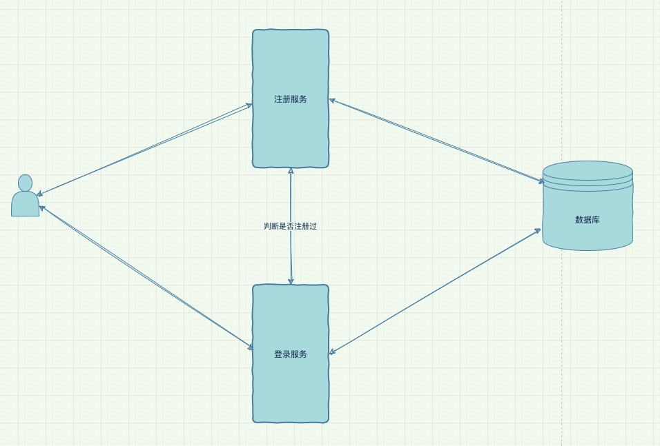

# 1. 什么是分布式系统

分布式系统大家从网络上看到的学术定义简单来说就是一套由一组计算机协同工作，让用户感觉像是一个统一的整体的系统。

但是，由于这个定义定的过于简练，很多初入门的人会毫无感知的潜意识就会混淆了分布式系统的概念。

什么意思？我这里问下，当我们用 keepalived 做高可用集群的时候，我们是在搞分布式系统吗？当我们并发不

够，搞了一堆机器做负载均衡，我们是在搞分布式系统吗？

当你心里默默回答是，或者不清楚是不是的时候，你本身对分布式系统这个概念就已经糊涂了。

这里，就需要为分布式系统画出一个边界来，并以此告知大家，并不是多台机器堆在一起了就是分布式系统了。对

于刚才那两个问题，正确的答案就是 keepalived 做的高可用集群，用 Nginx 或者 lvs 后面跟着一堆应用集群配合

搞的负载均衡，他们都不是分布式系统，他们就仅仅是个集群而已。

类似的，数据库比如 MySQL 的主从，双主什么的当然也不是分布式系统。因为这些集群少了分布式系统最核心的

东西：

**应用所在服务器之间的相互协作**

为了说清集群和分布式，我再给大家举一个通俗易懂的例子：

假设有一天我开了个软件公司，公司就我一个程序员，前端、后端、测试的活儿，都是我干，一个月我能做完一个

项目。

后来项目多了，我忙不过来了，为了多赚钱，怎么办呢，我想了两条路

1. 再招一个和我一样强的全栈工程师，我俩每个人独立做项目，这样我们一个月能做完两个项目。我俩就组成了

   一个**集群**。

2. 招一个前端、一个测试配合我，前端、后端、测试分头干。通过协作，我们半个月能干完一个项目。这时候我

   们的关系就是**分布式**。

从上面例子你就能看出:

- 集群中的多个服务器都在做相同的事情，并不能缩短处理一件事情的时间。
- 而分布式呢，是把事情拆开，多个服务器分头做事，可以缩短时间。

知道了什么是分布式系统之后，一个最简单的分布式系统应该是什么样的？

假设我们做了一套系统，这套系统仅有两个功能：**1. 注册、2. 登录**

如果我们想让这套系统变成分布式系统该怎么做？最简单的是，把注册功能和登录功能分别做成两套子服务，然后

部署到两台服务器上，让他们互相协作，这就变成了一套最简单的分布式系统。

你看到这里可能会非常震惊：
这就是一套分布式系统了？
我想学习的分布式系统的那么多技术栈呢？
那些高大上的算法呢？
能瞬间闪回的容错机制呢？
无缝热升级的功能呢？
问题到底出现在哪里？
我们搭建的这套简单的系统真的是我们日常谈论的分布式系统吗？

# 2. 为什么我们要搞分布式系统

为什么要搞分布式系统？答案很简单：形势所迫！一套分布式系统往往是由于业务发展后采取的终极方案。

假如公司新开展了一项在线业务，而我们因此要为这套业务搭建开发一套业务系统。往往这时候，由于项目前景未知，又由于要快速上线进入市场做试错，此时，我们可能会优先搞一套单体架构，先上线。

随着业务的开展和运营，我们往往面临的第一个问题是系统的崩溃和服务器的宕机。

这时候，大家就搞一套高可用架构来解决问题。把相同的项目部署在多台机器上，一台机器出问题了，直接换到另外一台提供服务即可。

随后，由于业务进一步的发展和壮大，此时，出现瓶颈的往往就是系统的响应时间了。响应时间的增加直接影响了用户体验，而这本身也反映了吞吐量出现了瓶颈。

对于这种问题，架构师们就会祭出**集群大法好**的思路来搞定。这时候，系统架构开始复杂了起来，因为别忘了，我们在保证负载均衡的同时，还需要保证服务的高可用。

到目前为止，貌似没什么问题了。我们通过高可用保证了系统的可靠性，通过负载均衡，分散了系统的压力。

但是，以上这些方案都不是分布式，系统也不是分布式系统，依然是 Monoliths 这种被一些技术疯子们嘲笑的笨重架构。

我们还需要分布式吗？

上图是某大厂的支付平台一小部分架构图。

从这张图可以看出，业务发展到后面会有多么复杂。面对如此复杂的业务，我们发现我们之前搞的那种集群怎么也说不过去了。

这时候，就需要进行业务的拆分。

虽然业务拆分了，但是这些业务终究是要对外合作提供一个整体的服务的，这时候，才是真正需要分布式系统的时候了。我们需要一组在不同的服务器上相互协作的系统。

所以我们说，分布式系统是由于业务发展后的终极解决方案。最终，业务复杂到拆分的地步，那么分布式系统就是天然的需求了。

在这里，我们也可以解答下上节我们面临的问题了。我们需要的不是简单的直接把模块分散部署的无意义分布式，不是简单的模块分解。我们需要的是系统在被迫搞成分布式的情况下依然能够：

1. 保持出色的性能
2. 拥有着无比可靠的可用性
3. 以及非常优秀的弹性

而为了保证以上这三个指标，就出现了分布式系统那繁杂艰深的技术栈。

# 3. 分布式系统的技术栈

上面我们说了，分布式系统的出现完全是形式所迫，完全是业务发展导致的最终结果。而由于业务的拆分，我们又被迫会衍生出更多的分布式需求来，以及应对这些需求的技术：

- 因为业务拆分的多，业务对应的模块之间就需要通信，为了保证通信的快速可靠，我们需要掌握**分布式通信**技术。
- 业务拆分的过多，每个模块可能还需要搞集群，那么多服务器资源，为了能够保证资源的精准分配，我们还需要考虑**分布式资源管理**和负载调度技术。
- 业务拆分之后，模块与模块之间又需要对很多共享数据做访问，为了保证安全完整的数据状态，我们也要用到**分布式协调与同步**技术。
- 到了业务拆分的阶段，数据必然庞大，为了数据存储的可靠，为了保证优秀的数据读写性能，我们需要**分布式存储**技术。
- 业务如此复杂，为了公司的发展，业务能继续扩大，就需要能更加精准的营销和运营，我们还需要对数据进行实时、离线处理分析，此时，我们又得考虑**分布式计算**技术。
- 在业务拆分后，整体架构出现了巨变，不可能再用以前集群方式的思维去考虑高可用，那么**分布式的可靠性**技术又要纳入我们的掌握范畴。

你看分布式系统的技术栈这么多、这么复杂对吧，别慌。

我写这篇文章不是为了劝退你们的，我们要学习必须分步骤分主题的学习，对整体的分布式技术栈分而克之，逐步掌握。

# 4. 如何学习分布式系统的技术栈

在分布式技术栈中我们可以看到，其实分布式技术是有分类的，我们可以根据不同的分类去掌握每种类别的分布式技术背后的概念和思想。无论分布式技术有多少实现，这些实现永远都是以其所在分类的分布式技术原理作为核心底层来实现的。

同时呢，我们在学习当中，还必须理论联系实际，根据我们的实际开发和架构需要学习。

而且，业务是逐步发展的，项目也不会一下就发展的特别庞大。这就给与了我们分步学习，逐步掌握的时间和机会。

## 4.1 分布式通信

那具体到底如何做呢？

首先，分布式中的根基是什么？就我自己的经历而言，我认为是通信，最重要的其实分布式系统中那些模块中的通信机制。

而通信机制该怎么学习？我认为首先要了解我们可用的各通信机制的区别。其中尤为重要的是了解各通信机制的缺点。对，你没看错，就是缺点。

为什么缺点最重要呢？因为架构师在架构的时候，一项尤为重要的工作就是做技术选型。而技术选型的目标很多时候的应用场景往往非常模糊，如果能了解到各选型的缺点，则对选型的结果是否准确就起到了极其重要的作用。

比如，我们现在想搞模块间通信，那么到底是用 RPC 还是用 MQ ？此时，我们知道 RPC 的缺点和 MQ 的缺点的话，就能很容易做出更准确的选型。

RPC 的缺点:

1. 不能搞流量削锋
2. 不能广播给多个模块
3. 消息投递没有保证
4. 模块和模块之间没法解耦

MQ 的缺点：

1. 不能保证延迟时间
2. 不适合搞强一致性的事务
3. 增加了系统的复杂度
4. 降低了系统的可用性

好了，知道了缺点，我们就很容易选型了。如果我们现在有个业务是实时扣费，我们肯定要搞 RPC，因为这是延迟敏感并且是需要强一致性。

如果我们现在有个业务是同时给会计系统和合作方发记账请求的需求，那这时候我们就可能选用 MQ 通信了。

## 4.2 分布式协调和同步

我们理解了分布式通信之后，下一步我认为最要学的是分布式协调和同步。

因为在现实里，即使系统搞成分布式了，其实往往没有特别大，分布式资源管理暂时可以先不考虑。分布式存储也可能还在使用数据库的主备或者 Sharding 方式在抗。而分布式计算的需求也可能没有那么紧急。

但是，一旦分布式系统中的全局状态出问题了，那就是事故了。所以，理解分布式协调和同步，一定是很紧急也很重要的。

那协调和同步怎么学呢？

我们要知道，我们所谓的协调数据访问，同步数据访问到底是在做什么。其实协调数据访问的本质就是去对数据访问的请求做优先级排列，这就是协调数据访问的本质。而如何定义优先级？根据什么定义优先级？就是我们需要学习的东西。

至于同步，其实就是对数据访问的保护。如何限制对数据的访问？限制数据访问的策略是什么？就是同步的本质。

然后，如果我们理解了多线程的数据协调和同步，我们通过分布式和多线程的相同和区别，能更容易更快速的去把握好分布式协调的技术本质。

## 4.3 分布式存储

当理解了分布式协调和同步之后，我们就应该关注分布式存储。因为业务的核心是数据，海量的数据最终还需要分布式存储来解决安全可靠的持久化问题。

而分布式存储最最重要的是理解什么？不是存储的各种实现，是分布式存储的立身之本：**CAP 理论**。

我们通过对 CAP 理论的理解，去理解分布式存储实现是如何实现对应的 CP 或者 AP 的，就会非常容易了。并且理解了 CAP，我们就能根据真实的业务需求，理解业务是需要 CP 还是 AP，然后就能根据这些，对分布式存储做合适的选型了。

## 4.4 分布式计算

当学习了分布式存储，此时，我们就应该去学习分布式计算。因为分布式计算很可能会成为一个重要的运营需求。而分布式计算，就整体而言，一共就四种模式。任你千变万化，都逃不掉这四种模式。

从计算方式上看，一共就两种方法：

1. MR 方式（MapReduce）
2. Stream 方式

从处理过程来看，也只有两种模式：

1. Actor 模式
2. 流水线模式

## 4.5 分布式可靠性

到此，在知道了这些知识之后，对于一般公司的架构任务，架构师们做起来就游刃有余了。一个完整的正向分布式学习流程的知识，其实就差不多了。

此时，我们还需要知道一般的分布式可靠性的处理方案。其实大体也不会超过三种：

1. 对量大的模块搞负载均衡的集群；
2. 对某些有资源限制条件的模块可以搞流量控制；
3. 当任何模块对应的服务器出现问题时，想办法不让它影响正常的系统运转，而这个就叫做故障隔离。

而对于以上三种方案，其中两种其实都是很通用的技术，即使大家不搞分布式，也照样需要学习和了解。

唯独对于第三种，故障隔离，是需要深入了解下的。但是故障隔离并不是什么高大上的黑科技，当我们搞分布式的时候，由于天然是不同的模块有不同的机器，并且机器还做了集群，所以，这个故障隔离就是天然就有的。

只是，有的时候，我们想更细粒度的对故障隔离进行阻隔，比如，想在线程级别或者进程级别就把故障隔离开了。此时，我就就可以考虑用下线程或者容器等去执行任务，然后才去一些调度策略，把故障就天然的隔离为线程或者进程级别了。

## 4.6 分布式资源管理

最后，我们想深造能应对更庞大的分布式系统，毕竟人都是追求进步的。这时候，我们就需要去理解分布式的体系结构相关的知识，需要去理解分布式的资源管理。

但庆幸的是，分布式的资源管理本身技术栈很小。对于分布式体系结构，一共就两种结构：

1. 集中式结构
2. 非集中式结构

对于分布式资源的分配或者说调度，一共就三种方法：

1. 单体调度
2. 两层调度
3. 共享状态调度