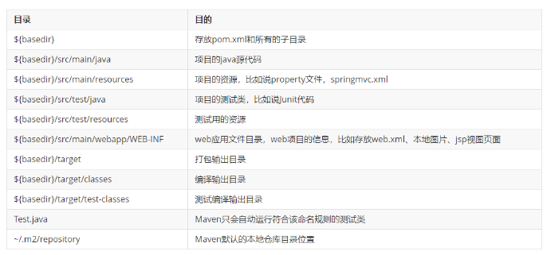
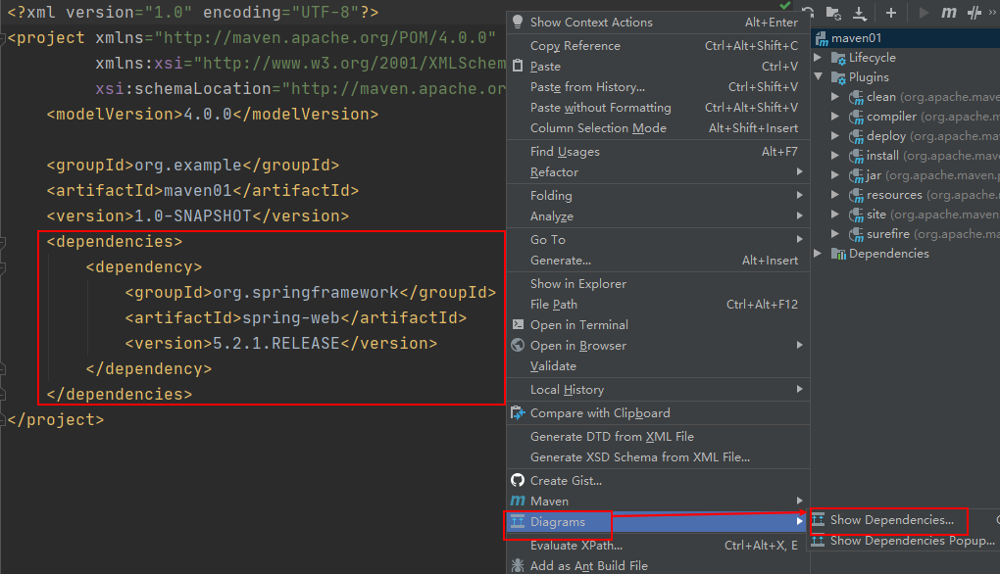
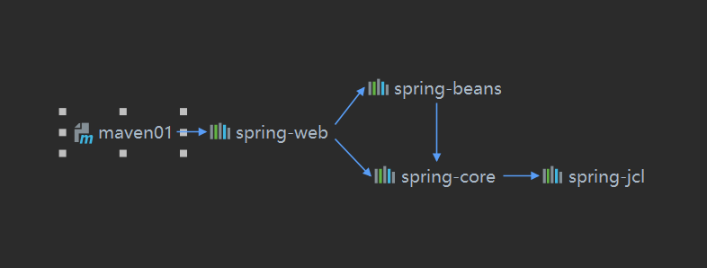

### maven约定配置

Maven 提倡使用一个共同的标准目录结构，Maven 使用约定优于配置的原则，大家尽可能的遵守这样的目录结构，如下所示：



### maven中pom文件

当我们在项目中需要用到maven帮我们解决jar包依赖问题，帮我们解决项目中的编译、测试、打包、部署时，项目中必须要有pom.xml文件，这些都是依靠pom的配置来完成的。

POM( Project Object Model，项目对象模型 ) 是 Maven 工程的基本工作单元，是一个XML文件，包含了项目的基本信息，用于描述项目如何构件，声明项目依赖，等等。

执行任务或目标时，Maven 会在当前目录中查找 POM。它读取 POM，获取所需的配置信息，然后执行目标。

POM 中可以指定以下配置：

- 项目依赖
- 插件
- 执行目标
- 项目构件 profile
- 项目版本
- 项目开发者列表
- 相关邮件列表信息

```java
<?xml version="1.0" encoding="UTF-8"?>
<project xmlns="http://maven.apache.org/POM/4.0.0"
         xmlns:xsi="http://www.w3.org/2001/XMLSchema-instance"
         xsi:schemaLocation="http://maven.apache.org/POM/4.0.0 http://maven.apache.org/xsd/maven-4.0.0.xsd">
    <!-- 模型版本 -->
    <modelVersion>4.0.0</modelVersion>

    <!-- 定义当前构件所属的组，通常与域名反向一一对应 -->
    <groupId>com.javacode2018</groupId>
    <!--项目的唯一ID，一个groupId下面可能多个项目，就是靠artifactId来区分的-->
    <artifactId>maven-chat02</artifactId>

    <!-- 版本号 -->
    <version>1.0-SNAPSHOT</version>

</project>
```

### maven坐标详解

maven中构件坐标是通过一些元素定义的，他们是groupId、artifactId、version、packaging、classifier。比如上面的代码：

```java
    <!-- 定义当前构件所属的组，通常与域名反向一一对应 -->
    <groupId>com.javacode2018</groupId>
    <!--项目的唯一ID，一个groupId下面可能多个项目，就是靠artifactId来区分的-->
    <artifactId>maven-chat02</artifactId>

    <!-- 版本号 -->
    <version>1.0-SNAPSHOT</version>
```


- goupId：定义当前构件所属的组，通常与域名反向一一对应。

- artifactId：项目组中构件的编号。

- version：当前构件的版本号，每个构件可能会发布多个版本，通过版本号来区分不同版本的构件。

- package：定义该构件的打包方式，比如我们需要把项目打成jar包，采用`java -jar`去运行这个jar包，那这个值为jar；若当前是一个web项目，需要打成war包部署到tomcat中，那这个值就是war，可选（jar、war、ear、pom、maven-plugin），比较常用的是jar、war、pom，这些后面会详解。

上面接元素中，groupId、artifactId、version是必须要定义的，packeage可以省略，默认为jar。

### maven依赖导入功能

maven可以帮我们引入需要依赖的构件(jar等)，而maven是如何定位到某个构件的呢？

项目中如果需要使用第三方的jar，我们需要知道其坐标信息，然后将这些信息放入pom.xml文件中的`dependencies`元素中：

```java
<project>
    <dependencies>
        <!-- 在这里添加你的依赖 -->
        <dependency>
            <groupId></groupId>
            <artifactId></artifactId>
            <version></version>
            <type></type>
            <scope></scope>
            <optional></optional>
            <exclusions>
                <exclusion></exclusion>
                <exclusion></exclusion>
            </exclusions>
        </dependency>
    </dependencies>
</project>
```

- dependencies元素中可以包含多个`dependency`，每个`dependency`就表示当前项目需要依赖的一个构件的信息
- dependency中groupId、artifactId、version是定位一个构件必须要提供的信息，所以这几个是必须的
- type：依赖的类型，表示所要依赖的构件的类型，对应于被依赖的构件的packaging。大部分情况下，该元素不被声明，默认值为jar，表示被依赖的构件是一个jar包。
- scope：依赖的范围
- option：标记依赖是否可选
- exclusions：用来排除传递性的依赖

通常情况下我们依赖的都是一些jar包，所以大多数情况下，只需要提供`groupId、artifactId、version`信息就可以了。

### maven依赖范围详解

**java中编译代码、运行代码都需要用到classpath变量，classpath用来列出当前项目需要依赖的jar包**，**maven用到classpath的地方有：编译源码、编译测试代码、运行测试代码、运行项目。**

编译、测试、运行需要的classpath对应的值可能是不一样的，这个maven中的scope为我们提供了支持，可以帮我们解决这方面的问题，scope是用来控制被依赖的构件与classpath的关系（编译、打包、运行所用到的classpath），scope有以下几种值：

**compile**

编译依赖范围，如果没有指定，默认使用该依赖范围，**对于编译源码、编译测试代码、测试、运行4种classpath都有效**

**test**

测试依赖范围，使用此依赖范围的maven依赖，**只对编译测试、运行测试的classpath有效，在编译主代码、运行项目时无法使用此类依赖**。比如junit，它只有在编译测试代码及运行测试的时候才需要。

**provide**

已提供依赖范围。表示项目的运行环境中已经提供了所需要的构件，对于此依赖范围的maven依赖，**对于编译源码、编译测试、运行测试中classpath有效，但在运行时无效**。比如servlet-api，这个在编译和测试的时候需要用到，但是在运行的时候，web容器已经提供了，就不需要maven帮忙引入了。

**runtime**

运行时依赖范围，使用此依赖范围的maven依赖，**对于编译测试、运行测试和运行项目的classpath有效，但在编译主代码时无效**，比如jdbc驱动实现，运行的时候才需要具体的jdbc驱动实现。

**system**

系统依赖范围，该依赖与classpath的关系，和provided依赖范围完全一致。但是，使用system范围的依赖时必须通过systemPath元素显示第指定依赖文件的路径。这种依赖直接依赖于本地路径中的构件，可能每个开发者机器中构件的路径不一致，所以如果使用这种写法，你的机器中可能没有问题，别人的机器中就会有问题，所以建议谨慎使用。

如下：

```
<dependency>
    <groupId>com.javacode2018</groupId>
    <artifactId>rt</artifactId>
    <version>1.8</version>
    <scope>system</scope>
    <systemPath>${java.home}/lib/rt.jar</systemPath>
</dependency>
```

**import**

这个比较特殊，springboot和springcloud中用到的比较多。

**依赖范围与classpath的关系如下：**


> scope如果对于运行范围有效，意思是指依赖的jar包会被打包到项目的运行包中，最后运行的时候会被添加到classpath中运行。如果scope对于运行项目无效，那么项目打包的时候，这些依赖不会被打包到运行包中。

### maven依赖的传递

当我们在项目中引入spring-web的依赖时，我们会发现`spring-beans、spring-core、spring-jcl`，这3个依赖也被自动加进来了，这种就叫做依赖的传递。







scope元素的值会对这种传递依赖产生影响。

假设A依赖于B，B依赖于C，我们说A对于B是第一直接依赖，B对于C是第二直接依赖，而A对于C是传递性依赖，而第一直接依赖的scope和第二直接依赖的scope决定了传递依赖的范围，即决定了A对于C的scope的值。

列表示第一依赖，行表示第二依赖，行列交叉的值显示的是A对于C最后产生的依赖效果。


### maven中依赖调解功能

现实中可能存在这样的情况，A->B->C->Y(1.0)，A->D->Y(2.0)，此时Y出现了2个版本，1.0和2.0，此时maven会选择Y的哪个版本？

解决这种问题，maven有2个原则：

**路径最近原则**

上面`A->B->C->Y(1.0)，A->D->Y(2.0)`，Y的2.0版本距离A更近一些，所以maven会选择2.0。

但是如果出现了路径是一样的，如：`A->B->Y(1.0)，A->D->Y(2.0)`，此时maven又如何选择呢？

**最先声明原则**

如果出现了路径一样的，此时会看A的pom.xml中所依赖的B、D在`dependencies`中的位置，谁的声明在最前面，就以谁的为主，比如`A->B`在前面，那么最后Y会选择1.0版本。

**这两个原则希望大家记住：路径最近原则、最先声明原则。**

### 可选依赖（optional元素）的使用

有这么一种情况：

```java
A->B中scope:compile
B->C中scope:compile
```

按照上面介绍的依赖传递性，C会传递给A，被A依赖。

假如B不想让C被A自动依赖，可以怎么做呢？

`dependency元素下面有个optional，是一个boolean值，表示是一个可选依赖`，B->C时将这个值置为true，那么C不会被A自动引入。

### 排除依赖的使用

A项目的pom.xml中

```java
<dependency>
    <groupId>com.javacode2018</groupId>
    <artifactId>B</artifactId>
    <version>1.0</version>
</dependency>
```

B项目1.0版本的pom.xml中

```java
<dependency>
    <groupId>com.javacode2018</groupId>
    <artifactId>C</artifactId>
    <version>1.0</version>
</dependency>
```

上面A->B的1.0版本，B->C的1.0版本，而scope都是默认的compile，根据前面讲的依赖传递性，C会传递给A，会被A自动依赖，但是C此时有个更新的版本2.0，A想使用2.0的版本，此时A的pom.xml中可以这么写：

```java
<dependency>
    <groupId>com.javacode2018</groupId>
    <artifactId>B</artifactId>
    <version>1.0</version>
    <exclusions>
        <exclusion>
            <groupId>com.javacode2018</groupId>
            <artifactId>C</artifactId>
        </exclusion>
    </exclusions>
</dependency>
```

上面使用使用exclusions元素排除了B->C依赖的传递，也就是B->C不会被传递到A中。

exclusions中可以有多个`exclusion`元素，可以排除一个或者多个依赖的传递，声明exclusion时只需要写上groupId、artifactId就可以了，version可以省略。

### Maven寻找依赖的jar

**maven采用引用的方式将依赖的jar引入进来，不对真实的jar进行拷贝，但是打包的时候，运行需要用到的jar都会被拷贝到安装包中。**

maven官方为我们提供了一个站点，该站点称为**maven中央仓库**，这个站点中存放了很多第三方常用的构建（jar、war、zip、pom等等），当我们需要使用这些构件时，只需将其坐标加入到pom.xml中，此时maven会自动将这些构建下载到本地一个目录，该本地目录叫做**本地仓库**，然后进行自动引用。

默认情况下，当项目中引入依赖的jar包时，maven先在本地仓库检索jar，若本地仓库没有，maven再去从中央仓库寻找，然后从中央仓库中将依赖的构件下载到本地仓库，然后才可以使用，如果2个地方都没有，maven会报错。

### Maven仓库的分类

https://mp.weixin.qq.com/s/d3n6oMFpacx3LbCbFJcKIg

在 Maven 中，仓库是一个位置，这个位置是用来存放各种第三方构件的，所有maven项目可以共享这个仓库中的构件。

Maven 仓库能帮助我们管理构件（主要是jar包），它就是放置所有jar文件（jar、war、zip、pom等等）的地方。

**仓库的分类**

主要分为2大类：

1. **本地仓库**
2. **远程仓库**

**而远程仓库又分为：中央仓库、私服、其他公共远程仓库**

当maven根据坐标寻找构件的时候，会首先查看本地仓库，如果本地仓库存在，则直接使用；如果本地不存在，maven会去远程仓库中查找，如果找到了，会将其下载到本地仓库中进行使用，如果本地和远程仓库都没有找到构件，maven会报错，构件只有在本地仓库中存在了，才能够被maven项目使用。

### Maven中远程仓库的配置

**方式一：**

pom.xml中配置远程仓库，语法如下：

```java
<project>
    <repositories>
        <repository>
            <id>aliyun-releases</id>
            <url>https://maven.aliyun.com/repository/public</url>
            <releases>
                <enabled>true</enabled>
            </releases>
            <snapshots>
                <enabled>false</enabled>
            </snapshots>
        </repository>
    </repositories>
</project>
```

在repositories元素下，可以使用repository子元素声明一个或者多个远程仓库。

repository元素说明：

- id：远程仓库的一个标识，中央仓库的id是`central`，所以添加远程仓库的时候，id不要和中央仓库的id重复，会把中央仓库的覆盖掉
- url：远程仓库地址
- releases：主要用来配置是否需要从这个远程仓库下载稳定版本构建
- snapshots：主要用来配置是否需要从这个远程仓库下载快照版本构建

releases和snapshots中有个`enabled`属性，是个boolean值，默认为true，表示是否需要从这个远程仓库中下载稳定版本或者快照版本的构建，一般使用第三方的仓库，都是下载稳定版本的构建。

快照版本的构建以`-SNAPSHOT`结尾，稳定版没有这个标识。

pom中配置远程仓库的方式只对当前项目起效，如果我们需要对所有项目起效，我们可以使用**镜像的方式**

**方式2：镜像的方式**

如果仓库X可以提供仓库Y所有的内容，那么我们就可以认为X是Y的一个镜像，通俗点说，可以从Y获取的构件都可以从他的镜像中进行获取。

可以采用镜像的方式配置远程仓库，镜像在`settings.xml`中进行配置，对所有使用该配置的maven项目起效，配置方式如下：

```java
<mirror>
  <id>mirrorId</id>
  <mirrorOf>repositoryId</mirrorOf>
  <name>Human Readable Name for this Mirror.</name>
  <url>http://my.repository.com/repo/path</url>
</mirror>
```

mirrors元素下面可以有多个mirror元素，每个mirror元素表示一个远程镜像，元素说明：

- id：镜像的id，是一个标识
- name：镜像的名称，这个相当于一个描述信息，方便大家查看
- url：镜像对应的远程仓库的地址
- mirrorOf：指定哪些远程仓库的id使用这个镜像，这个对应pom.xml文件中repository元素的id，就是表示这个镜像是给哪些pom.xml文章中的远程仓库使用的，这里面需要列出远程仓库的id，多个之间用逗号隔开，`*`表示给所有远程仓库做镜像

这里主要对mirrorOf再做一下说明，上面我们在项目中定义远程仓库的时候，pom.xml文件的repository元素中有个id，这个id就是远程仓库的id，而mirrorOf就是用来配置哪些远程仓库会走这个镜像去下载构件。

mirrorOf的配置有以下几种:

```
<mirrorOf>*</mirrorOf> 
```

> 上面匹配所有远程仓库id，这些远程仓库都会走这个镜像下载构件

```
<mirrorOf>远程仓库1的id,远程仓库2的id</mirrorOf> 
```

> 上面匹配指定的仓库，这些指定的仓库会走这个镜像下载构件

```
<mirrorOf>*,! repo1</mirrorOf> 
```

> 上面匹配所有远程仓库，repo1除外，使用感叹号将仓库从匹配中移除。

需要注意镜像仓库完全屏蔽了被镜像的仓库，所以当镜像仓库无法使用的时候，maven是无法自动切换到被镜像的仓库的，此时下载构件会失败，这个需要了解。

**关于镜像一个比较常用的用法是结合私服一起使用，由于私服可以代理所有远程仓库（包含中央仓库），因此对于maven用来来说，只需通过访问一个私服就可以间接访问所有外部远程仓库了**