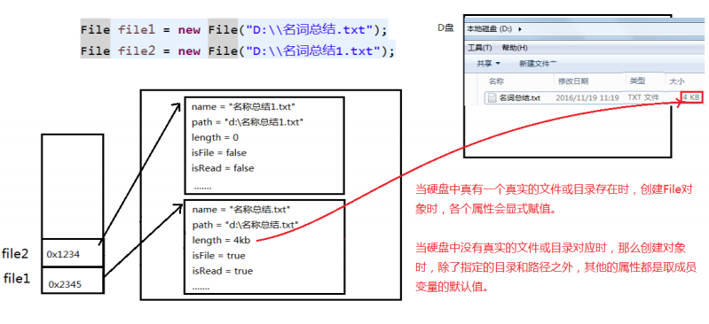

# 1.File类的使用

## 1.1概述

 java.io.File类：文件和文件目录路径的抽象表示形式，与平台无关

 File 能新建、删除、重命名文件和目录，但 File 不能访问文件内容本身。如果需要访问文件内容本身，则需要使用输入/输出流。 

 想要在Java程序中表示一个真实存在的文件或目录，那么必须有一个File对 象，但是Java程序中的一个File对象，可能没有一个真实存在的文件或目录。 

 File对象可以作为参数传递给流的构造器

## 1.2常用构造器

- **public File(String pathname)** 

  以pathname为路径创建File对象，可以是**绝对路径或者相对路径**，如果pathname是相对路径，则默认的当前路径在系统属性user.dir中存储。

  - 绝对路径：是一个固定的路径,从盘符开始
  - 相对路径：是相对于某个位置开始 

- **public File(String parent,String child)**

  以parent为父路径，child为子路径创建File对象。 

- **public File(File parent,String child)**

  根据一个父File对象和子文件路径创建File对象

**路径分隔符**

 路径中的每级目录之间用一个**路径分隔符**隔开。

 路径分隔符和系统有关：

 windows和DOS系统默认使用“\”来表示

 UNIX和URL使用“/”来表示

 Java程序支持跨平台运行，因此路径分隔符要慎用。

 为了解决这个隐患，File类提供了一个常量：

​             **public static final String separator**。根据操作系统，动态的提供分隔符。

```java
File file1 = new File("d:\\atguigu\\info.txt");
File file2 = new File("d:" + File.separator + "atguigu" + File.separator + "info.txt");
File file3 = new File("d:/atguigu");
```



## 1.3常用方法

**File类的获取功能**

 `public String getAbsolutePath()`：获取绝对路径

 `public String getPath()` ：获取路径

 `public String getName()` ：获取名称

 `public String getParent()`：获取上层文件目录路径。若无，返回null

 `public long length()` ：获取文件长度（即：字节数）。不能获取目录的长度。 

 `public long lastModified()` ：获取最后一次的修改时间，毫秒值

 `public String[] list()` ：获取指定目录下的所有文件或者文件目录的名称数组

 `public File[] listFiles()` ：获取指定目录下的所有文件或者文件目录的File数组

**File类的重命名功能**

 `public boolean renameTo(File dest)`:把文件重命名为指定的文件路径

**File类的判断功能**

 `public boolean isDirectory()`：判断是否是文件目录

 `public boolean isFile()` ：判断是否是文件

 `public boolean exists()` ：判断是否存在

 `public boolean canRead()` ：判断是否可读

 `public boolean canWrite()` ：判断是否可写

 `public boolean isHidden()` ：判断是否隐藏

**File类的创建功能**

 `public boolean createNewFile()` ：创建文件。若文件存在，则不创建，返回false

 `public boolean mkdir()` ：创建文件目录。如果此文件目录存在，就不创建了。如果此文件目录的上层目录不存在，也不创建。 

 `public boolean mkdirs()` ：创建文件目录。如果上层文件目录不存在，一并创建

> **注意事项：如果你创建文件或者文件目录没有写盘符路径，那么，默认在项目路径下。** 

```java
File dir1 = new File("D:/IOTest/dir1");
if (!dir1.exists()) { // 如果D:/IOTest/dir1不存在，就创建为目录
	dir1.mkdir();
}
// 创建以dir1为父目录,名为"dir2"的File对象
File dir2 = new File(dir1, "dir2");
if (!dir2.exists()) { // 如果还不存在，就创建为目录
	dir2.mkdirs();
}
File dir4 = new File(dir1, "dir3/dir4");
if (!dir4.exists()) {
	dir4.mkdirs();
}
// 创建以dir2为父目录,名为"test.txt"的File对象
File file = new File(dir2, "test.txt");
if (!file.exists()) { // 如果还不存在，就创建为文件
	file.createNewFile();
}
```

**File类的删除功能**

 `public boolean delete()`：删除文件或者文件夹

> 删除注意事项：
>
> Java中的删除不走**回收站**。 
>
> 要删除一个文件目录，请注意该文件目录内不能包含文件或者文件目录1

# 2.IO流原理及流的分类


# 3.节点流（或文件流）


# 4.缓冲流


# 5.转换流


# 6.标准输入流、输出流


# 7.打印流


# 8.数据流


# 9.对象流


# 10.随机存取文件流


# 11. NIO.2中Path、Paths、Files类的使用


