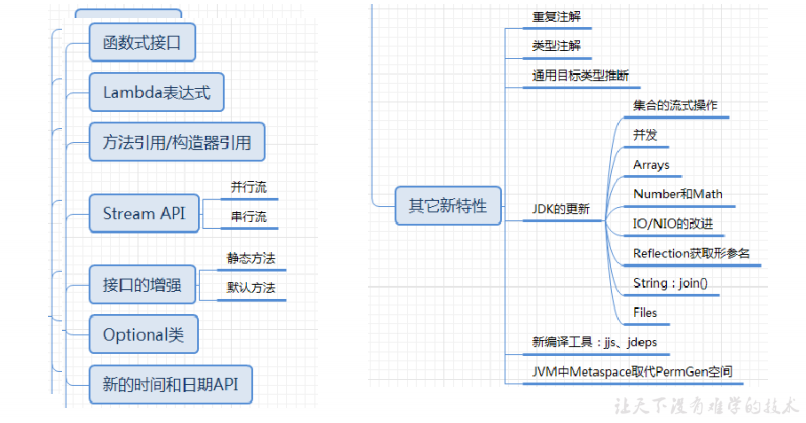
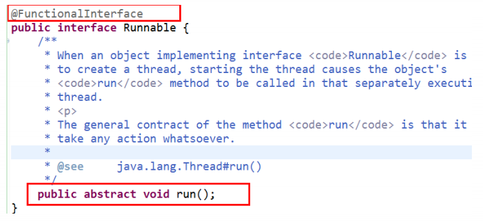
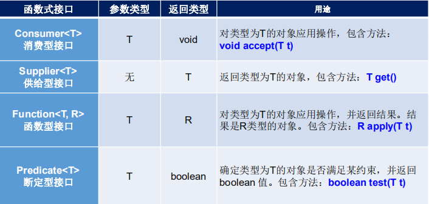

# 1.JDK8新特性



## 1.1Lambda表达式

### 1.1.1为什么要引入Lambda表达式

Java8以前，如果想把某个接口的实现类作为参数传递给一个方法会怎么做？要么创建一个类实现该接口，然后new出一个对象，在调用方法时传递进去，要么使用匿名类，可以精简一些代码。以创建一个线程并打印一行日志为例，使用匿名函数写法如下：

```java
new Thread(new Runnable() {
    @Override
    public void run() {
        System.out.println("小白也能看懂了的Lambda 表达式");
    }
}).start();
```

在java8以前，使用匿名函数已经算是很简洁的写法了，在JDK8以后，使用Lambda表达式，代码如下

```
new Thread(() -> System.out.println("小白也能看懂了的Lambda 表达式")).start();
```

### 1.1.2Lambda表达式简介

Lambda 是一个**匿名函数**，我们可以把 Lambda 表达式理解为是**一段可以传递的代码**（将代码像数据一样进行传递）。使用它可以写出更简洁、更灵活的代码。作为一种更紧凑的代码风格，使Java的语言表达能力得到了提升

### 1.1.3Lambda表达式语法结构

Lambda 表达式：在Java 8 语言中引入的一种新的语法元素和操作符。这个操作符为 “**->**” ， 该操作符被称为 **Lambda** **操作符**或**箭头操作符**。它将 Lambda 分为两个部分：

​            **左侧：**指定了 Lambda 表达式需要的**参数列表**

​            **右侧：**指定了 **Lambda** **体**，是抽象方法的实现逻辑，也即Lambda 表达式要执行的功能

通用格式：

```java
([type1 parameter1,type2 paramerer2,...]) ->{ body; }
```

说明：

1. 参数类型可以省略，格式如下:

   ```java
   ([parameter1,paramerer2,...]) ->{ body; }
   ```

2. 如果只有一个参数，参数的小括号可以省略

   ```java
   parameter ->{ body; }
   ```

3. Lambda体只有一条语句时，若无返回值，大括号可以省略，若有返回值，return和大括号都省略。

   ```java
   ([parameter1,paramerer2,...]) ->body
   ```

基本格式：

```java
//没有参数
() -> body
// 1个参数
(param) -> body
// 或
(param) ->{ body; }
// 多个参数
(param1, param2...) -> { body }
// 或
(type1 param1, type2 param2...) -> { body }
```

实例：

```java
public class LambdaTest2 {
    //1.无参，无返回值
    @Test
    public void test1() {
        Runnable runnable = new Runnable() {
            @Override
            public void run() {
                System.out.println("我使用的是普通的方法");
            }
        };
        runnable.run();

        System.out.println("*********************************");
        Runnable runnable1 = () -> System.out.println("我使用了Lambda表达式");
        runnable1.run();
        /*运行结果
        我使用的是普通的方法
        *********************************
        我使用了Lambda表达式
        */
    }

    //2.一个参数，无返回值
    @Test
    public void test2(){
        Consumer<String> consumer=new Consumer<String>() {
            @Override
            public void accept(String s) {
                System.out.println("我使用的是普通的方法，"+s);
            }
        };
        consumer.accept("繁琐");

        System.out.println("****************************************");
        Consumer<String> consumer1=s -> System.out.println("我使用了Lambda表达式,"+s);
        consumer1.accept("简洁");
        /*运行结果
         我使用的是普通的方法，繁琐
         ****************************************
         我使用了Lambda表达式,简洁
        */
    }

    //3.Lambda 需要两个或以上的参数，多条执行语句，并且可以有返回值
    @Test
    public void test3(){
        Comparator<Integer> com=new Comparator<Integer>() {
            @Override
            public int compare(Integer o1, Integer o2) {
                System.out.println(o1);
                System.out.println(o2);
                return o1.compareTo(o2);
            }
        };
        System.out.println(com.compare(12,32));

        System.out.println("******************************");
        Comparator<Integer> com1=(o1,o2)->{
            System.out.println(o1);
            System.out.println(o2);
            return o1.compareTo(o2);
        };
        System.out.println(com1.compare(12,10));
    }

    //4.当 Lambda 体只有一条语句时，return 与大括号若有，都可以省略
    @Test
    public void test4(){
        Comparator<Integer> com1 = (o1,o2) -> {
            return o1.compareTo(o2);
        };
        System.out.println(com1.compare(12,6));
        System.out.println("*****************************");
        Comparator<Integer> com2 = (o1,o2) -> o1.compareTo(o2);
        System.out.println(com2.compare(12,21));
    }
}
```

### 1.1.4函数式接口

#### 1.1.4.1什么是函数式接口

 **只包含一个抽象方法的接口**，称为**函数式接口**。 

 可以在一个接口上使用 **@FunctionalInterface** 注解，这样做可以检查它是否是一个函数式接口。同时javadoc 也会包含一条声明，说明这个接口是一个函数式接口。



 可以通过 Lambda 表达式来创建该接口的对象。（若 Lambda 表达式抛出一个受检异常(即：非运行时异常)，那么该异常需要在目标接口的抽象方法上进行声明）。

 **在java.util.function包下定义了Java 8 的丰富的函数式接口**。

#### 1.1.4.2如何理解函数式接口

 Java从诞生日起就是一直倡导“一切皆对象”，在Java里面面向对象(OOP)编程是一切。但是随着python、scala等语言的兴起和新技术的挑战，Java不得不做出调整以便支持更加广泛的技术要求，也即**java不但可以支持OOP还可以支持OOF（面向函数编程）** 

 在函数式编程语言当中，函数被当做一等公民对待。在将函数作为一等公民的编程语言中，Lambda表达式的类型是函数。但是在Java8中，有所不同。在Java8中，Lambda表达式是对象，而不是函数，它们必须依附于一类特别的对象类型——**函数式接口**。 

 简单的说，在Java8中，**Lambda表达式就是一个函数式接口的实例**。这就是Lambda表达式和函数式接口的关系。也就是说，只要一个对象是函数式接口的实例，那么该对象就可以用Lambda表达式来表示。

 **所以以前用匿名实现类表示的现在都可以用Lambda表达式来写**

#### 1.1.4.3自定义函数式接口

使用@FunctionalInterface注解

```java
@FunctionalInterface
public interface MyInterface {
    void method1();
}
```

```java
@Test
public void test3(){
    MyInterface myInterface=()-> System.out.println("lallalal");
    myInterface.method1();
}
```

#### 1.1.4.4作为参数传递Lambda表达式


#### 1.1.4.5java内置四大核心函数式接口



其他接口：


### 1.1.5方法引用


### 1.1.6构造器引用和数组引用


## 1.2Stream API


## 1.3Optional类

