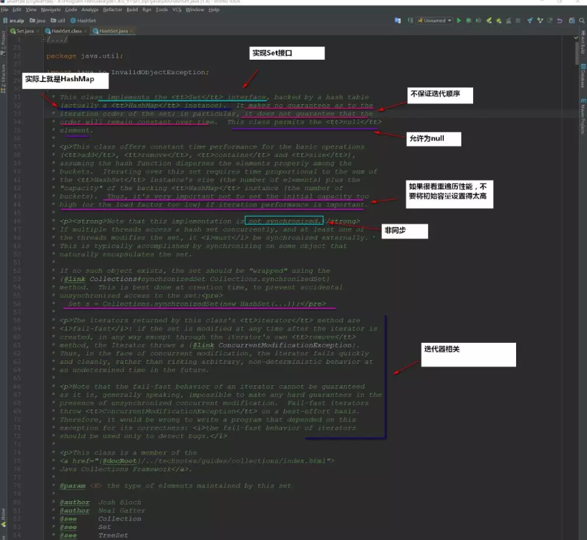
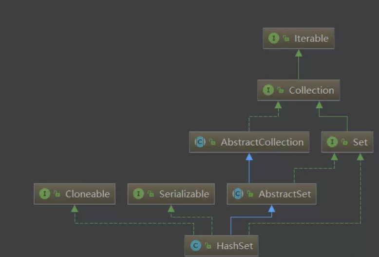
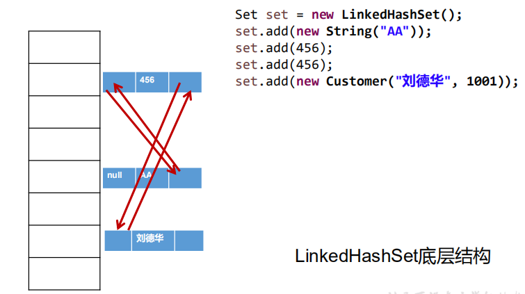

### HashSet源码分析



```java
public class HashSet<E>
    extends AbstractSet<E>
    implements Set<E>, Cloneable, java.io.Serializable
{
    static final long serialVersionUID = -5024744406713321676L;

    private transient HashMap<E,Object> map;

    // Dummy value to associate with an Object in the backing Map
    private static final Object PRESENT = new Object();  //object在hashmap中充当value

    /**
     * Constructs a new, empty set; the backing <tt>HashMap</tt> instance has
     * default initial capacity (16) and load factor (0.75).
     */
    public HashSet() {    //初始化HashSet时创建了HashMap
        map = new HashMap<>();
    }
    
    public boolean add(E e) {
        return map.put(e, PRESENT)==null;
    }
```

HashSet实际上就是封装了HashMap，**操作HashSet元素实际上就是操作HashMap**。

TreeSet的类继承结构图：




## **Set**实现类之二：LinkedHashSet

- LinkedHashSet 是 HashSet 的子类

- LinkedHashSet 根据元素的 hashCode 值来决定元素的存储位置，但它同时使用双向链表维护元素的次序，这使得元素看起来是以插入顺序保存的。

- LinkedHashSet插入性能略低于 HashSet，但在迭代访问 Set 里的全部元素时有很好的性能。

- LinkedHashSet 不允许集合元素重复。
- LinkedHashSet特点：
  - 迭代是有序的
  - 允许为null
  - **底层实际上是一个HashMap+双向链表实例(其实就是LinkedHashMap)…**
  - 非同步
  - 性能比HashSet差一丢丢，因为要维护一个双向链表
  - 初始容量与迭代无关，LinkedHashSet迭代的是双向链表



## **Set**实现类之三：TreeSet

- TreeSet 是 SortedSet 接口的实现类，TreeSet 可以确保集合元素处于排序状态。

- TreeSet底层使用**红黑树**结构存储数据

```java
public class TreeSet<E> extends AbstractSet<E>
    implements NavigableSet<E>, Cloneable, java.io.Serializable
{
    /**
     * The backing map.
     */
    private transient NavigableMap<E,Object> m;

    // Dummy value to associate with an Object in the backing Map
    private static final Object PRESENT = new Object();  //Object是map中的value

    /**
     * Constructs a set backed by the specified navigable map.
     */
    TreeSet(NavigableMap<E,Object> m) {
        this.m = m;
    }

    /**
     * Constructs a new, empty tree set, sorted according to the
     * natural ordering of its elements.  All elements inserted into
     * the set must implement the {@link Comparable} interface.
     * Furthermore, all such elements must be <i>mutually
     * comparable</i>: {@code e1.compareTo(e2)} must not throw a
     * {@code ClassCastException} for any elements {@code e1} and
     * {@code e2} in the set.  If the user attempts to add an element
     * to the set that violates this constraint (for example, the user
     * attempts to add a string element to a set whose elements are
     * integers), the {@code add} call will throw a
     * {@code ClassCastException}.
     */
    public TreeSet() {
        this(new TreeMap<E,Object>());  //treeSet底层是TreeMap
    }

    /**
     * Constructs a new, empty tree set, sorted according to the specified
     * comparator.  All elements inserted into the set must be <i>mutually
     * comparable</i> by the specified comparator: {@code comparator.compare(e1,
     * e2)} must not throw a {@code ClassCastException} for any elements
     * {@code e1} and {@code e2} in the set.  If the user attempts to add
     * an element to the set that violates this constraint, the
     * {@code add} call will throw a {@code ClassCastException}.
     *
     * @param comparator the comparator that will be used to order this set.
     *        If {@code null}, the {@linkplain Comparable natural
     *        ordering} of the elements will be used.
     */
    public TreeSet(Comparator<? super E> comparator) {
        this(new TreeMap<>(comparator));
    }
```

-  新增的方法如下： (了解) 
  - Comparator comparator()
  - Object first()
  - Object last()
  - Object lower(Object e)
  - Object higher(Object e)
  - SortedSet subSet(fromElement, toElement) 
  - SortedSet headSet(toElement) 
  - SortedSet tailSet(fromElement) 

- 特点：
  - 实现NavigableSet接口
  - 可以实现排序功能
  - **底层实际上是一个TreeMap实例**
  - 非同步
- TreeSet 两种排序方法：**自然排序**和**定制排序**。默认情况下，TreeSet 采用自然排序。

#### 排 序—自然排序

- **自然排序**：TreeSet 会调用集合元素的 compareTo(Object obj) 方法来比较元素之间的大小关系，然后将集合元素按升序(默认情况)排列

- 如果试图把一个对象添加到 TreeSet 时，则该对象的类必须实现 Comparable 接口。

- 实现 Comparable 的类必须实现 compareTo(Object obj) 方法，两个对象即通过compareTo(Object obj) 方法的返回值来比较大小。 

-  Comparable 的典型实现：
  - BigDecimal、BigInteger 以及所有的数值型对应的包装类：按它们对应的数值大小进行比较
  - Character：按字符的 unicode值来进行比较
  - Boolean：true 对应的包装类实例大于 false 对应的包装类实例
  - String：按字符串中字符的 unicode 值进行比较
  - Date、Time：后边的时间、日期比前面的时间、日期大

- 向 TreeSet 中添加元素时，只有第一个元素无须比较compareTo()方法，后面添加的所有元素都会调用compareTo()方法进行比较。

- **因为只有相同类的两个实例才会比较大小，所以向** **TreeSet中添加的应该是同一个类的对象。** 

- 对于 TreeSet 集合而言，它判断两个对象是否相等的唯一标准是：两个对象通过 compareTo(Object obj) 方法比较返回值。

- 当需要把一个对象放入 TreeSet 中，重写该对象对应的 equals() 方法时，应保证该方法与 compareTo(Object obj) 方法有一致的结果：如果两个对象通过equals() 方法比较返回 true，则通过 compareTo(Object obj) 方法比较应返回 0。否则，让人难以理解。

#### 排 序—定制排序

- TreeSet的自然排序要求元素所属的类实现Comparable接口，如果元素所属的类没有实现Comparable接口，或不希望按照升序(默认情况)的方式排列元素或希望按照其它属性大小进行排序，则考虑使用定制排序。定制排序，通过Comparator接口来实现。需要重写compare(T o1,T o2)方法。 

- 利用int compare(T o1,T o2)方法，比较o1和o2的大小：如果方法返回正整数，则表示o1大于o2；如果返回0，表示相等；返回负整数，表示o1小于o2。 

- 要实现定制排序，需要将实现Comparator接口的实例作为形参传递给TreeSet的构造器。

- 此时，仍然只能向TreeSet中添加类型相同的对象。否则发生ClassCastException异常。

- 使用定制排序判断两个元素相等的标准是：通过Comparator比较两个元素返回了0。

面试题：

```java
HashSet set = new HashSet();

Person p1 = new Person(1001,"AA");

Person p2 = new Person(1002,"BB");

set.add(p1);

set.add(p2);

p1.name = "CC";

set.remove(p1);
System.out.println(set);  //[Person1{pno=1002, name='BB'}, Person1{pno=1001, name='CC'}]

set.add(new Person(1001,"CC"));  
System.out.println(set); //[Person1{pno=1002, name='BB'}, Person1{pno=1001, name='CC'}, Person1{pno=1001, name='CC'}]

set.add(new Person(1001,"AA"));
System.out.println(set); //[Person1{pno=1002, name='BB'}, Person1{pno=1001, name='CC'}, Person1{pno=1001, name='CC'}, Person1{pno=1001, name='AA'}]

```

**其中Person类中重写了hashCode()和equal()方法**