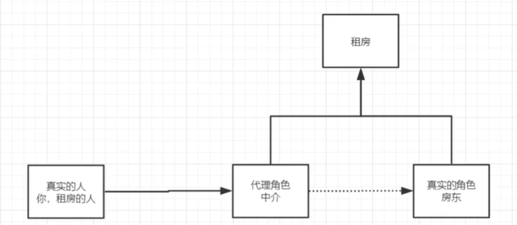
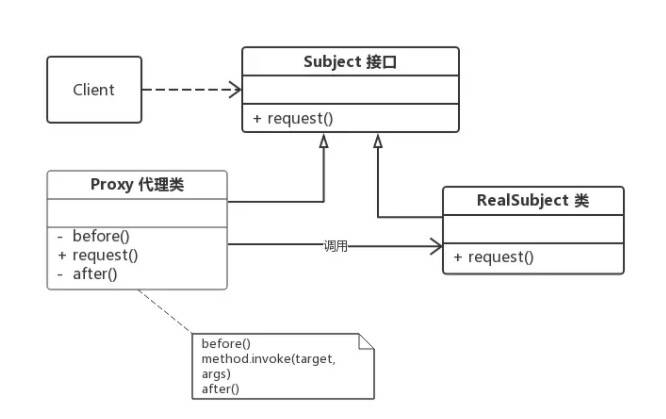

# 1.什么是代理模式

## 1.1定义

为其他对象提供一种代理以控制对这个对象的访问。在某些情况下，一个对象不适合或者不能直接引用另一个对象，而代理对象可以在客户端和目标对象之间起到中介的作用。

## 1.2特点

1）很直接的，实现同一个接口或者继承同一个抽象类。

2）代理对象控制对被代理对象的访问。

## 1.3代理模式角色



这是代理模式的通用UML，涉及到的角色如下所示：

- **抽象主题角色：定义了被代理角色和代理角色的共同接口或者抽象类。**

- **被代理角色：实现或者继承抽象主题角色，定义实现具体业务逻辑的实现。**

- **代理角色：实现或者继承抽象主题角色，持有被代理角色的引用，控制和限制被代理角色的实现，并且拥有自己的处理方法（预处理和善后）**
- **客户：访问代理对象的人**

## 1.4代理模式分类

- 静态代理

- 动态代理

# 2.静态代理

静态代理：由程序员创建或特定工具自动生成源代码，也就是在编译时就已经将接口，被代理类，代理类等确定下来。在程序运行之前，代理类的.class文件就已经生成。

实例：买房子：房东、中介、客户

抽象主题角色：出租房子

```java
//定义房东和中介共同的行为：出租房子
public interface Rent {
    public void rent();
}
```

真实对象：房东

```java
//房东
public class Host implements Rent{
    @Override
    public void rent() {
        System.out.println("房东要出租房子");
    }
}
```

代理角色：中介

```java
public class Proxy implements Rent {
    
    //中介需要持有一份目标对象（真实对象：房东）的引用
    private Host host;
    public Proxy(Host host) {
        this.host = host;
    }
    
    public Proxy() {
    }
    
    @Override
    public void rent() {
        seeHouse();
        host.rent();
        hetong();
        fee();
    }
    
    //中介可以添加一些附属操作
    public void seeHouse(){
        System.out.println("中介带着看房");
    }
    public void hetong(){
        System.out.println("签租赁合同");
    }
    public void fee(){
        System.out.println("收中介费");
    }
}
```

客户：需要买房子的人

```java
public class Client {
    public static void main(String[] args) {
        //要先有一份真实对象（房东）
        Host host=new Host();
        //代理者（中介）要持有这个真实对象
        Proxy proxy=new Proxy(host);
        
        proxy.rent();
    }
}

```

静态代理的缺点:

静态代理实现简单且不侵入原代码，但当场景复杂时，静态代理会有以下缺点：

1、当需要代理多个类时，代理对象要实现与目标对象一致的接口。要么，只维护一个代理类来实现多个接口，但这样会导致代理类过于庞大。要么，新建多个代理类，但这样会产生过多的代理类。

2、当接口需要增加、删除、修改方法时，目标对象与代理类都要同时修改，不易维护。

对于上述缺点，通过动态代理的方式进行了弥补。

# 3.动态代理

## 3.1动态代理分类

- jdk动态代理
- cglib代理

**jdk自带的代理只能为接口创建代理类，如果需要给具体的类创建代理类，需要用后面要说的cglib**

## 3.2jdk动态代理

jdk中为实现代理提供了支持，主要用到2个类：

```java
java.lang.reflect.Proxy
java.lang.reflect.InvocationHandler
```

### 3.2.1Proxy类常用静态方法

（1）`public static Class<?> getProxyClass(ClassLoader loader,Class<?>... interfaces)`

​         为指定的接口创建代理类，返回代理类的Class对象

​         参数说明：

​                loader：定义代理类的类加载器

​                interfaces：指定需要实现的接口列表，创建的代理默认会按顺序实现interfaces指定的接口

（2）`public static Object newProxyInstance(ClassLoader loader, Class<?>[]           interfaces,InvocationHandler h)`

​           创建代理类的实例对象

​           这个方法先为指定的接口创建代理类，然后会生成代理类的一个实例。

​           最后一个参数比较特殊，是InvocationHandler类型的，这个是个接口如下：

​          `public Object invoke(Object proxy, Method method, Object[] args) throws Throwable;`

​           这个方法会返回一个代理对象，当调用代理对象的任何方法的时候，就会被`InvocationHandler`接口的`invoke`方法处理，所以主要代码需要写在`invoke`方法中。

（3）`public static boolean isProxyClass(Class<?> cl)`

​           判断指定的类是否是一个代理类

（4）`public static InvocationHandler getInvocationHandler(Object proxy) throws IllegalArgumentException`

​           获取代理对象的`InvocationHandler`对象

### 3.2.2创建代理

#### 3.2.2.1方式一

步骤：

1. 调用Proxy.getProxyClass方法获取代理类的Class对象
2. 使用InvocationHandler接口创建代理类的处理器
3. 通过代理类和InvocationHandler创建代理对象
4. 上面已经创建好代理对象了，接着我们就可以使用代理对象了

实现：

#### 3.2.2.2方式二

步骤：

1. 使用InvocationHandler接口创建代理类的处理器
2. 使用Proxy类的静态方法newProxyInstance直接创建代理对象
3. 使用代理对象

实现：

### 3.2.3Proxy使用注意

1. **jdk中的Proxy只能为接口生成代理类，如果你想给某个类创建代理类，那么Proxy是无能为力的，此时需要我们用到下面要说的cglib了。**
2. **Proxy类中提供的几个常用的静态方法大家需要掌握**
3. **通过Proxy创建代理对象，当调用代理对象任意方法时候，会被InvocationHandler接口中的invoke方法进行处理，这个接口内容是关键**

## 3.3cglib代理

# 4CGLIB和Java动态代理的区别

1. **Java动态代理只能够对接口进行代理，不能对普通的类进行代理（因为所有生成的代理类的父类为Proxy，Java类继承机制不允许多重继承）；CGLIB能够代理普通类；**
2. **Java动态代理使用Java原生的反射API进行操作，在生成类上比较高效；CGLIB使用ASM框架直接对字节码进行操作，在类的执行过程中比较高效**
3. **代理的就介绍到这里，spring中很多地方会用到这块，所以大家一定要熟悉，欢迎大家留言交流**