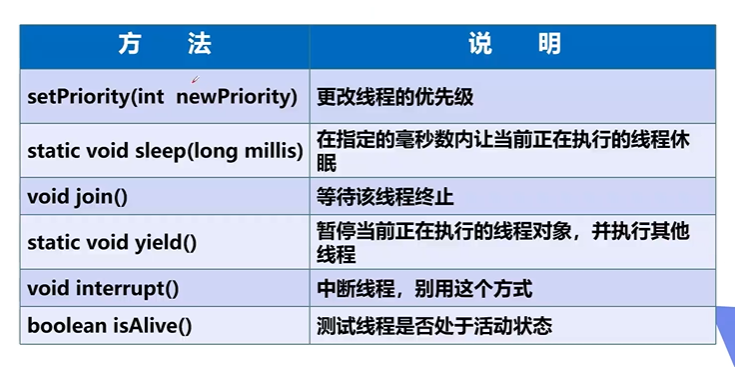
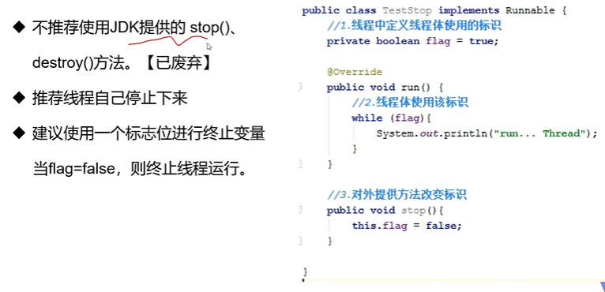

# 1.基本概念

## 1.1普通方法调用和多线程


## 1.2程序、进程和线程

程序是指令和数据的有序集合，其本身没有任何运行的含义，是一个静态的概念

进程是执行程序的一次执行过程，它是一个动态的概念。是系统资源分配的单位

通常在一个进程中可以包含若干个线程，当然一个进程中至少有一个线程，不然没有存在的意义。线程是CPU调度和执行的单位

> 注意：很多线程是模拟出来的，真正的多线程是指有多个cpu,即多核，如服务器。如果是模拟出来的多线程，即在一个cpu的情况下，在同一个时间点，cpu只能执行一个代码，因为切换的很快，所以就有同时执行的错局。

# 2.线程的创建和使用

三种创建方式：

1. **继承Thread类**
2. **实现Runnable接口**
3. **实现Callable接口**

## 2.1继承Thread类

### 2.1.1创建步骤


## 2.2实现Runnable接口


案例


## 2.3实现Callable接口


# 3.线程的状态


线程状态观测


```java
public class StateTest {
    public static void main(String[] args) {
        Thread thread=new Thread(()->{
            for (int i = 0; i < 5; i++) {
                try {
                    Thread.sleep(1000);
                } catch (InterruptedException e) {
                    e.printStackTrace();
                }
            }
            System.out.println("线程执行完成");
        });

        //观察状态
        Thread.State state = thread.getState();
        System.out.println(state);

        //观察启动后
        thread.start();
        state=thread.getState();
        System.out.println(state);

        //只要线程不终止，就一直输出状态
        while(thread.getState()!=Thread.State.TERMINATED){
            try {
                Thread.sleep(100);
            } catch (InterruptedException e) {
                e.printStackTrace();
            }
            state=thread.getState();
            System.out.println(state);
        }
    }
}
```


# 4.线程方法



停止线程



线程休眠


线程礼让(yield)


线程强制执行（join)


线程优先级


守护(daemon)线程


使用`setDaemon(Boolean b)`设置某线程为守护线程，默认为false表示时用户线程。正常的线程都是用户线程。

# 5.线程的生命周期

# 6.线程的同步

多个线程操作同一个资源

并发：同一个对象被多个线程同时操作

处理多线程问题时，多个线程访问同一个对象，并且某些线程还想修改这个对象，这时候我们就需要线程同步。线程同步其实就是一种等待机制，多个需要同时访问此对象的线程进入这个对象的等待池形成队列，等待前面线程使用完毕，下一个线程才能使用。


三大不安全案例

 买火车票的例子

```java
public class ThreadTest implements Runnable {

    private int ticketNum = 5;
    @Override
    public void run() {
        while(true){
            if(ticketNum <= 0){
                break;
            }
            try {
                Thread.sleep(100);
            } catch (InterruptedException e) {
                e.printStackTrace();
            }
            System.out.println(Thread.currentThread().getName()+"拿到了第"+(ticketNum--)+"票");
        }
    }

}

public class Project01 {
    public static void main(String[] args) {
          ThreadTest tt=new ThreadTest();
          new Thread(tt,"张三").start();
          new Thread(tt,"李四").start();
          new Thread(tt,"王五").start();
    }
}


//执行结果
王五拿到了第5票
张三拿到了第3票
李四拿到了第4票
李四拿到了第2票
张三拿到了第2票
王五拿到了第2票
张三拿到了第1票
李四拿到了第-1票
王五拿到了第0票

//多个线程操作同一个资源时，出现重复或者负数的情况。
```

银行取款案例

```java
public class UnsafeBank {
    public static void main(String[] args) {
        Account account=new Account("zhangsan",100);
        Drawing drawing=new Drawing(account,50,"zhangsan");
        Drawing drawing1=new Drawing(account,100,"lisi");
        drawing.start();
        drawing1.start();
    }
}
//账户
class Account{
    private String name;
    private double money;

    public Account(String name, double money) {
        this.name = name;
        this.money = money;
    }

    public String getName() {
        return name;
    }

    public void setName(String name) {
        this.name = name;
    }

    public double getMoney() {
        return money;
    }

    public void setMoney(double money) {
        this.money = money;
    }
}
//银行：模拟取款
class Drawing extends Thread{
    Account account;
    double drawingMoney;

    public Drawing(Account account, double drawingMoney,String name) {
        super(name);
        this.account = account;
        this.drawingMoney = drawingMoney;
    }

    @Override
    public void run() {
        try {
            Thread.sleep(1000);
        } catch (InterruptedException e) {
            e.printStackTrace();
        }
        if(account.getMoney()-drawingMoney<0){
            System.out.println("卡内余额不足");
            return;
        }
        System.out.println(Thread.currentThread().getName()+"取了"+drawingMoney+"元");
        account.setMoney(account.getMoney()-drawingMoney);
        System.out.println("卡内还剩"+account.getMoney()+"元");
    }
}

//执行结果
zhangsan取了50.0元
卡内还剩50.0元
lisi取了100.0元
卡内还剩-50.0元
    
//在执行结果中我们发现账户余额出现了负数
```

线程不安全的集合

```java
public class UnsafeList {
    public static void main(String[] args) {
        List<String> list=new ArrayList<>();
        for (int i = 0; i < 10000; i++) {
            new Thread(()->{
                list.add(Thread.currentThread().getName());
            }).start();
        }
        try {
            Thread.sleep(1000);
        } catch (InterruptedException e) {
            e.printStackTrace();
        }
        System.out.println(list.size());
    }
}

//运行该程序，我们会发现执行结果有时不正确，插入的数据个数不是10000；
```


同步方法和同步块


死锁


```java
public class DeadLock {
    public static void main(String[] args) {
        MakeUp m1=new MakeUp(0,"小美");
        MakeUp m2=new MakeUp(1,"小红");

        m1.start();
        m2.start();
    }
}

class Mirror{

}
class Lipstick{

}

class MakeUp extends Thread{

    @Override
    public void run() {
        makeup();
    }

    static Lipstick lipstick=new Lipstick();
    static Mirror mirror=new Mirror();

    int choice;
    String girlname;

    public MakeUp(int choice,String name){
        this.choice=choice;
        this.girlname=name;
    }

    public void makeup(){
        if(choice==0){
            synchronized (lipstick){
                System.out.println(this.girlname+"需要口红");

                synchronized (mirror){
                    System.out.println(this.girlname+"需要镜子");
                }
            }
        }else{
            synchronized (mirror){
                System.out.println(this.girlname+"需要镜子");

                synchronized (lipstick){
                    System.out.println(this.girlname+"需要口红");
                }
            }
        }
    }
}
```

死锁避免方法


Lock(锁)


# 7.线程的通信


管程法（利用缓冲区解决）

```java
public class TestPC {
    public static void main(String[] args) {
        SynContainer synContainer=new SynContainer();
        Productor p=new Productor(synContainer);
        Consumer c=new Consumer(synContainer);
        p.start();
        c.start();
    }
}
//生产者
class Productor extends Thread{

    private SynContainer synContainer;
    public Productor(SynContainer synContainer){
        this.synContainer=synContainer;
    }

    @Override
    public void run() {
        for (int i = 0; i < 100; i++) {
            synContainer.push(new Product(i));
            System.out.println("生产第"+i+"个产品");

        }

    }
}
//消费者
class Consumer extends Thread{
    private SynContainer synContainer;
    public Consumer(SynContainer synContainer){
        this.synContainer=synContainer;
    }

    @Override
    public void run() {
        for (int i = 0; i < 100; i++) {
            System.out.println("消费第"+synContainer.pop().id+"个产品");
        }

    }
}

//产品
class Product{
    int id;

    public Product(int id) {
        this.id = id;
    }
}

//缓冲区
class SynContainer{
    static Product[] products=new Product[10];
    int count=0;
    public synchronized void push(Product product){
        //如果缓冲区满了，就需要等待消费者消费
        if(count==products.length){
            try {
                this.wait();
            } catch (InterruptedException e) {
                e.printStackTrace();
            }
        }
        //如果没有满，就需要丢入产品
        products[count++]=product;
        //通知消费者消费
        this.notifyAll();
    }

    public synchronized Product pop() {
        //如果缓冲区为空，就需要等待生产者生产
        if(count==0){
            try {
                this.wait();
            } catch (InterruptedException e) {
                e.printStackTrace();
            }
        }
        //如果没有孔，就需要消费
        count--;
        //通知消生产者生产
        this.notifyAll();
        return products[count];
    }
}
```

信号灯法

```java
public class TestPC02 {
    public static void main(String[] args) {
        Product02 product02=new Product02();
        Productor02 p=new Productor02(product02);
        Consumer02 c=new Consumer02(product02);
        p.start();
        c.start();
    }
}

class Productor02 extends Thread{
    private Product02 product02;
    public Productor02(Product02 product02){
        this.product02=product02;
    }

    @Override
    public void run() {
        for (int i = 0; i < 10; i++) {
            product02.push();
        }

    }
}
class Consumer02 extends Thread{
    private Product02 product02;
    public Consumer02(Product02 product02){
        this.product02=product02;
    }

    @Override
    public void run() {
        for (int i = 0; i < 10; i++) {
            product02.pop();
        }

    }
}
class Product02{
    boolean flag=true;//true：表示生产者生产

    //生产
    public synchronized void push(){
        if(!flag){
            try {
                this.wait();
            } catch (InterruptedException e) {
                e.printStackTrace();
            }
        }
        System.out.println("生产者生产产品");
        //通知给消费者消费
        this.notifyAll();
        this.flag=!this.flag;
    }

    //消费
    public synchronized void pop(){
        if(flag){
            try {
                this.wait();
            } catch (InterruptedException e) {
                e.printStackTrace();
            }
        }
        System.out.println("消费者消费产品");
        //通知生产者
        this.notifyAll();
        this.flag=!this.flag;
    }

}
```

线程池


使用线程池

