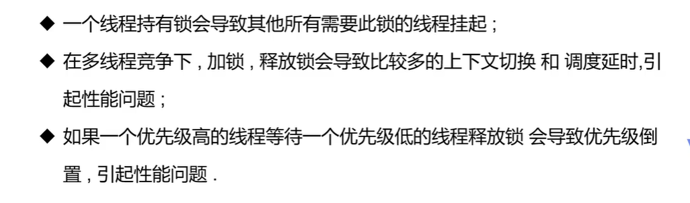

# 1.基本概念

## 1.1普通方法调用和多线程


## 1.2程序、进程和线程

### 1.2.1什么是程序

程序是指令和数据的有序集合，其本身没有任何运行的含义，是一个静态的概念

### 1.2.2什么是进程

进程是执行程序的一次执行过程，是系统进行资源分配（运行程序）的单位，它是一个动态的概念。系统运行一个程序即是一个进程从创建，运行到消亡的过程。简单来说，**一个进程就是一个执行中的程序**，它在计算机中一个指令接着一个指令地执行着，同时，每个进程还占有某些系统资源如CPU时间，内存空间，文件，输入输出设备的使用权等等。换句话说，当程序在执行时，将会被操作系统载入内存中。

### 1.2.3什么是线程

线程与进程相似，但线程是一个比进程更小的执行单位，是CPU调度和执行的单位。通常在一个进程中可以包含若干个线程（一个进程中至少有一个线程，不然没有存在的意义）。

> 简单来讲就是：线程可以理解成为在进程中**独立运行的子任务**。比如：一间房子相当于一个容器，也就是进程的概念。这间房子住着你和你的父母，三个人就是分别的线程。你上学，妈妈干家务，爸爸上班，做着不同的事情，维持的进程的运行。

与进程不同的是**同类的多个线程共享同一块内存空间和一组系统资源**，所以系统在产生一个线程，或是在各个线程之间作切换工作时，负担要比进程小得多，也正因为如此，线程也被称为轻量级进程。

### 1.2.4进程和线程的区别

-  调度：线程作为调度和分配的基本单位，进程作为拥有资源的基本单位 。

- 并发性：不仅进程之间可以并发执行，同一个进程的多个线程之间也可并发执行。

-  拥有资源：进程是拥有资源的一个独立单位，线程自己基本上不拥有系统资源，只拥有一点在运行中必不可少的资源（如程序计数器、一组寄存器和栈），但是它可以与同属一个进程的其他线程共享进程所拥有的全部资源。进程之间是不能共享地址空间的, 而线程是共享着所在进程的地址空间的。

- 系统开销：在创建或撤消进程时，由于系统都要为之分配和回收资源，导致系统的开销明显大于创建或撤消线程时的开销。


### 1.2.5什么是多线程

多线程就是**几乎同时执行多个线程**。（一个处理器在某一个时间点上永远都只能是一个线程！即使这个处理器是多核的，除非有多个处理器才能实现多个线程同时运行。）几乎同时是因为实际上多线程程序中的多个线程实际上是一个线程执行一会然后其他的线程再执行，并不是很多书籍所谓的同时执行。

> 注意：很多线程是模拟出来的，真正的多线程是指有多个cpu,即多核，如服务器。如果是模拟出来的多线程，即在一个cpu的情况下，在同一个时间点，cpu只能执行一个代码，因为切换的很快，所以就有同时执行的错局。

### 1.2.6为什么要使用多线程

1. 使用线程可以把占据长时间的程序中的任务放到后台去处理
2. 用户界面可以更加吸引人，这样比如用户点击了一个按钮去触发某些事件的处理，可以弹出一个进度条来显示处理的进度
3. 程序的运行速度可能加快
4. 在一些等待的任务实现上如用户输入,文件读取和网络收发数据等,线程就比较有用了。

# 2.线程的创建和使用

三种创建方式：

1. **继承Thread类**
2. **实现Runnable接口**
3. **实现Callable接口**

## 2.1继承Thread类

### 2.1.1创建步骤


## 2.2实现Runnable接口

### 2.2.1创建步骤


**以上两种方式的区别：**


**案例**


## 2.3实现Callable接口

### 2.3.1创建步骤


# 3.线程方法

## 3.1常用方法

**对象方法：**

- `public void start()`：使该线程开始执行；Java 虚拟机调用该线程的 run 方法。

- `public void run()`：如果该线程是使用独立的 Runnable 运行对象构造的，则调用该 Runnable 对象的 run 方法；否则，该方法不执行任何操作并返回。

- `public final void setName(String name)`：改变线程名称，使之与参数 name 相同。
-  `public String getName()`：返回此线程的名称

- `public final void setPriority(int priority)`：更改线程的优先级。
- `public int getPriority()`：返回此线程的优先级

- `public final void setDaemon(boolean on)`：将该线程标记为守护线程或用户线程。 

- `public final void join(long millisec)`：等待该线程终止的时间最长为 millis 毫秒。  在很多情况下，主线程生成并起动了子线程，如果子线程里要进行大量的耗时的运算，主线程往往将于子线程之前结束，但是如果主线程处理完其他的事务后，需要用到子线程的处理结果，也就是主线程需要等待子线程执行完成之后再结束，这个时候就要用到join()方法了。

  join()的作用是：“等待该线程终止”，这里需要理解的就是该线程是指的主线程等待子线程的终止。也就是在子线程调用了join()方法后面的代码，只有等到子线程结束了才能执行

- `public Thread.State getState()`：返回此线程的状态

- public void interrupt()中断线程（已废弃）

- `public final boolean isAlive()`：测试线程是否处于活动状态。

**静态方法：**

- `public static void yield()`：暂停当前正在执行的线程对象，并执行其他线程。注意：放弃的时间不确定，可能一会就会重新获得CPU时间片。

- `public static void sleep(long millisec)`：在指定的毫秒数内让当前正在执行的线程休眠（暂停执行），此操作受到系统计时器和调度程序精度和准确性的影响。  

- public static boolean holdsLock(Object x)：当且仅当当前线程在指定的对象上保持监视器锁时，才返回true。  
- `public static Thread currentThread()`：返回对当前正在执行的线程对象的引用。

- public static void dumpStack()：将当前线程的堆栈跟踪打印至标准错误流。

## 3.2线程的基本操作

### 3.2.1停止线程

- stop(),suspend(),resume()（仅用于与suspend()一起使用）这些方法已被弃用。
- 使用interrupt()方法中断线程，但这个不会终止一个正在运行的线程，还需要加入一个判断才可以完成线程的停止。

```java
public class MyThread extends Thread {
	@Override
	public void run() {
		super.run();
		for (int i = 0; i < 5000000; i++) {
			System.out.println("i=" + (i + 1));
		}
	}
}
```

```java
public class ThreadTest {
	public static void main(String[] args) {
		try {
			MyThread thread = new MyThread();
			thread.start();
			Thread.sleep(2000);
			thread.interrupt();
		} catch (InterruptedException e) {
			System.out.println("main catch");
			e.printStackTrace();
		}
        System.out.println("end!");
	}

}
```

运行上述代码发现，**线程并不会终止。**

针对上述代码进行改进：

修改MyThread类，在循环时使用interrupted()方法判断线程是否停止，如果是停止状态则return，代码如下：

```java
public class MyThread extends Thread {
	@Override
	public void run() {
		super.run();
		for (int i = 0; i < 500000; i++) {
			if (this.interrupted()) {
				System.out.println("已经是停止状态了!我要退出了!");
				return;
			}
			System.out.println("i=" + (i + 1));
		}
	}
}

```


- 使用一个标志位进行终止变量，当flag=false,则终止线程运行，也就是当run方法完成后线程终止

```java
public class ThreadStop implements Runnable {
    //1.线程中定义线程体使用的标识
    private boolean flag=true;
    @Override
    public void run() {
        //2.线程体使用该标识
        while(flag){
            System.out.println("run... Thread");
        }
    }
    //3.对外提供方法改变标识
    public void stop(){
        System.out.println("stop...Thread");
        flag=false;
    }
}

public class ThreadTest {
    public static void main(String[] args) {
        try {
            ThreadStop threadStop=new ThreadStop();
            Thread thread=new Thread(threadStop);
            thread.start();
            thread.sleep(2000);
            
            threadStop.stop();
        } catch (InterruptedException e) {
            e.printStackTrace();
        }

    }
}

```


### 3.2.2线程休眠


### 3.2.3线程礼让(yield)


### 3.2.4线程强制执行（join)


### 3.2.5线程优先级

每个线程都具有各自的优先级，**线程的优先级可以在程序中表明该线程的重要性，如果有很多线程处于就绪状态，系统会根据优先级来决定首先使哪个线程进入运行状态。**但这个并不意味着低 优先级的线程得不到运行，而只是它运行的几率比较小，如垃圾回收机制线程的优先级就比较低。所以很多垃圾得不到及时的回收处理。


线程优先级特性：

- 继承性
  比如A线程启动B线程，则B线程的优先级与A是一样的。
- 规则性
  高优先级的线程总是大部分先执行完，但不代表高优先级线程全部先执行完。
- 随机性
  优先级较高的线程不一定每一次都先执行完。


### 3.2.6守护(daemon)线程

（1）、在Java线程中有两种线程，一种是User Thread（用户线程），另一种是Daemon Thread(守护线程)。

用户线程：运行在前台，执行具体的任务，如程序的主线程、连接网络的子线程等都是用户线程。

守护线程：运行在后台，为其他前台线程服务.也可以说守护线程是JVM中非守护线程的 **“佣人”**。

（2）、守护线程的特点：一旦所有用户线程都结束运行，守护线程会随JVM一起结束工作

​                                            虚拟机必须确保用户线程执行完毕

​                                            虚拟机不用等待守护线程执行完毕

（3）、守护线程的作用：是为其他线程的运行提供服务，比如说GC线程。其实User Thread线程和Daemon Thread守护线程本质上来说去没啥区别的，唯一的区别之处就在虚拟机的离开：如果User Thread全部撤离，那么Daemon Thread也就没啥线程好服务的了，所以虚拟机也就退出了。

（4）、应用：数据库连接池中的检测线程，JVM虚拟机启动后的检测线程

（5）、最常见的守护线程：垃圾回收线程

**如何设置守护线程？**

守护线程并非虚拟机内部可以提供，用户也可以自行的设定守护线程，可以通过调用Thead类的setDaemon(boolean flag)方法设置当前的线程为守护线程。默认为false表示时用户线程，正常的线程都是用户线程。

> 注意事项：
>
> - `thread.setDaemon(true)`**必须在thread.start()之前设置，否则会跑出一个IllegalThreadStateException异常**。不能把正在运行的常规线程设置为守护线程。  （备注：这点与守护进程有着明显的区别，守护进程是创建后，让进程摆脱原会话的控制+让进程摆脱原进程组的控制+让进程摆脱原控制终端的控制；所以说寄托于虚拟机的语言机制跟系统级语言有着本质上面的区别）
> - **在Daemon线程中产生的新线程也是Daemon的**。  （这一点又是有着本质的区别了：守护进程fork()出来的子进程不再是守护进程，尽管它把父进程的进程相关信息复制过去了，但是子进程的进程的父进程不是init进程，所谓的守护进程本质上说就是“父进程挂掉，init收养，然后文件0,1,2都是/dev/null，当前目录到/”）
> - **不是所有的应用都可以分配给Daemon线程来进行服务，比如读写操作或者计算逻辑**。因为在Daemon Thread还没来的及进行操作时，虚拟机可能已经退出了。


# 4.线程的状态

## 4.1线程状态转换


1、新建状态（New）：新创建了一个线程对象。

2、就绪状态（Runnable）：线程对象创建后，其他线程调用了该对象的start()方法。该状态的线程位于可运行线程池中，变得可运行，等待获取CPU的使用权。

3、运行状态（Running）：就绪状态的线程获取了CPU，执行程序代码。

4、阻塞状态（Blocked）：阻塞状态是线程因为某种原因放弃CPU使用权，暂时停止运行。直到线程进入就绪状态，才有机会转到运行状态。阻塞的情况分三种：

（一）、等待阻塞：运行的线程执行wait()方法，JVM会把该线程放入等待池中。

（二）、同步阻塞：运行的线程在获取对象的同步锁时，若该同步锁被别的线程占用，则JVM会把该线程放入锁池中。

（三）、其他阻塞：运行的线程执行sleep()或join()方法，或者发出了I/O请求时，JVM会把该线程置为阻塞状态。当sleep()状态超时、join()等待线程终止或者超时、或者I/O处理完毕时，线程重新转入就绪状态。


> sleep和wait的区别:
>
> - `sleep`是`Thread`类的方法,`wait`是`Object`类中定义的方法.
> - `Thread.sleep`不会导致锁行为的改变, 如果当前线程是拥有锁的, 那么`Thread.sleep`不会让线程释放锁.
> - `Thread.sleep`和`Object.wait`都会暂停当前的线程. OS会将执行时间分配给其它线程. 区别是, 调用`wait`后, 需要别的线程执行`notify/notifyAll`才能够重新获得CPU执行时间.


5、死亡状态（Dead）：线程执行完了或者因异常退出了run()方法，该线程结束生命周期。


## **4.2线程状态观测**


```java
public class StateTest {
    public static void main(String[] args) {
        Thread thread=new Thread(()->{
            for (int i = 0; i < 5; i++) {
                try {
                    Thread.sleep(1000);
                } catch (InterruptedException e) {
                    e.printStackTrace();
                }
            }
            System.out.println("线程执行完成"); //TERMINATED
        });

        //观察状态
        Thread.State state = thread.getState();
        System.out.println(state); //NEW

        //观察启动后
        thread.start();
        state=thread.getState();
        System.out.println(state); //RUNNABLE

        //只要线程不终止，就一直输出状态
        while(thread.getState()!=Thread.State.TERMINATED){
            try {
                Thread.sleep(100);
            } catch (InterruptedException e) {
                e.printStackTrace();
            }
            state=thread.getState(); //TIMED_WAITING
            System.out.println(state);
        }
    }
}
```

# 5.线程的生命周期

线程经过其生命周期的各个阶段。下图显示了一个线程完整的生命周期。


- 新建状态:

使用 **new** 关键字和 **Thread** 类或其子类建立一个线程对象后，该线程对象就处于新建状态。它保持这个状态直到程序 **start()** 这个线程。

- 就绪状态:

当线程对象调用了start()方法之后，该线程就进入就绪状态。就绪状态的线程处于就绪队列中，要等待JVM里线程调度器的调度。

- 运行状态:

如果就绪状态的线程获取 CPU 资源，就可以执行 **run()**，此时线程便处于运行状态。处于运行状态的线程最为复杂，它可以变为阻塞状态、就绪状态和死亡状态。

- 阻塞状态:

如果一个线程执行了sleep（睡眠）、suspend（挂起）等方法，失去所占用资源之后，该线程就从运行状态进入阻塞状态。在睡眠时间已到或获得设备资源后可以重新进入就绪状态。

- 死亡状态:

一个运行状态的线程完成任务或者其他终止条件发生时，该线程就切换到终止状态。

# 6.线程的同步

多个线程操作同一个资源

并发：同一个对象被多个线程同时操作

处理多线程问题时，多个线程访问同一个对象，并且某些线程还想修改这个对象，这时候我们就需要线程同步。线程同步其实就是一种等待机制，多个需要同时访问此对象的线程进入这个对象的等待池形成队列，等待前面线程使用完毕，下一个线程才能使用。



三大不安全案例

 买火车票的例子

```java
public class ThreadTest implements Runnable {

    private int ticketNum = 5;
    @Override
    public void run() {
        while(true){
            if(ticketNum <= 0){
                break;
            }
            try {
                Thread.sleep(100);
            } catch (InterruptedException e) {
                e.printStackTrace();
            }
            System.out.println(Thread.currentThread().getName()+"拿到了第"+(ticketNum--)+"票");
        }
    }

}

public class Project01 {
    public static void main(String[] args) {
          ThreadTest tt=new ThreadTest();
          new Thread(tt,"张三").start();
          new Thread(tt,"李四").start();
          new Thread(tt,"王五").start();
    }
}


//执行结果
王五拿到了第5票
张三拿到了第3票
李四拿到了第4票
李四拿到了第2票
张三拿到了第2票
王五拿到了第2票
张三拿到了第1票
李四拿到了第-1票
王五拿到了第0票

//多个线程操作同一个资源时，出现重复或者负数的情况。
```

银行取款案例

```java
public class UnsafeBank {
    public static void main(String[] args) {
        Account account=new Account("zhangsan",100);
        Drawing drawing=new Drawing(account,50,"zhangsan");
        Drawing drawing1=new Drawing(account,100,"lisi");
        drawing.start();
        drawing1.start();
    }
}
//账户
class Account{
    private String name;
    private double money;

    public Account(String name, double money) {
        this.name = name;
        this.money = money;
    }

    public String getName() {
        return name;
    }

    public void setName(String name) {
        this.name = name;
    }

    public double getMoney() {
        return money;
    }

    public void setMoney(double money) {
        this.money = money;
    }
}
//银行：模拟取款
class Drawing extends Thread{
    Account account;
    double drawingMoney;

    public Drawing(Account account, double drawingMoney,String name) {
        super(name);
        this.account = account;
        this.drawingMoney = drawingMoney;
    }

    @Override
    public void run() {
        try {
            Thread.sleep(1000);
        } catch (InterruptedException e) {
            e.printStackTrace();
        }
        if(account.getMoney()-drawingMoney<0){
            System.out.println("卡内余额不足");
            return;
        }
        System.out.println(Thread.currentThread().getName()+"取了"+drawingMoney+"元");
        account.setMoney(account.getMoney()-drawingMoney);
        System.out.println("卡内还剩"+account.getMoney()+"元");
    }
}

//执行结果
zhangsan取了50.0元
卡内还剩50.0元
lisi取了100.0元
卡内还剩-50.0元
    
//在执行结果中我们发现账户余额出现了负数
```

线程不安全的集合

```java
public class UnsafeList {
    public static void main(String[] args) {
        List<String> list=new ArrayList<>();
        for (int i = 0; i < 10000; i++) {
            new Thread(()->{
                list.add(Thread.currentThread().getName());
            }).start();
        }
        try {
            Thread.sleep(1000);
        } catch (InterruptedException e) {
            e.printStackTrace();
        }
        System.out.println(list.size());
    }
}

//运行该程序，我们会发现执行结果有时不正确，插入的数据个数不是10000；
```


同步方法和同步块


死锁


```java
public class DeadLock {
    public static void main(String[] args) {
        MakeUp m1=new MakeUp(0,"小美");
        MakeUp m2=new MakeUp(1,"小红");

        m1.start();
        m2.start();
    }
}

class Mirror{

}
class Lipstick{

}

class MakeUp extends Thread{

    @Override
    public void run() {
        makeup();
    }

    static Lipstick lipstick=new Lipstick();
    static Mirror mirror=new Mirror();

    int choice;
    String girlname;

    public MakeUp(int choice,String name){
        this.choice=choice;
        this.girlname=name;
    }

    public void makeup(){
        if(choice==0){
            synchronized (lipstick){
                System.out.println(this.girlname+"需要口红");

                synchronized (mirror){
                    System.out.println(this.girlname+"需要镜子");
                }
            }
        }else{
            synchronized (mirror){
                System.out.println(this.girlname+"需要镜子");

                synchronized (lipstick){
                    System.out.println(this.girlname+"需要口红");
                }
            }
        }
    }
}
```

死锁避免方法


Lock(锁)


# 7.线程的通信


管程法（利用缓冲区解决）

```java
public class TestPC {
    public static void main(String[] args) {
        SynContainer synContainer=new SynContainer();
        Productor p=new Productor(synContainer);
        Consumer c=new Consumer(synContainer);
        p.start();
        c.start();
    }
}
//生产者
class Productor extends Thread{

    private SynContainer synContainer;
    public Productor(SynContainer synContainer){
        this.synContainer=synContainer;
    }

    @Override
    public void run() {
        for (int i = 0; i < 100; i++) {
            synContainer.push(new Product(i));
            System.out.println("生产第"+i+"个产品");

        }

    }
}
//消费者
class Consumer extends Thread{
    private SynContainer synContainer;
    public Consumer(SynContainer synContainer){
        this.synContainer=synContainer;
    }

    @Override
    public void run() {
        for (int i = 0; i < 100; i++) {
            System.out.println("消费第"+synContainer.pop().id+"个产品");
        }

    }
}

//产品
class Product{
    int id;

    public Product(int id) {
        this.id = id;
    }
}

//缓冲区
class SynContainer{
    static Product[] products=new Product[10];
    int count=0;
    public synchronized void push(Product product){
        //如果缓冲区满了，就需要等待消费者消费
        if(count==products.length){
            try {
                this.wait();
            } catch (InterruptedException e) {
                e.printStackTrace();
            }
        }
        //如果没有满，就需要丢入产品
        products[count++]=product;
        //通知消费者消费
        this.notifyAll();
    }

    public synchronized Product pop() {
        //如果缓冲区为空，就需要等待生产者生产
        if(count==0){
            try {
                this.wait();
            } catch (InterruptedException e) {
                e.printStackTrace();
            }
        }
        //如果没有孔，就需要消费
        count--;
        //通知消生产者生产
        this.notifyAll();
        return products[count];
    }
}
```

信号灯法

```java
public class TestPC02 {
    public static void main(String[] args) {
        Product02 product02=new Product02();
        Productor02 p=new Productor02(product02);
        Consumer02 c=new Consumer02(product02);
        p.start();
        c.start();
    }
}

class Productor02 extends Thread{
    private Product02 product02;
    public Productor02(Product02 product02){
        this.product02=product02;
    }

    @Override
    public void run() {
        for (int i = 0; i < 10; i++) {
            product02.push();
        }

    }
}
class Consumer02 extends Thread{
    private Product02 product02;
    public Consumer02(Product02 product02){
        this.product02=product02;
    }

    @Override
    public void run() {
        for (int i = 0; i < 10; i++) {
            product02.pop();
        }

    }
}
class Product02{
    boolean flag=true;//true：表示生产者生产

    //生产
    public synchronized void push(){
        if(!flag){
            try {
                this.wait();
            } catch (InterruptedException e) {
                e.printStackTrace();
            }
        }
        System.out.println("生产者生产产品");
        //通知给消费者消费
        this.notifyAll();
        this.flag=!this.flag;
    }

    //消费
    public synchronized void pop(){
        if(flag){
            try {
                this.wait();
            } catch (InterruptedException e) {
                e.printStackTrace();
            }
        }
        System.out.println("消费者消费产品");
        //通知生产者
        this.notifyAll();
        this.flag=!this.flag;
    }

}
```

线程池


使用线程池

