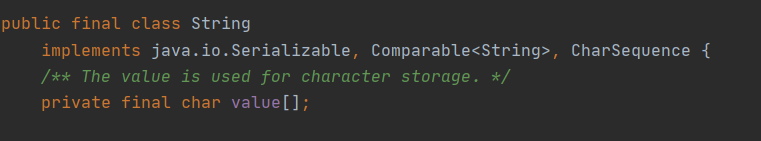

# 1. 字符串相关的类

## 1.1 String类

### 1.1.1 String的特性

- **String****类：代表字符串。**Java 程序中的所有字符串字面值（如 "abc" ）都作为此类的实例实现。

-  String是一个final类，代表不可变的字符序列。 不可被继承



**字符串的不可变性：**

```java
String s1="abc";//字面量的定义方法
String s2="abc";
System.out.println(s1==s2);//比较s1和s2的地址值
                           //true
s1="hello";
System.out.println(s1==s2);//比较s1和s2的地址值
                           //false
String s3="abc";
s3+="def";
System.out.println(s3==s2);//比较s3和s2的地址值
                           //false
String s4="abc";
String s5=s4.replace('a','e');
System.out.println(s5==s4);//比较s5和s4的地址值
                           //false
System.out.println(s4==s2);//比较s4和s2的地址值
                           //true
```

通过字面量的方式（区别new)给一个字符串赋值，此时的字符串值声明在字符串常量池中，“abc"就被放入这个常量池中，并返回一个地址值，s1便指向这个地址。因**在字符串常量池中不存在相同的值，**因此在执行`String s2=“abc"`时，首先寻找常量池中是否具有相同的值，如果有，就将s2指向该值所在的地址，否则s2指向新的地址值。


当执行`s1="hello"`时，因**String是一个final类**，原有的内容不会被改变，需要重新指定内存区域，将”hello"放入该区域中，s1指向的“hello"所在的内存区域。


当执行`s3+="def"`对现有的字符串进行连接操作时，也需要重新指定内存区域，不能在原有的值上做修改，将”abcdef"放入该区域中，s3指向"abcdef"所在的内存区域。

当执行`String s5=s4.replace('a','e');`时，s4原有内容保持不变，重新为s5指定内存区域，不能在原有的值上做修改。

- 字符串是常量，用双引号引起来表示。它们的值在创建之后不能更改。 

- String对象的字符内容是存储在一个字符数组value[]中

### 1.1.2 String对象的创建

# 2. JDK8之前的日期时间API

# 3. JDK8中新时间的API

# 4. Java比较器

# 5. System类

# 6. Math类

# 7. BigInteger与BigDecimal

