# 1. 字符串相关的类

## 1.1 String类

### 1.1.1 String的特性

- **String**类：代表字符串。Java 程序中的所有字符串字面值（如 "abc" ）都作为此类的实例实现。

-  String是一个final类，代表不可变的字符序列。 不可被继承

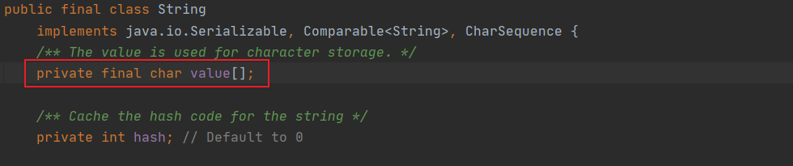

**字符串的不可变性：**

```java
String s1="abc";//字面量的定义方法
String s2="abc";
System.out.println(s1==s2);//比较s1和s2的地址值
                           //true
s1="hello";
System.out.println(s1==s2);//比较s1和s2的地址值
                           //false
String s3="abc";
s3+="def";
System.out.println(s3==s2);//比较s3和s2的地址值
                           //false
String s4="abc";
String s5=s4.replace('a','e');
System.out.println(s5==s4);//比较s5和s4的地址值
                           //false
System.out.println(s4==s2);//比较s4和s2的地址值
                           //true
```

通过字面量的方式（区别new)给一个字符串赋值，此时的字符串值声明在字符串常量池中，“abc"就被放入这个常量池中，并返回一个地址值，s1便指向这个地址。因**在字符串常量池中不存在相同的值，**因此在执行`String s2=“abc"`时，首先寻找常量池中是否具有相同的值，如果有，就将s2指向该值所在的地址，否则s2指向新的地址值。

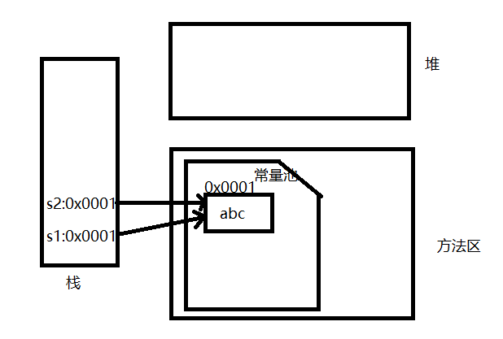

当执行`s1="hello"`时，因**String是一个final类**，原有的内容不会被改变，需要重新指定内存区域，将”hello"放入该区域中，s1指向的“hello"所在的内存区域。

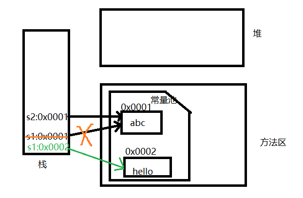

当执行`s3+="def"`对现有的字符串进行连接操作时，也需要重新指定内存区域，不能在原有的值上做修改，将”abcdef"放入该区域中，s3指向"abcdef"所在的内存区域。

当执行`String s5=s4.replace('a','e');`时，s4原有内容保持不变，重新为s5指定内存区域，不能在原有的值上做修改。

- 字符串是常量，用双引号引起来表示。它们的值在创建之后不能更改。 

- String对象的字符内容是存储在一个**字符数组value[]**中

### 1.1.2 String对象的创建

//通过字面量的方式

`String str = "hello";`

//本质上this.value = new char[0];

`String s1 = new String();`

//this.value = original.value;

`String s2 =new String(String original);`

//this.value = Arrays.copyOf(value, value.length);

`String s3 = new String(char[] a);`

`String s4 = new  String(char[] a,int startIndex,int count)`


**String不同实例化方式的对比：**

1. `String s1="abc"`  s1的数据“abc"声明在方法区中的字符串常量池中
2. String s2=new String("abc")  s2指向的地址是在堆空间中开辟的地址值，”abc"在 堆空间开辟的空间所指向的内存空间中。

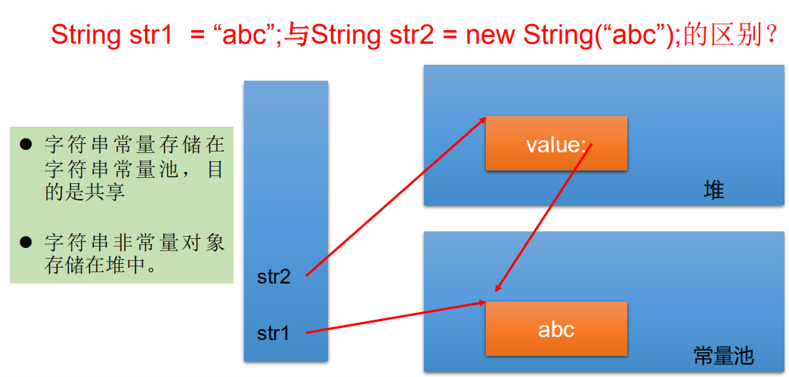


**字符串对象是怎样存储的**

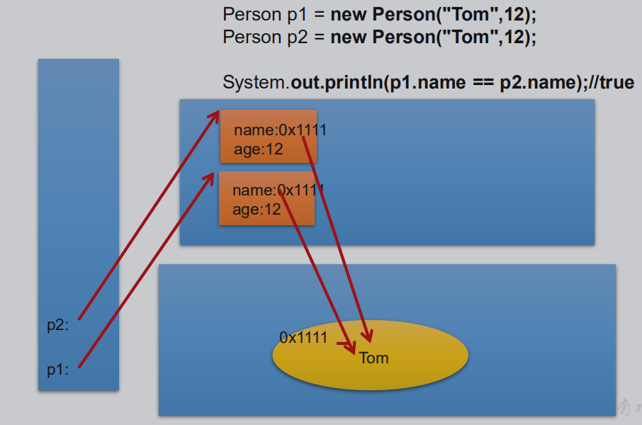

面试题：`String s=new String("abc")`方式创建对象，在内存中创建列了几个对象？

​        两个：一个是堆空间中new结构，另一个是char[]对应的常量池中的数据"abc"


**String不同拼接操作的对比**

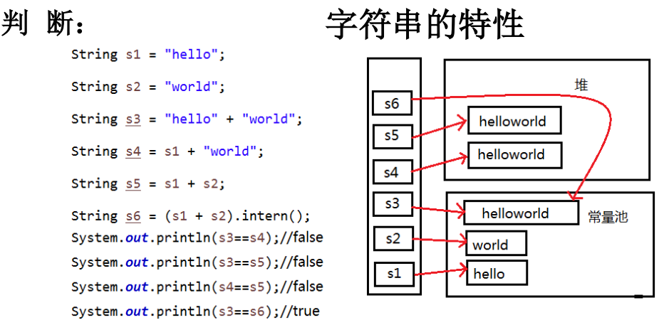

说明：

- `String s1="hello"；`在字符串常量池中创建了一个字面量为"hello"的字符串。
- `String s3="hello"+"world";`直接在字符串常量池中创建一个字面量为"helloworld"的字符串，s3指向这个字符串
- `Stirng s4=s1+"world";`在堆空间中产生了一个字符串s1+"world"（也就是"helloworld")，s4指向这个字符串
- `String s6=s5.intern();`堆空间的s5对象在调用intern()之后，会将常量池中已经存在的"helloworld"字符串赋值给s6。

结论：

- 常量与常量的拼接结果在常量池。且常量池中不会存在相同内容的常量。 
- 只要其中有一个是变量，结果就在堆中
- 如果拼接的结果调用`intern()方法`，返回值就在常量池中 .当调用intern方法时，如果池中已经包含一个等于此String对象的字符串（该对象由equals(obj)方法确定),则返回池中的字符串。

练习：

```java
String s1="abc";
String s2="def";

String s3="abcdef";
String s4="abc"+"def";
String s5=s1+"def";
String s6="abc"+s2;
String s7=s1+s2;

System.out.println(s3==s4);//true
System.out.println(s3==s5);//false
System.out.println(s3==s5);//false
System.out.println(s5==s6);//false
System.out.println(s3==s7);//false
System.out.println(s5==s7);//false
System.out.println(s6==s7);//false

String s8=s5.intern();
System.out.println(s3==s8);//true

final String s9="abc";  //s4是常量
String s10=s9+"def";
System.out.println(s3==s10);//true
```

面试题：

```java
下列程序运行的结果：
public class StringTest {
    String str = new String("good");
    char[] ch = { 't', 'e', 's', 't' };
    public void change(String str, char ch[]) {
        str = "test ok";
        ch[0] = 'b'; 
    }
    public static void main(String[] args) {
        StringTest ex = new StringTest();
        ex.change(ex.str, ex.ch);
        System.out.print(ex.str + " and ");//good
        System.out.println(ex.ch);//best
    }
}
```

### 1.1.3 String常用方法

 **int length()**：返回字符串的长度： return value.length

 **char charAt(int index)**： 返回某索引处的字符return value[index] 

 **boolean isEmpty()**：判断是否是空字符串：return value.length == 0 

 **String toLowerCase()**：使用默认语言环境，将 String 中的所有字符转换为小写

 **String toUpperCase()**：使用默认语言环境，将 String 中的所有字符转换为大写

 **String trim()**：返回字符串的副本，忽略前导空白和尾部空白

 **boolean equals(Object obj)**：比较字符串的内容是否相同

 **boolean equalsIgnoreCase(String anotherString)**：与equals方法类似，忽略大小写

 **String concat(String str)**：将指定字符串连接到此字符串的结尾。 等价于用“+” 

 **int compareTo(String anotherString)**：比较两个字符串的大小


 **String substring(int beginIndex)**：返回一个新的字符串，它是此字符串的从beginIndex开始截取到最后的一个子字符串。 

 **String substring(int beginIndex, int endIndex)** **：**返回一个新字符串，它是此字符串从beginIndex开始截取到endIndex(不包含)的一个子字符串。


 **boolean endsWith(String suffix)**：测试此字符串是否以指定的后缀结束

 **boolean startsWith(String prefix)**：测试此字符串是否以指定的前缀开始

 **boolean startsWith(String prefix, int toffset)**：测试此字符串从指定索引开始的子字符串是否以指定前缀开始


 **boolean contains(CharSequence s)**：当且仅当此字符串包含指定的 char 值序列时，返回 true

 **int indexOf(String str)**：返回指定子字符串在此字符串中第一次出现处的索引

 **int indexOf(String str, int fromIndex)**：返回指定子字符串在此字符串中第一次出现处的索引，从指定的索引fromIndex开始

 **int lastIndexOf(String str)**：返回指定子字符串在此字符串中最右边出现处的索引

 **int lastIndexOf(String str, int fromIndex)**：返回指定子字符串在此字符串中最后一次出现处的索引，从指定的索引开始反向搜索

注：indexOf和lastIndexOf方法如果未找到都是返回-1

什么情况下indexof(str)和lastindexof(str)返回值相同？情况一：存在唯一的一个str；情况二：不存在str


 **String replace(char oldChar, char newChar)**：返回一个新的字符串，它是通过用 newChar 替换此字符串中出现的所有 oldChar 得到的。 

 **String replace(CharSequence target, CharSequence replacement)**：使用指定的字面值替换序列替换此字符串所有匹配字面值目标序列的子字符串。 

 **String replaceAll(String regex, String replacement)** **：** 使 用 给 定 的replacement 替换此字符串所有匹配给定的正则表达式的子字符串。 

 **String replaceFirst(String regex, String replacement)** **：** 使 用 给 定 的replacement 替换此字符串匹配给定的正则表达式的第一个子字符串。 


 **boolean matches(String regex)**：告知此字符串是否匹配给定的正则表达式。

 

 **String[] split(String regex)**：根据给定正则表达式的匹配拆分此字符串。 

 **String[] split(String regex, int limit)**：根据匹配给定的正则表达式来拆分此字符串，最多不超过limit个，如果超过了，剩下的全部都放到最后一个元素中。

### 1.1.4 String与基本数据类型转换

字符串转化为基本数据类型、包装类

- Integer包装类的public static int **parseInt(String s)**：可以将由“数字”字符组成的字符串转换为整型。

- 类似地,使用java.lang包中的Byte、Short、Long、Float、Double类调相应的类方法可以将由“数字”字符组成的字符串，转化为相应的基本数据类型。

基本数据类型、包装类转化为字符串

- 调用String类的public String **valueOf(int n)**可将int型转换为字符串

- 相应的valueOf(byte b)、valueOf(long l)、valueOf(float f)、valueOf(double d)、valueOf(boolean b)可由参数的相应类型到字符串的转换

### 1.1.5 String与字符数组转换

字符数组转化为字符串

- String 类的构造器：**String(char[])** **和** **String(char[]**，**int offset**，**int length)** 分别用字符数组中的全部字符和部分字符创建字符串对象。

字符串转化为字符数组

- **public char[] toCharArray()**：将字符串中的全部字符存放在一个字符数组中的方法。
- **public void getChars(int srcBegin, int srcEnd, char[] dst,** **int dstBegin)：**提供了将指定索引范围内的字符串存放到数组中的方法。

### 1.1.6 String与字节数组转换

字节数组转化为字符串

- `String(byte[])`：通过使用平台的默认字符集解码指定的 byte 数组，构造一个新的 String。 

- `String(byte[]，int offset，int length)`：用指定的字节数组的一部分，即从数组起始位置offset开始取length个字节构造一个字符串对象。 

字符串转化为字节数组

- `public byte[] getBytes()`：使用平台的默认字符集将此 String 编码为byte 序列，并将结果存储到一个新的 byte 数组中。 

- `public byte[] getBytes(String charsetName)` **：**使用指定的字符集将 此 String 编码到 byte 序列，并将结果存储到新的 byte 数组。

## 1.2 StringBuffer类

### 1.2.1 StringBuffer的特性 

-  java.lang.StringBuffer代表**可变的字符序列**，JDK1.0中声明，可以对字符串内容进行增删，此时不会产生新的对象。

-  很多方法与String相同。

- 作为参数传递时，方法内部可以改变值
- StringBuffer对象的字符内容是存储在一个**字符数组value[]**中

```java
public final class StringBuffer extends AbstractStringBuilder
    implements java.io.Serializable, CharSequence
{

    /**
     * A cache of the last value returned by toString. Cleared
     * whenever the StringBuffer is modified.
     */
    private transient char[] toStringCache;

```

```java
abstract class AbstractStringBuilder implements Appendable, CharSequence {
    /**
     * The value is used for character storage.
     */
    char[] value; //value没有final声明，value可以不断扩容

    /**
     * The count is the number of characters used.
     */
    int count; //count记录有效字符的个数
```


### 1.2.2 StringBuffer的创建

- **StringBuffer()**：初始容量为16的字符串缓冲区

- **StringBuffer(int size)**：构造指定容量的字符串缓冲区

- **StringBuffer(String str)**：将内容初始化为指定字符串内容

```Java
String s = new String("我喜欢学习"); 
StringBuffer buffer = new StringBuffer("我喜欢学习"); 
buffer.append("数学");
```

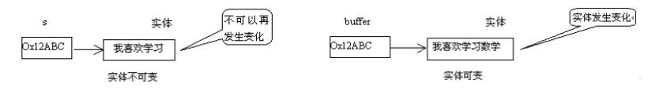

### 1.2.3 StringBuffer常用方法

- StringBuffer **append**(xxx)：提供了很多的append()方法，用于进行字符串拼接

- StringBuffer **delete**(int start,int end)：删除指定位置 [start,end) 的内容

- StringBuffer **replace**(int start, int end, String str)：把[start,end)位置替换为str

- StringBuffer **insert**(int offset, xxx)：在指定位置插入xxx

- StringBuffer **reverse**() ：把当前字符序列逆转

当append和insert时，如果原来value数组长度不够，可扩容。 

如上这些方法支持方法链操作。

方法链的原理：

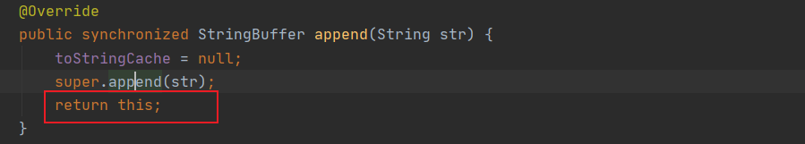

- public int **indexOf**(String str)

- public String **substring**(int start,int end)：截取字符串

- public int **length**()

- public char **charAt**(int n )：获取指定位置的字符

- public void **setCharAt**(int n ,char ch)：将指定位置的字符设置为ch


## 1.3 StringBuilder类

**StringBuilder** **和** **StringBuffer** **非常类似，均代表可变的字符序列，**而且提供相关功能的方法也一样,不同的是StringBuilder是线程不安全的，方法没有synchronized修饰。


## 1.4面试题

1、String、StringBuffer、StringSBuider三者之间的区别？

(1)、String（JDK1.0）：不可变的字符序列；底层使用char[]数组存储

底层分析：

```java
String str=new String(); //char[] value=new char[0];
String str=new String("abc"); //char[] value=new char[]{'a','b','c'};
```

(2)、StringBuffer（JDK1.0）：可变的字符序列，线程安全，效率低；底层使用char[]数组存储

底层分析：

```java
StringBuffer str=new StringBuffer(); //char[] value=new char[16];底层创建了一个长度为16的字符数组。
System.out.println(str.length);//0
str.append('a');//value[0]='a';
str.append('b');//value[1]='b';
```

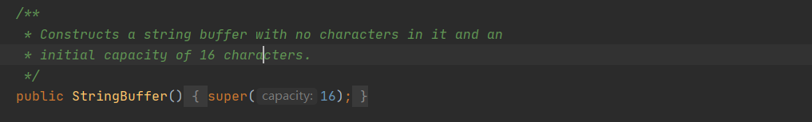

```java
StringBuffer str2=new StringBuffer("abc"); //char[] value=new char["abc".length+16];
System.out.println(str.length);//3
```

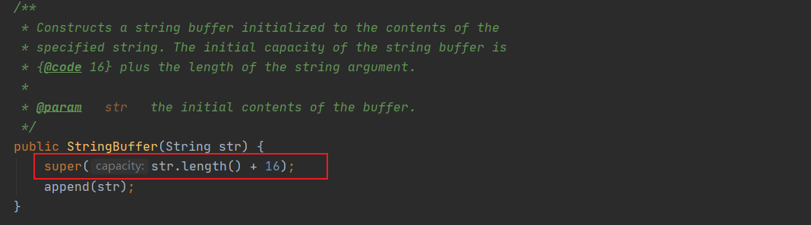

扩容问题：如果要添加的数据超过了底层数组的长度，那就需要扩容底层的数组

​                   默认情况下，扩容为原来容量的2倍+2，同时将原来数组中的元素复制到新的数组中。

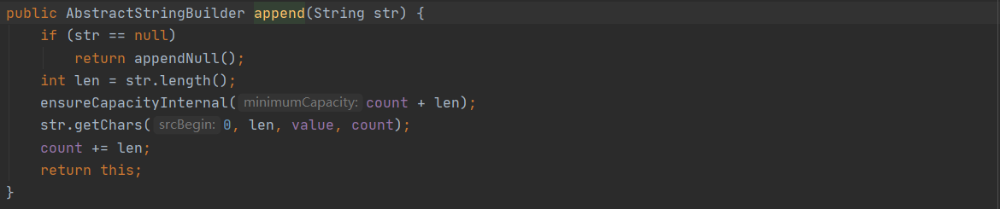

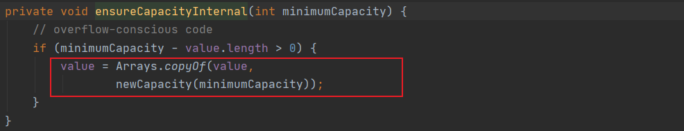

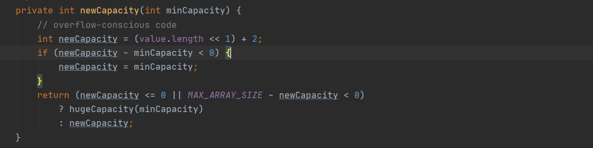

(3)、StringBuilder（JDK5.0）：可变的字符序列，线程不安全，效率高；底层使用char[]数组存储

> 注意：作为参数传递的话，方法内部String不会改变其值，StringBuffer和StringBuilder会改变其值。

**效率从高到低：StringBuilder > StringBuffer > String**

# 2. JDK8之前的日期时间API

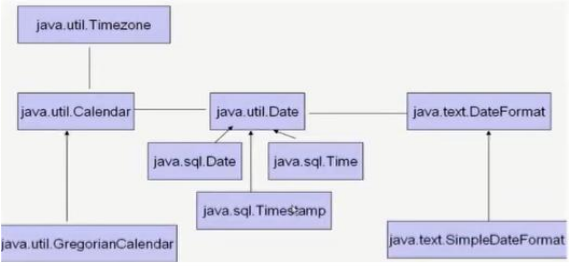

## **2.1 java.lang.System**类

- System类提供的public static long currentTimeMillis()用来返回当前时间与1970年1月1日0时0分0秒之间以毫秒为单位的时间差。

- **此方法适于计算时间差。**

计算世界时间的主要标准有：

- UTC(Coordinated Universal Time)

- GMT(Greenwich Mean Time)

- CST(Central Standard Time)  

## **2.2 java.util.Date**类

表示特定的瞬间，精确到毫秒

**构造器：** 

-  **Date()**：使用无参构造器创建的对象可以获取本地当前时间。

-  **Date(long date):**创建指定毫秒数的Date对象

**常用方法:**

- **getTime():**返回自 1970 年 1 月 1 日 00:00:00 GMT 以来此 Date 对象表示的毫秒数。
- **toString():**把此 Date 对象转换为以下形式的 String： dow mon dd hh:mm:ss zzz yyyy 其中： dow 是一周中的某一天 (Sun, Mon, Tue, Wed, Thu, Fri, Sat)，zzz是时间标准。 
-  其它很多方法都过时了。

**java.util.Date转化为java.sql.Date**

使用构造器：`java.sql.Date birthdate=new java.sql.Date(date.getTime());`

## **2.3  java.text.SimpleDateFormat**类

- Date类的API不易于国际化，大部分被废弃了，**java.text.SimpleDateFormat**类是一个不与语言环境有关的方式来**格式化和解析日期的具体类**。

- 它允许进行**格式化：日期转文本**、**解析：文本转日期**

-  **格式化：**

 **SimpleDateFormat()** ：默认的模式和语言环境创建对象

 **public SimpleDateFormat(String pattern)**：该构造方法可以用参数pattern指定的格式创建一个对象，该对象调用： **public String format(Date date)**：方法格式化时间对象date

-  **解析：**

 **public Date parse(String source)**：从给定字符串的开始解析文本，以生成一个日期。

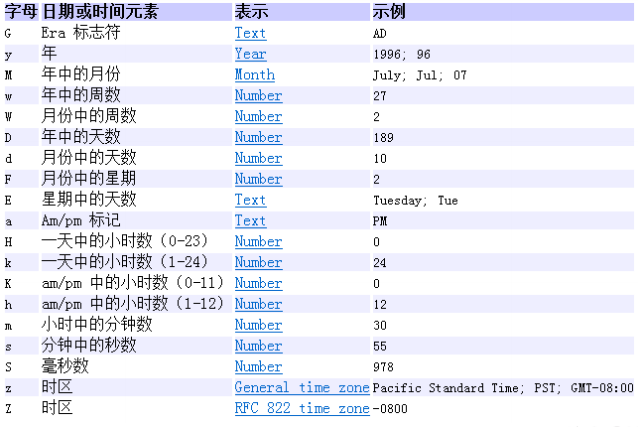

## 2.4 java.util.Calendar(日历)类 

- Calendar是一个抽象基类，主用用于完成日期字段之间相互操作的功能。

- 获取Calendar实例的方法

​               (1)、使用`Calendar.getInstance()`方法

​               (2)、调用它的子类`GregorianCalendar`的构造器。

-  一个Calendar的实例是系统时间的抽象表示，通过`get(int field)`方法来取得想要的时间信息。比如YEAR、MONTH、DAY_OF_WEEK、HOUR_OF_DAY 、MINUTE、SECOND

​                `public void set(int field,int value)`

​                `public void add(int field,int amount)`

​                `public final Date getTime()`：日历类--->Date

​                `public final void setTime(Date date)` :Date--->日历类

-  **注意**: 

​               获取月份时：一月是0，二月是1，以此类推，12月是11

​               获取星期时：周日是1，周二是2 ， 。。。。周六是7


# 3. JDK8中新日期时间的API

## 3.1 新日期时间的API简介

JDK 1.0中包含了一个java.util.Date类，但是它的大多数方法已经在JDK 1.1引入Calendar类之后被弃用

了。而Calendar并不比Date好多少。它们面临的问题是：

- 可变性：像日期和时间这样的类应该是不可变的。

- 偏移性：Date中的年份是从1900开始的，而月份都从0开始。

```java
Date date2=new Date(2020,9,8);
System.out.println(date2); //Fri Oct 08 00:00:00 CST 3920
                           //得到的结果与我们设置的不一样，原因是：年份是从1900年开始的，月份从0开始
Date date3=new Date(2020-1900,9-1,8);
System.out.println(date3); //Tue Sep 08 00:00:00 CST 2020
```

源码： 

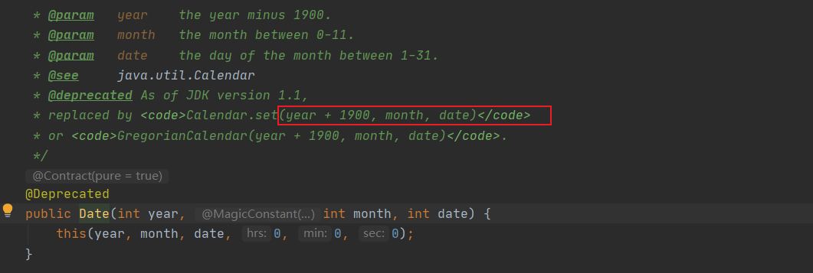

- 格式化：格式化只对Date有用，Calendar则不行。

- 此外，它们也不是线程安全的；不能处理闰秒等。

第三次引入的API是成功的，并且Java 8中引入的java.time API 已经纠正了过去的缺陷，将来很长一段时间内它都会为我们服务。

java 8 吸收了 Joda-Time 的精华，以一个新的开始为 Java 创建优秀的 API。新的 java.time 中包含了所有关于本地日期（LocalDate）、本地时间（LocalTime）、本地日期时间（LocalDateTime）、时区（ZonedDateTime）和持续时间（Duration）的类。历史悠久的 Date 类新增了 toInstant() 方法，用于把 Date 转换成新的表示形式。这些新增的本地化时间日期 API 大大简化了日期时间和本地化的管理。

**LocalDate、LocalTime、LocalDateTime 类**是其中较重要的几个类，它们的实例是**不可变的对象**，分别表示使用 ISO-8601日历系统的日期、时间、日期和时间。它们提供了简单的本地日期或时间，并不包含当前的时间信息，也不包含与时区相关的信息。 

- `LocalDate`代表IOS格式（yyyy-MM-dd）的日期,可以存储 生日、纪念日等日期。

- `LocalTime`表示一个时间，而不是日期。 

- `LocalDateTime`是用来表示日期和时间的，这是一个最常用的类之一。

> 注：ISO-8601日历系统是国际标准化组织制定的现代公民的日期和时间的表示法，也就是公历。

## 3.2 新日期时间的API实例化及方法

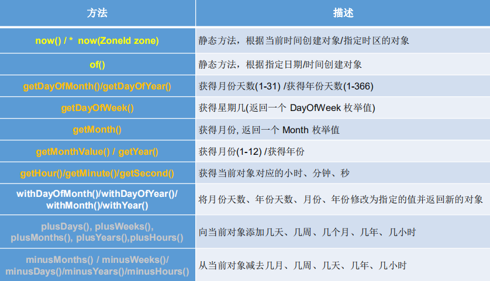


## 3.3 瞬时：Instant

-  Instant：时间线上的一个瞬时点。 这可能被用来记录应用程序中的事件时间戳。 

- 在处理时间和日期的时候，我们通常会想到年,月,日,时,分,秒。然而，这只是时间的一个模型，是面向人类的。第二种通用模型是面向机器的，或者说是连续的。在此模型中，时间线中的一个点表示为一个很大的数，这有利于计算机处理。在UNIX中，这个数从1970年开始，以秒为的单位；同样的，在Java中，也是从1970年开始，但以毫秒为单位。

- java.time包通过值类型Instant提供机器视图，不提供处理人类意义上的时间单位。Instant表示时间线上的一点，而不需要任何上下文信息，例如，时区。概念上讲，它只是简单的表示自1970年1月1日0时0分0（UTC）开始的秒数。因为java.time包是基于纳秒计算的，所以Instant的精度可以达到纳秒级。 

> (1 ns = 10-9 s) 1秒 = 1000毫秒 =10^6微秒=10^9纳秒


**Instant的实例化和方法**

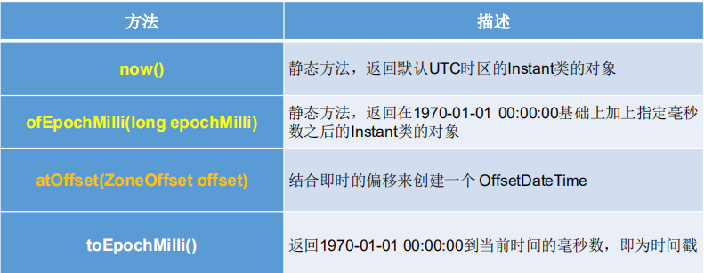


> **时间戳是指格林威治时间**1970年01月01日00时00分00秒(北京时间1970年01月01日08时00分00秒)起至现在的总秒数。

## 3.4 **格式化与解析日期或时间**

`java.time.format.DateTimeFormatter` 类：该类提供了三种格式化方法：

- 预定义的标准格式。如：**ISO_LOCAL_DATE_TIME;ISO_LOCAL_DATE;ISO_LOCAL_TIME**

```java
DateTimeFormatter formatter=DateTimeFormatter.ISO_LOCAL_DATE_TIME;
String format = formatter.format(LocalDateTime.now());
System.out.println(format);
```

- 本地化相关的格式。如：`ofLocalizedDateTime(FormatStyle datestyle)`、`ofLocalizedDate(FormatStyle datestyle)` 

FormatStyle 的取值：

`FormatStyle.LONG / FormatStyle.MEDIUM / FormatStyle.SHORT`：适用于LocalDateTime

`FormatStyle.FULL / FormatStyle.LONG / FormatStyle.MEDIUM / FormatStyle.SHORT`：适用于LocalDate

- 自定义的格式。如：`ofPattern(“yyyy-MM-dd hh:mm:ss”)`

## 3.5 其他API

 **ZoneId****：**该类中包含了所有的时区信息，一个时区的ID，如 Europe/Paris

 **ZonedDateTime****：**一个在ISO-8601日历系统时区的日期时间，如 2007-12-03T10:15:30+01:00 Europe/Paris。 

```java
//ZoneId:类中包含了所有的时区信息
// ZoneId的getAvailableZoneIds():获取所有的ZoneId
Set<String> zoneIds = ZoneId.getAvailableZoneIds();
for (String s : zoneIds) {
    System.out.println(s);
}

// ZoneId的of():获取指定时区的时间
LocalDateTime localDateTime = LocalDateTime.now(ZoneId.of("Asia/Tokyo"));
System.out.println(localDateTime);

//ZonedDateTime:带时区的日期时间
// ZonedDateTime的now():获取本时区的ZonedDateTime对象
ZonedDateTime zonedDateTime = ZonedDateTime.now();
System.out.println(zonedDateTime);

// ZonedDateTime的now(ZoneId id):获取指定时区的ZonedDateTime对象
ZonedDateTime zonedDateTime1 = ZonedDateTime.now(ZoneId.of("Asia/Tokyo"));
System.out.println(zonedDateTime1);
```

 其中每个时区都对应着ID，地区ID都为“{区域}/{城市}”的格式，例如：Asia/Shanghai等 

 **Clock****：**使用时区提供对当前即时、日期和时间的访问的时钟。 

 持续时间：**Duration**，用于计算两个“时间”间隔

```java
//Duration:用于计算两个“时间”间隔，以秒和纳秒为基准
LocalTime localTime = LocalTime.now();
LocalTime localTime1 = LocalTime.of(15, 23, 32);

//between():静态方法，返回Duration对象，表示两个时间的间隔
Duration duration = Duration.between(localTime1, localTime);
System.out.println(duration);

System.out.println(duration.getSeconds());
System.out.println(duration.getNano());

LocalDateTime localDateTime = LocalDateTime.of(2016, 6, 12, 15, 23, 32);
LocalDateTime localDateTime1 = LocalDateTime.of(2017, 6, 12, 15, 23, 32);
Duration duration1 = Duration.between(localDateTime1, localDateTime);
System.out.println(duration1.toDays());
```

 日期间隔：**Period**，用于计算两个“日期”间隔

```java
//Period:用于计算两个“日期”间隔，以年、月、日衡量
LocalDate localDate = LocalDate.now();
LocalDate localDate1 = LocalDate.of(2028, 3, 18);

Period period = Period.between(localDate, localDate1);
System.out.println(period);

System.out.println(period.getYears());
System.out.println(period.getMonths());
System.out.println(period.getDays());

Period period1 = period.withYears(2);
System.out.println(period1);
```

 **TemporalAdjuster :** 时间校正器。有时我们可能需要获取例如：将日期调整到“下一个工作日”等操作。

```java
// TemporalAdjuster:时间校正器
// 获取当前日期的下一个周日是哪天？
TemporalAdjuster temporalAdjuster = TemporalAdjusters.next(DayOfWeek.SUNDAY);
LocalDateTime localDateTime = LocalDateTime.now().with(temporalAdjuster);
System.out.println(localDateTime);
// 获取下一个工作日是哪天？
LocalDate localDate = LocalDate.now().with(new TemporalAdjuster() {
    @Override
    public Temporal adjustInto(Temporal temporal) {
        LocalDate date = (LocalDate) temporal;
        if (date.getDayOfWeek().equals(DayOfWeek.FRIDAY)) {
            return date.plusDays(3);
        } else if (date.getDayOfWeek().equals(DayOfWeek.SATURDAY)) {
            return date.plusDays(2);
        } else {
            return date.plusDays(1);
        } 
    }
});
System.out.println("下一个工作日是：" + localDate);
```

 **TemporalAdjusters :** 该类通过静态方法(firstDayOfXxx()/lastDayOfXxx()/nextXxx())提供了大量的常用TemporalAdjuster 的实现。

## 3.6 与传统日期处理的转换

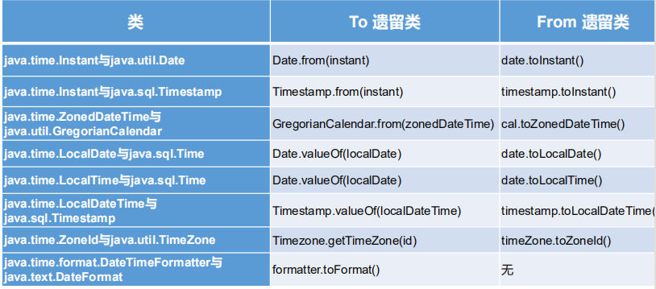

# 4. Java比较器

-  在Java中经常会涉及到**对象数组的排序问题**，那么就涉及到**对象之间的比较问题**。 

- Java实现**对象排序**的方式有两种：

​                 **自然排序：**java.lang.Comparable

​                 **定制排序：**java.util.Comparator

## 4.1 自然排序

- Comparable接口强行对实现它的每个类的对象进行整体排序。这种排序被称为类的自然排序。 

- 实现 Comparable 的类必须重写 compareTo(Object obj) 方法，两个对象即通过 compareTo(Object obj) 方法的返回值来比较大小。**如果当前对象this大 于形参对象obj，则返回正整数，如果当前对象this小于形参对象obj，则返回负整数，如果当前对象this等于形参对象obj，则返回零。** 

- 实现Comparable接口的对象列表（和数组）可以通过 Collections.sort 或Arrays.sort进行自动排序。实现此接口的对象可以用作**有序映射中的键或有序集合中的元素**，无需指定比较器。 

-  对于类 C 的每一个 e1 和 e2 来说，当且仅当 e1.compareTo(e2) == 0 与e1.equals(e2) 具有相同的 boolean 值时，类 C 的自然排序才叫做与 equals 一致。建议（虽然不是必需的）**最好使自然排序与 equals 一致。**

**Comparable** **的典型实现**：(默认都是从小到大排列的) 

- String：按照字符串中字符的Unicode值进行比较

- Character：按照字符的Unicode值来进行比较

- 数值类型对应的包装类以及BigInteger、BigDecimal：按照它们对应的数值大小进行比较

- Boolean：true 对应的包装类实例大于 false 对应的包装类实例

- Date、Time等：后面的日期时间比前面的日期时间大

```java
/**
*使用：实现Comparable接口，重写CompareTo(Object o)方法
*/
class Goods implements Comparable {
    private String name;
    private double price;
    //按照价格，比较商品的大小
    @Override
    public int compareTo(Object o) {
        if(o instanceof Goods) {
        	Goods other = (Goods) o;
            if (this.price > other.price) {
            	return 1;
            } else if (this.price < other.price) {
            	return -1;
            }
            	return 0;
            }
        throw new RuntimeException("输入的数据类型不一致");
    }
    //构造器、getter、setter、toString()方法略
}

public class ComparableTest{
    public static void main(String[] args) {
        Goods[] all = new Goods[4];
        all[0] = new Goods("《红楼梦》", 100);
        all[1] = new Goods("《西游记》", 80);
        all[2] = new Goods("《三国演义》", 140);
        all[3] = new Goods("《水浒传》", 120);
        
        Arrays.sort(all);
        System.out.println(Arrays.toString(all));
    } 
}
```


## 4.2 定制排序

- 当元素的类型没有实现java.lang.Comparable接口而又不方便修改代码，或者实现了java.lang.Comparable接口的排序规则不适合当前的操作，那么可以考虑使用 `Comparator 的对象`来排序，**强行对多个对象进行整体排序的比较。**

- 重写`compare(Object o1,Object o2)`方法，比较o1和o2的大小：**如果方法返回正整数，则表示o1大于o2；如果返回0，表示相等；返回负整数，表示o1小于o2。** 

- 可以**将 Comparator 传递给 sort 方法**（如 Collections.sort 或 Arrays.sort），从而允许在排序顺序上实现精确控制。 

- 还可以使用 Comparator 来控制某些数据结构（如有序 set或有序映射）的顺序，或者为那些没有自然顺序的对象 collection 提供排序

 修改上面代码ComparableTest类：

```java
public class ComparableTest{
    public static void main(String[] args) {
        Goods[] all = new Goods[4];
        all[0] = new Goods("《红楼梦》", 100);
        all[1] = new Goods("《西游记》", 80);
        all[2] = new Goods("《三国演义》", 140);
        all[3] = new Goods("《水浒传》", 120);
        
        Arrays.sort(all,new comparator(){
            //按照产品名称从低到高排序，名字相同按价格从高到低排序
            @Override
            public int compare(Object o1,Object o2){
                if(o1.instanceof Goods && o2.instanceof Goods){
                    Goods g1=(Goods)o1;
                    Goods g2=(Goods)o2;
                    if(g1.getName().equals(g2.getName())){
                        return -Double.compare(g1.getPrice(),g2.getPrice());
                    }else{
                        return g1.getName().compareTo(g2.getName());
                    }
                }
                throw new RuntimeException("输入的数据类型不一致");
            }
        });
        System.out.println(Arrays.toString(all));
    } 
}
```

 

# 5. System类

- System类代表系统，系统级的很多属性和控制方法都放置在该类的内部。该类位于java.lang包。 

- 由于该类的构造器是private的，所以无法创建该类的对象，也就是无法实例化该类。其内部的成员变量和成员方法都是static的，所以也可以很方便的进行调用。 

-  成员变量
  
- System类内部包含in、out和err三个成员变量，分别代表标准输入流(键盘输入)，标准输出流(显示器)和标准错误输出流(显示器)。 
  
- 成员方法

  - **native long currentTimeMillis()**：

  ​       该方法的作用是返回当前的计算机时间，时间的表达格式为当前计算机时间和GMT时间(格林威治时间)1970年1月1号0时0分0秒所差的毫秒数。

  -  **void exit(int status)**：

  ​        该方法的作用是退出程序。其中status的值为0代表正常退出，非零代表异常退出。**使用该方法可以在图形界面编程中实现程序的退出功能**等。

  - **void gc()**：

  ​        该方法的作用是请求系统进行垃圾回收。至于系统是否立刻回收，则取决于系统中垃圾回收算法的实现以及系统执行时的情况。

  - **String getProperty(String key)**：

  ​        该方法的作用是获得系统中属性名为key的属性对应的值。系统中常见的属性名以及属性的作用如下表所示：

  ​                        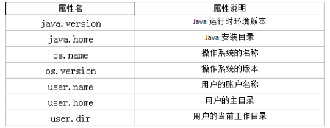

   

# 6. Math类

**java.lang.Math**提供了一系列静态方法用于科学计算。其方法的参数和返回**

**值类型一般为double**型。

**abs** **绝对值**

**acos,asin,atan,cos,sin,tan**       **三角函数**

**sqrt **   **平方根**

**pow(double a,doble b)   a的b次幂**

**log**    **自然对数**

**exp   e为底指数**

**max(double a,double b)**

**min(double a,double b)**

**random()      返回0.0到1.0的随机数**

**long round(double a)      double型数据a转换为long型（四舍五入）**

**toDegrees(double angrad)      弧度—>角度**

**toRadians(double angdeg)      角度—>弧度**

# 7. BigInteger与BigDecimal

## 7.1BigInteger类

- Integer类作为int的包装类，能存储的最大整型值为2 31-1，Long类也是有限的，最大为2 63-1。如果要表示再大的整数，不管是基本数据类型还是他们的包装类都无能为力，更不用说进行运算了。

- java.math包的**BigInteger**可以表示不可变的任意精度的整数。BigInteger 提供所有 Java 的基本整数操作符的对应物，并提供 java.lang.Math 的所有相关方法。另外，BigInteger 还提供以下运算：模算术、GCD 计算、质数测试、素数生成、位操作以及一些其他操作。

- 构造器 
  - **BigInteger**(String val)：根据字符串构建BigInteger对象

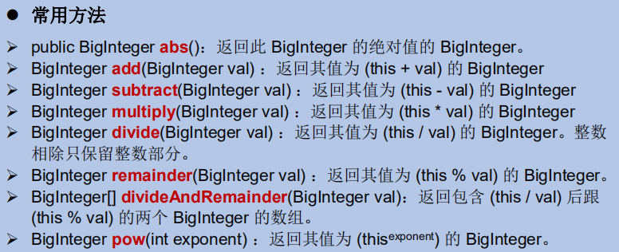


## 7.2BigDecimal类

- 一般的Float类和Double类可以用来做科学计算或工程计算，但在**商业计算中，要求数字精度比较高，故用到ava.math.BigDecima类。**

-  BigDecimal类支持不可变的、任意精度的有符号十进制定点数。 

- 构造器 
  - public BigDecimal(double val) 
  - public BigDecimal(String val) 

- 常用方法
  - public BigDecimal **add**(BigDecimal augend)
  - public BigDecimal **subtract**(BigDecimal subtrahend)
  - public BigDecimal **multiply**(BigDecimal multiplicand)
  - public BigDecimal **divide**(BigDecimal divisor, int scale, int roundingMode)


# 8.Enum类