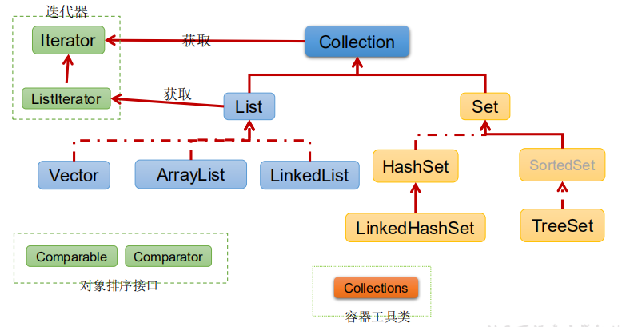
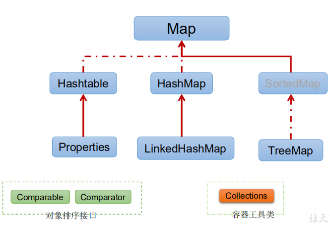
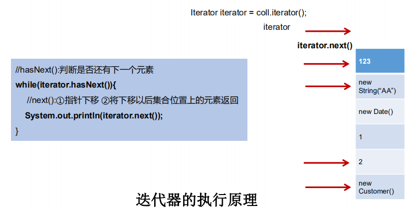

# 1. Java集合框架

## 1.1集合概述

**集合**：集合是java中提供的一种容器，可以用来存储多个不同类型的数据。

- 面向对象语言对事物的体现都是以对象的形式，为了方便对多个对象的操作，就要对对象进行存储。使用Array存储对象具有一些**弊端**，而Java 集合就像一种容器，可以动态地把多个对象的引用放入容器中。
  - **数组在内存存储方面的特点**
    1. 数组初始化以后，长度就确定了。
    2. 数组声明的类型，就决定了进行元素初始化时的类型
  - **数组在存储数据方面的弊端：**
    1. 数组初始化以后，长度就不可变了，不便于扩展
    2. 数组中提供的属性和方法少，不便于进行添加、删除、插入等操作，且效率不高。同时无法直接获取存储元素的个数。
    3. 数组存储的数据是有序的、可以重复的。---->存储数据的特点单一
- Java 集合类可以用于存储数量不等的多个**对象**，还可用于保存具有映射关系的关联数组。
- 在 Java5 之前，Java 集合会丢失容器中所有对象的数据类型，把所有对象都当成 Object 类型处理；从 JDK 5.0 增加了**泛型**以后，Java 集合可以记住容器中对象的数据类型。

**集合和数组既然都是容器，它们有啥区别呢？** 

- 数组的长度是固定的。集合的长度是可变的。 

- 数组中存储的是同一类型的元素，可以存储基本数据类型值，也可以存储引用类型。集合中可以存储不同类型的元素，但只能是引用类型（如果存储的是简单的int,它会自动装箱成Integer）。在开发中一般当对象多的时候，使用集合进行存储。 

## 1.2集合框架

集合按照其存储结构可以分为两大类，分别是单列集合 java.util.Collection 和双列集合 java.util.Map 

- **Collection**：单列集合类的根接口，用于存储一系列符合某种规则的元素，它有两个重要的子接口，分别是 java.util.List 和 java.util.Set 。其中， List 的特点是元素有序、元素可重复。 Set 的特点是元素无 序，而且不可重复。 List 接口的主要实现类有 java.util.ArrayList 和 java.util.LinkedList ， Set 接口 的主要实现类有 java.util.HashSet 和 java.util.TreeSet 。 
- 

Collection接口框架图：



集合本身是一个工具，它存放在java.util包中。

-  **Map**接口：双列数据，保存具有映射关系“key-value对”的集合



# 2. Collection接口方法

1、添加

- add(Object obj) ：把给定的对象添加到当前集合中 ，添加一个元素

- addAll(Collection coll) ：添加一个集合的元素

2、获取有效元素的个数

- int size()

3、清空集合

- void clear()

4、是否是空集合 

- boolean isEmpty()

5、是否包含某个元素

- boolean contains(Object obj)：是通过元素的equals方法来判断是否是同一个对象

- boolean containsAll(Collection c)：也是调用元素的equals方法来比较的。拿两个集合的元素挨个比较。

6、删除

- boolean remove(Object obj) ：通过元素的equals方法判断是否是要删除的那个元素。只会删除找到的第一个元素

- boolean removeAll(Collection coll)：取当前集合的差集

7、取两个集合的交集

- boolean retainAll(Collection c)：把交集的结果存在当前集合中，不影响c 

8、集合是否相等

- boolean equals(Object obj)

9、转成对象数组

- Object[] toArray()

10、获取集合对象的哈希值

- hashCode()

11、遍历

- iterator()：返回迭代器对象，用于集合遍历

# 3. Iterator迭代器接口

## 3.1Iterator接口

**迭代**：即Collection集合元素的通用获取方式。在取元素之前先要判断集合中有没有元素，如果有，就把这个 元素取出来，继续在判断，如果还有就再取出出来。一直把集合中的所有元素全部取出。这种取出方式专业 术语称为迭代。 

- 在程序开发中，经常需要遍历集合中的所有元素。针对这种需求，JDK专门提供了一个接口 `java.util.Iterator` 

- Iterator对象称为迭代器(设计模式的一种)，主要用于遍历 Collection 集合中的元素。

- GOF给迭代器模式的定义为：提供一种方法访问一个容器(container)对象中各个元素，而又不需暴露该对象的

- 内部细节。**迭代器模式，就是为容器而生。**类似于“公交车上的售票员”、“火车上的乘务员”、“空姐”。 

-  Collection接口继承了java.lang.Iterable接口，该接口有一个iterator()方法，那么所有实现了Collection接口的集合类都有一个iterator()方法，用以返回一个实现了Iterator接口的对象。 

  获取迭代器的方法： `public Iterator iterator()` 获取集合对应的迭代器，用来遍历集合中的元素的

- **Iterator 仅用于遍历集合，Iterator 本身并不提供承装对象的能力。如果需要创建Iterator 对象，则必须有一个被迭代的集合。**

- 集合对象每次调用iterator()方法都得到一个全新的迭代器对象，默认游标都在集合的第一个元素之前。

- Iterator接口的常用方法

  - public E next() :返回迭代的下一个元素。 

  - public boolean hasNext() :如果仍有元素可以迭代，则返回 true。

  - public void remove():删除集合中的元素。

    ```java
    Iterator iter = coll.iterator();
    while(iter.hasNext()){
        Object obj = iter.next();
        if(obj.equals("Tom")){
        	iter.remove();
        }
    }
    ```

    > 注意：
    >
    > - Iterator可以删除集合的元素，但是是遍历过程中通过迭代器对象的remove方 法，不是集合对象的remove方法。 
    >
    > - 如果还未调用next()或在上一次调用 next 方法之后已经调用了 remove 方法，再调用remove都会报IllegalStateException

## 3.2迭代器的执行原理

- 当遍历集合时，首先通过调用t集合的iterator()方法获得 迭代器对象，然后使用hashNext()方法判断集合中是否存在下一个元素，如果存在，则调用next()方法将元素取 出，否则说明已到达了集合末尾，停止遍历素。
- Iterator迭代器对象在遍历集合时，内部采用指针的方式来跟踪集合中的元素，



在调用Iterator的next方法之前，迭代器的索引位于第一个元素之前，不指向任何元素，当第一次调用迭代器的 next方法后，迭代器的索引会向后移动一位，指向第一个元素并将该元素返回，当再次调用next方法时，迭代器的 索引会指向第二个元素并将该元素返回，依此类推，直到hasNext方法返回false，表示到达了集合的末尾，终止对 元素的遍历。

> 在调用next()方法之前必须要调用hasNext()进行检测。若不调用，且下一条记录无效，直接调用next()会抛出NoSuchElementException异常。

# 4. Collection子接口一：List

## 4.1 List接口概述

- 鉴于Java中数组用来存储数据的局限性，我们通常使用List替代数组

- List集合类中**元素有序(存储顺序和取出顺序一致)、且可重复**，集合中的每个元素都有其对应的顺序索引。

- List容器中的元素都对应一个整数型的序号记载其在容器中的位置，可以根据序号存取容器中的元素。

- JDK API中List接口的实现类常用的有：ArrayList、LinkedList和Vector。

## 4.2 List接口方法

List除了从Collection集合继承的方法外，List 集合里添加了一些根据索引来操作集合元素的方法。 

- **void add(int index, Object ele)**:在index位置插入ele元素
- **boolean addAll(int index, Collection eles):**从index位置开始将eles中的所有元素添加进来
- **Object get(int index):**获取指定index位置的元素
- **int indexOf(Object obj):**返回obj在集合中首次出现的位置
- **int lastIndexOf(Object obj):**返回obj在当前集合中末次出现的位置
- **Object remove(int index):**移除指定index位置的元素，并返回此元素
- **Object set(int index, Object ele):**设置指定index位置的元素为ele
- **List subList(int fromIndex, int toIndex):**返回从fromIndex到toIndex位置的子集合

List集合的三个子类：

- ArrayList

- - 底层数据结构是数组。线程不安全

- LinkedList

- - 底层数据结构是链表。线程不安全

- Vector

- - 底层数据结构是数组。线程安全

## 4.3 List实现类之一：ArrayList

- ArrayList 是 List 接口的典型实现类
- ArrayList是**基于动态数组实现的**，在**增删时候，需要数组的拷贝复制**
- 它不是线程安全的。它能存放null值。

- 本质上，ArrayList是对象引用的一个”变长”数组
-  Arrays.asList(…) 方法返回的 List 集合，既不是 ArrayList 实例，也不是Vector 实例。 Arrays.asList(…) 返回值是一个固定长度的 List 集合
- ArrayList的默认初始化容量是10，每次扩容时候增加原先容量的一半，也就是变为原来的1.5倍
- 在**增删时候，需要数组的拷贝复制(navite 方法由C/C++实现)**
- **迭代器**：ArrayList的iterator和listIterator方法返回的迭代器是fail-fast的。

**ArrayList的JDK1.8之前与之后的实现区别？**

-  JDK1.7：ArrayList像饿汉式，直接创建一个初始容量为10的数组

-  JDK1.8：ArrayList像懒汉式，一开始创建一个长度为0的数组，当添加第一个元素时再创建一个始容量为10的数组，这样做可以节省内存。

### 4.3.1源码分析

JDK1.7源码分析：

#### 4.3.1.1JDK1.7ArrayList源码

```java
public class ArrayList<E> extends AbstractList<E>
        implements List<E>, RandomAccess, Cloneable, java.io.Serializable
{
    private static final long serialVersionUID = 8683452581122892189L;

    /**
     * The array buffer into which the elements of the ArrayList are stored.
     * The capacity of the ArrayList is the length of this array buffer.
     */
    private transient Object[] elementData;

    /**
     * The size of the ArrayList (the number of elements it contains).
     *
     * @serial
     */
    private int size;

    /**
     * Constructs an empty list with the specified initial capacity.
     *
     * @param  initialCapacity  the initial capacity of the list
     * @throws IllegalArgumentException if the specified initial capacity
     *         is negative
     */
    public ArrayList(int initialCapacity) {
        super();
        if (initialCapacity < 0)
            throw new IllegalArgumentException("Illegal Capacity: "+
                                               initialCapacity);
        this.elementData = new Object[initialCapacity];
    }

    /**
     * Constructs an empty list with an initial capacity of ten.
     */
    public ArrayList() {
        this(10);   //ArrayList容器初始化为10
    }
    
    /**
     * Appends the specified element to the end of this list.
     *
     * @param e element to be appended to this list
     * @return <tt>true</tt> (as specified by {@link Collection#add})
     */
    public boolean add(E e) {
        ensureCapacityInternal(size + 1);  // Increments modCount!!
        elementData[size++] = e;
        return true;
    }
    
```

```java

private void ensureCapacityInternal(int minCapacity) {
    modCount++;
    // overflow-conscious code 判断容器是否溢出
    if (minCapacity - elementData.length > 0)
        //如果溢出，进行扩容
        grow(minCapacity);
}
```

```java
/**
 * Increases the capacity to ensure that it can hold at least the
 * number of elements specified by the minimum capacity argument.
 *
 * @param minCapacity the desired minimum capacity
 */
private void grow(int minCapacity) {
    // overflow-conscious code
    int oldCapacity = elementData.length;
    int newCapacity = oldCapacity + (oldCapacity >> 1); //扩容1.5倍
    if (newCapacity - minCapacity < 0)
        newCapacity = minCapacity;
    if (newCapacity - MAX_ARRAY_SIZE > 0)
        newCapacity = hugeCapacity(minCapacity);
    // minCapacity is usually close to size, so this is a win:
    elementData = Arrays.copyOf(elementData, newCapacity);//将原有数组中的数据复制到新的数组中。
}

private static int hugeCapacity(int minCapacity) {
        if (minCapacity < 0) // overflow
            throw new OutOfMemoryError();
        return (minCapacity > MAX_ARRAY_SIZE) ?
            Integer.MAX_VALUE :
            MAX_ARRAY_SIZE;
    }
```

> **ArrayList创建说明：**
>
> ​      ArrayList list = new ArrayList();//底层创建了长度是10的Object[]数组elementData
> ​      list.add(123);//elementData[0] = new Integer(123);
> ​      ...
> ​      list.add(11);//如果此次的添加导致底层elementData数组容量不够，则扩容。
> ​      默认情况下，扩容为原来的容量的1.5倍，同时需要将原有数组中的数据复制到新的数组中。
>
> ​      结论：建议开发中使用带参的构造器：ArrayList list = new ArrayList(int capacity)


#### 4.3.1.2JDK1.8ArrayList源码

```java
public class ArrayList<E> extends AbstractList<E>
        implements List<E>, RandomAccess, Cloneable, java.io.Serializable
{
    private static final long serialVersionUID = 8683452581122892189L;

    /**
     * Default initial capacity.
     */
    private static final int DEFAULT_CAPACITY = 10;

    /**
     * Shared empty array instance used for empty instances.
     */
    private static final Object[] EMPTY_ELEMENTDATA = {};

    /**
     * Shared empty array instance used for default sized empty instances. We
     * distinguish this from EMPTY_ELEMENTDATA to know how much to inflate when
     * first element is added.
     */
    private static final Object[] DEFAULTCAPACITY_EMPTY_ELEMENTDATA = {};

    /**
     * The array buffer into which the elements of the ArrayList are stored.
     * The capacity of the ArrayList is the length of this array buffer. Any
     * empty ArrayList with elementData == DEFAULTCAPACITY_EMPTY_ELEMENTDATA
     * will be expanded to DEFAULT_CAPACITY when the first element is added.
     */
    transient Object[] elementData; // non-private to simplify nested class access

    /**
     * The size of the ArrayList (the number of elements it contains).
     *
     * @serial
     */
    private int size;

    /**
     * Constructs an empty list with the specified initial capacity.
     *
     * @param  initialCapacity  the initial capacity of the list
     * @throws IllegalArgumentException if the specified initial capacity
     *         is negative
     */
    public ArrayList(int initialCapacity) {
        if (initialCapacity > 0) {
            this.elementData = new Object[initialCapacity];
        } else if (initialCapacity == 0) {
            this.elementData = EMPTY_ELEMENTDATA;
        } else {
            throw new IllegalArgumentException("Illegal Capacity: "+
                                               initialCapacity);
        }
    }

    /**
     * Constructs an empty list with an initial capacity of ten.
     */
    public ArrayList() {
        this.elementData = DEFAULTCAPACITY_EMPTY_ELEMENTDATA;//elementData初始化为{}
    }
    
     /**
     * Appends the specified element to the end of this list.
     *
     * @param e element to be appended to this list
     * @return <tt>true</tt> (as specified by {@link Collection#add})
     */
    public boolean add(E e) {
        ensureCapacityInternal(size + 1);  // Increments modCount!!
        elementData[size++] = e;
        return true;
    }
```

```java
private void ensureCapacityInternal(int minCapacity) {
    if (elementData == DEFAULTCAPACITY_EMPTY_ELEMENTDATA) {  //设置初始化容量
        minCapacity = Math.max(DEFAULT_CAPACITY, minCapacity);
    }

    ensureExplicitCapacity(minCapacity);
}
private void ensureExplicitCapacity(int minCapacity) {
    modCount++;
    // overflow-conscious code
    if (minCapacity - elementData.length > 0)
        grow(minCapacity);
}
```

```java
private void grow(int minCapacity) {
    // overflow-conscious code
    int oldCapacity = elementData.length;
    int newCapacity = oldCapacity + (oldCapacity >> 1);//扩容1.5倍
    if (newCapacity - minCapacity < 0)
        newCapacity = minCapacity;
    if (newCapacity - MAX_ARRAY_SIZE > 0)
        newCapacity = hugeCapacity(minCapacity);
    // minCapacity is usually close to size, so this is a win:
    elementData = Arrays.copyOf(elementData, newCapacity);//将原有数组中的数据复制到新的数组中。
}

private static int hugeCapacity(int minCapacity) {
    if (minCapacity < 0) // overflow
        throw new OutOfMemoryError();
    return (minCapacity > MAX_ARRAY_SIZE) ?
        Integer.MAX_VALUE :
        MAX_ARRAY_SIZE;
}
```

> jdk 8中ArrayList的说明：
>      ArrayList list = new ArrayList();//底层Object[] elementData初始化为{}.并没有创建长度为10的数组
>
> ​     list.add(123);//第一次调用add()时，底层才创建了长度10的数组，并将数据123添加到elementData[0]
> ​      ...
> ​     后续的添加和扩容操作与jdk 7 无异。

**面试题：**

```java
public class test {
    public static void main(String[] args) {
        List list = new ArrayList();
        list.add(1);
        list.add(2);
        list.add(3);
        updateList(list);
        System.out.println(list);
    }
    private static void updateList(List list) {
        //判断删除的是索引为2的元素，还是内容为2的元素
        list.remove(2);  //删除的是索引为2的元素
        //如何删除内容为2的元素
        list.remove(new Integer(2));
    }
}
```

## 4.4 List实现类之二：LinkedList

- 对于**频繁的插入或删除元素**的操作，建议使用LinkedList类，效率较高
- 新增方法
  - **void addFirst(Object obj)**
  - **void addLast(Object obj)**
  - **Object getFirst()**
  - **Object getLast()**
  - **Object removeFirst()**
  - **Object removeLast()**

- LinkedList：**双向链表**，内部没有声明数组，而是定义了Node类型的first和last，用于记录首末元素。同时，定义内部类Node，作为LinkedList中保存数据的基本结构。Node除了保存数据，还定义了两个变量：
  - prev变量记录前一个元素的位置
  - next变量记录下一个元素的位置

### 4.4.1LinkList源码分析

```java
public class LinkedList<E>
    extends AbstractSequentialList<E>
    implements List<E>, Deque<E>, Cloneable, java.io.Serializable
{
    transient int size = 0;

    /**
     * Pointer to first node.
     * Invariant: (first == null && last == null) ||
     *            (first.prev == null && first.item != null)
     */
    transient Node<E> first;

    /**
     * Pointer to last node.
     * Invariant: (first == null && last == null) ||
     *            (last.next == null && last.item != null)
     */
    transient Node<E> last;

    /**
     * Constructs an empty list.
     */
    public LinkedList() {
    }

    /**
     * Constructs a list containing the elements of the specified
     * collection, in the order they are returned by the collection's
     * iterator.
     *
     * @param  c the collection whose elements are to be placed into this list
     * @throws NullPointerException if the specified collection is null
     */
    public LinkedList(Collection<? extends E> c) {
        this();
        addAll(c);
    }
```

```java
public boolean add(E e) {
    linkLast(e);
    return true;
}

void linkLast(E e) {
        final Node<E> l = last;
        final Node<E> newNode = new Node<>(l, e, null);
        last = newNode;
        if (l == null)
            first = newNode;
        else
            l.next = newNode;
        size++;
        modCount++;
    }
```

```java
private static class Node<E> {
    E item;
    Node<E> next;
    Node<E> prev;

    Node(Node<E> prev, E element, Node<E> next) {
        this.item = element;
        this.next = next;
        this.prev = prev;
    }
}
```

> 说明：
>
> ​        LinkedList list = new LinkedList(); 内部声明了Node类型的first和last属性，默认值为null
>
> ​        list.add(123);//将123封装到Node中，创建了Node对象。


## 4.5 List实现类之三：Vector

Vector底层是数组，是线程安全的，方法都被synchronized修饰

Vector的源码分析：jdk7和jdk8中通过Vector()构造器创建对象时，底层都创建了长度为10的数组。

在扩容方面，默认扩容为原来的数组长度的2倍。

```java
public class Vector<E>
    extends AbstractList<E>
    implements List<E>, RandomAccess, Cloneable, java.io.Serializable
{
    /**
     * The array buffer into which the components of the vector are
     * stored. The capacity of the vector is the length of this array buffer,
     * and is at least large enough to contain all the vector's elements.
     *
     * <p>Any array elements following the last element in the Vector are null.
     *
     * @serial
     */
    protected Object[] elementData;

    /**
     * The number of valid components in this {@code Vector} object.
     * Components {@code elementData[0]} through
     * {@code elementData[elementCount-1]} are the actual items.
     *
     * @serial
     */
    protected int elementCount;

    /**
     * The amount by which the capacity of the vector is automatically
     * incremented when its size becomes greater than its capacity.  If
     * the capacity increment is less than or equal to zero, the capacity
     * of the vector is doubled each time it needs to grow.
     *
     * @serial
     */
    protected int capacityIncrement;

    /** use serialVersionUID from JDK 1.0.2 for interoperability */
    private static final long serialVersionUID = -2767605614048989439L;

    /**
     * Constructs an empty vector with the specified initial capacity and
     * capacity increment.
     *
     * @param   initialCapacity     the initial capacity of the vector
     * @param   capacityIncrement   the amount by which the capacity is
     *                              increased when the vector overflows
     * @throws IllegalArgumentException if the specified initial capacity
     *         is negative
     */
    public Vector(int initialCapacity, int capacityIncrement) {
        super();
        if (initialCapacity < 0)
            throw new IllegalArgumentException("Illegal Capacity: "+
                                               initialCapacity);
        this.elementData = new Object[initialCapacity];
        this.capacityIncrement = capacityIncrement;
    }

    /**
     * Constructs an empty vector with the specified initial capacity and
     * with its capacity increment equal to zero.
     *
     * @param   initialCapacity   the initial capacity of the vector
     * @throws IllegalArgumentException if the specified initial capacity
     *         is negative
     */
    public Vector(int initialCapacity) {
        this(initialCapacity, 0);
    }

    /**
     * Constructs an empty vector so that its internal data array
     * has size {@code 10} and its standard capacity increment is
     * zero.
     */
    public Vector() {
        this(10);
    }
    
     public synchronized boolean add(E e) {
        modCount++;
        ensureCapacityHelper(elementCount + 1);
        elementData[elementCount++] = e;
        return true;
    }
    
    private void ensureCapacityHelper(int minCapacity) {
        // overflow-conscious code
        if (minCapacity - elementData.length > 0)
            grow(minCapacity);
    }
    
     /**
     * The maximum size of array to allocate.
     * Some VMs reserve some header words in an array.
     * Attempts to allocate larger arrays may result in
     * OutOfMemoryError: Requested array size exceeds VM limit
     */
    private static final int MAX_ARRAY_SIZE = Integer.MAX_VALUE - 8;

    private void grow(int minCapacity) {
        // overflow-conscious code
        int oldCapacity = elementData.length;
        int newCapacity = oldCapacity + ((capacityIncrement > 0) ?
                                         capacityIncrement : oldCapacity);
        if (newCapacity - minCapacity < 0)
            newCapacity = minCapacity;
        if (newCapacity - MAX_ARRAY_SIZE > 0)
            newCapacity = hugeCapacity(minCapacity);
        elementData = Arrays.copyOf(elementData, newCapacity);
    }

    private static int hugeCapacity(int minCapacity) {
        if (minCapacity < 0) // overflow
            throw new OutOfMemoryError();
        return (minCapacity > MAX_ARRAY_SIZE) ?
            Integer.MAX_VALUE :
            MAX_ARRAY_SIZE;
    }
```

面试题：

请问ArrayList/LinkedList/Vector的异同？谈谈你的理解？ArrayList底层是什么？扩容机制？Vector和ArrayList的最大区别? 

**ArrayList和LinkedList的异同**

二者都线程不安全，相对线程安全的Vector，执行效率高。此外，ArrayList是实现了基于动态数组的数据结构，LinkedList基于链表的数据结构。对于随机访问get和set，ArrayList优于LinkedList，因为LinkedList要移动指针。对于新增和删除操作add(特指插入)和remove，LinkedList比较占优势，因为ArrayList要移动数据。

 **ArrayList和Vector的区别**

Vector和ArrayList几乎是完全相同的,唯一的区别在于Vector是同步类(synchronized)，属于强同步类。因此开销就比ArrayList要大，访问要慢。正常情况下,大多数的Java程序员使用ArrayList而不是Vector,因为同步完全可以由程序员自己来控制。Vector每次扩容请求其大小的2倍空间，而ArrayList是1.5倍。

# 5. Collection子接口二：Set

- Set接口是Collection的子接口，set接口没有提供额外的方法

- Set 集合存储无序的、不可重复的数据，如果试把两个相同的元素加入同一个Set 集合中，则添加操作失败。
  1. 无序性：不等于随机性。存储的数据在底层数组中并非按照数组索引的顺序添加，而是根据数据的哈希值决定的。

  2. 不可重复性：保证添加的元素按照equals()判断时，不能返回true.即：相同的元素只能添加一个。

- Set 判断两个对象是否相同不是使用 == 运算符，而是根据 equals() 方法

- Set集合的三个子类：

  - HashSet集合

  - - A:底层数据结构是哈希表(是一个元素为链表的数组) + 红黑树

  - TreeSet集合

  - - A:底层数据结构是红黑树(是一个自平衡的二叉树)
    - B:保证元素的排序方式

  - LinkedHashSet集合

  - - A:：底层数据结构由哈希表(是一个元素为链表的数组)和双向链表组成。

## 5.1Set实现类之一：HashSet

- HashSet 是 Set 接口的典型实现，大多数时候使用 Set 集合时都使用这个实现类。

- HashSet 按 Hash 算法来存储集合中的元素，因此具有很好的存取、查找、删除性能。 

- **HashSet** **具有以下特点：**
  - 不能保证元素的排列顺序
  - HashSet 不是线程安全的
  - 集合元素可以是 null
  - **底层实际上是一个HashMap实例**

- **HashSet** **集合判断两个元素相等的标准**：两个对象通过 hashCode() 方法比较相等，并且两个对象的 equals() 方法返回值也相等。 

- 对于存放在Set容器中的对象，**对应的类一定要重写equals()和hashCode(Object  obj)方法，以实现对象相等规则。即：“相等的对象必须具有相等的散列码”。**

**向HashSet中添加元素的过程：**

当向 HashSet 集合中存入一个元素时，HashSet 会调用该对象的 hashCode() 方法来得到该对象的 hashCode 值，然后根据 hashCode 值，通过某种散列函数决定该对象在 HashSet 底层数组中的存储位置。（这个散列函数会与底层数组的长度相计算得到在数组中的下标，并且这种散列函数计算还尽可能保证能均匀存储元素，越是散列分布，该散列函数设计的越好） 

 如果两个元素的hashCode()值相等，会再继续调用equals方法，如果equals方法结果为true，添加失败；如果为false，那么会保存该元素，但是该数组的位置已经有元素了，那么会通过链表的方式继续链接。 

如果两个元素的 equals() 方法返回 true，但它们的 hashCode() 返回值不相等，hashSet 将会把它们存储在不同的位置，但依然可以添加成功

**重写** **hashCode()** **方法的基本原则**

- 在程序运行时，同一个对象多次调用 hashCode() 方法应该返回相同的值。

- 当两个对象的 equals() 方法比较返回 true 时，这两个对象的 hashCode() 方法的返回值也应相等。

- 对象中用作 equals() 方法比较的 Field，都应该用来计算 hashCode 值。

**重写** **equals()** **方法的基本原则**

以自定义的类为例，何时需要重写equals()？ 

- 当一个类有自己特有的“逻辑相等”概念,当改写equals()的时候，总是要改写hashCode()，根据一个类的equals方法（改写后），两个截然不同的实例有可能在逻辑上是相等的，但是，根据Object.hashCode()方法，它们仅仅是两个对象。

- 因此，违反了“相等的对象必须具有相等的散列码”。

-  结论：复写equals方法的时候一般都需要同时复写hashCode方法。**通常参与计算hashCode的对象的属性也应该参与到equals()中进行计算**

**Eclipse/IDEA工具里hashCode()的重写**

以Eclipse/IDEA为例，在自定义类中可以调用工具自动重写equals和hashCode。

问题：为什么用Eclipse/IDEA复写hashCode方法，有31这个数字？

- 选择系数的时候要选择尽量大的系数。因为如果计算出来的hash地址越大，所谓的“冲突”就越少，查找起来效率也会提高。（减少冲突）

- 并且31只占用5bits,相乘造成数据溢出的概率较小。

- 31可以 由i*31== (i<<5)-1来表示,现在很多虚拟机里面都有做相关优化。（提高算法效率）

- 31是一个素数，素数作用就是如果我用一个数字来乘以这个素数，那么最终出来的结果只能被素数本身和被乘数还有1来整除！(减少冲突)

# 6. Map接口


# 7. Collections工具类


# 8. 泛型