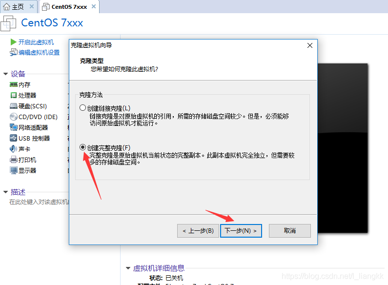

## VMware中完整克隆CentOS

**1、进行完全克隆**

- 选择要克隆的虚拟机右键，选择管理，然后选择克隆  （被克隆虚拟机在克隆前是处于关闭状态）

- 一直下一步，创建完整克隆（链接克隆是指在一些资源上两个虚拟机会共用，完整克隆是完全独立出来的一个新虚拟机）

 

- 设置虚拟机名称和安装位置，点击完成

**2、修改主机名：vim /etc/hostname**

**3、修改网络配置：vim /etc/sysconfig/network-scripts/ifcfg-ens33**

