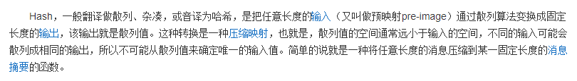
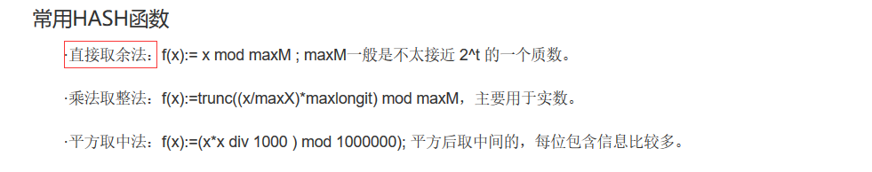

[https://blog.csdn.net/lijiecao0226/article/details/24609559](https://blog.csdn.net/lijiecao0226/article/details/24609559)

[https://www.cnblogs.com/whgk/p/6071617.html](https://www.cnblogs.com/whgk/p/6071617.html)

# 1.什么是hashcode

## 1.1什么是hash

hash是一个函数，该函数中的实现就是一种算法，就是通过一系列的算法来得到一个hash值，而这些hash值存在一张表中，该表称为**hash表**。

## 1.2hashcode

hashcode就是通过hash函数得来的，通俗的说，就是通过某一种算法得到的，hashcode就是在hash表中有对应的位置。