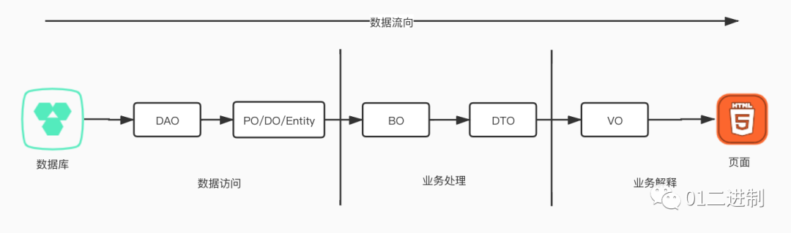

# 有哪些 O？

这些 O 有很多衍生出的命名，比如 VO、DO、BO，这里我们把常见的 O 列举出来，然后一一解释。

•DO（ Data Object）：与数据库表结构一一对应，通过 DAO 层向上传输数据源对象。•PO（Persistant Object）：持久对象，一个 PO 的数据结构对应着库中表的结构，表中的一条记录就是一个 PO 对象

•DTO（ Data Transfer Object）：数据传输对象，Service 或 Manager 向外传输的对象。

•BO（ Business Object）：业务对象。由 Service 层输出的封装业务逻辑的对象。

•AO（ Application Object）：应用对象。在 Web 层与 Service 层之间抽象的复用对象模型，极为贴近展示层，复用度不高。

•VO（ View Object）：显示层对象，通常是 Web 向模板渲染引擎层传输的对象。

•POJO（ Plain Ordinary Java Object）：POJO 专指只有 setter/getter/toString 的简单类，包括 DO/DTO/BO/VO 等。

•DAO（Data Access Objects）：数据访问对象，和上面那些 O 不同的是，其功能是用于进行数据操作的。通常不会用于描述数据实体。

一下子给出 8 个常见的 O，光看解释大家可能会有些迷糊，接下来我们从下面这张图入手，带大家直观的感受下，这些 O 的用处。

## 数据的流向

我们知道，一般情况下，前端是不会凭空造出数据的，因此最后前端展示的数据一定是从数据库中来的，数据的流向通常也是从数据库流向页面。我将其分成三个部分：数据访问、业务处理和业务解释。

1.数据访问：这一部分是用于从数据库中读取数据，将数据记录转换成数据实体也就是 Java 对象，便于操作。

2.业务处理：这一部分是数据流的核心，几乎所有数据的操作都是在这一部分完成的。

3.业务解释：这一部分是用于展示给前端的数据，解释业务体现在某些字段/值是需要经过处理的才会呈现的。

## 关键点

说了这么多，我们整理出以下关键点。

•DAO，是用于**操作数据**而不是描述数据的。

•PO/DO/Entity，其数据结构对应数据表中的一条记录，因此是同一类别的。

•BO，可以理解为 PO 的组合，举个简单的例子，假设 PO 是一条交易记录，BO 就可以是一个人全部的交易记录集合对象。

•DTO，用于传输数据，可能传递给前端，也有可能传递给其他系统。用于**承载数据**。

•VO，这个最好理解，前端最后需要的数据长什么样，对应的对象就是 VO。